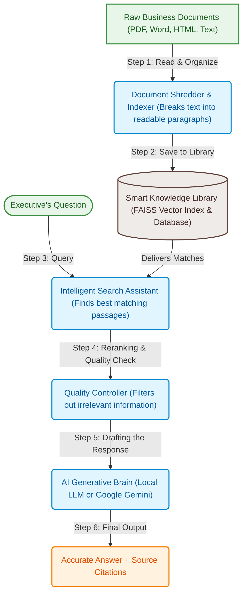

# CognIQ: Executive Brief & Demo Guide
An intelligent, secure, and cite-backed knowledge assistant for your business documents.

---

## 🌟 Executive Summary
**CognIQ** is a next-generation **Retrieval-Augmented Generation (RAG)** chatbot designed to act as an intelligent, automated library assistant for your company's proprietary documents. 

Unlike public AI models (like standard ChatGPT), which can guess or make up answers when they don't know the truth (known as "hallucination"), CognIQ operates in a **"closed-context" environment**. It is strictly grounded in the files you feed it, meaning it will only answer questions using the facts found inside your uploaded documents, and it will always point you to the exact page, document, or snippet where it found the information.

### Key Business Benefits
*   🔒 **Data Privacy & Security:** Can run entirely on local company hardware (fully offline) or via secure, encrypted channels. Your private business data never trains public AI models.
*   🎯 **Zero Hallucinations:** Strict adherence to provided documents ensures high-accuracy answers you can trust for decision-making.
*   🕵️ **Auditability & Citations:** Every answer includes interactive links/references to the source files, enabling instant verification.
*   ⚡ **High Speed & Low Cost:** Optimizes search using state-of-the-art retrieval techniques to find matching passages in milliseconds.

---

## 🧠 How It Works (A Simple Analogy)

Imagine you have a giant warehouse filled with thousands of pages of reports, manuals, and contracts, and you need to answer a complex business question. 

### Detailed Breakdown of the Steps:

1.  **Read & Organize (Ingestion & Chunking):** 
    CognIQ reads your files (PDFs, Word documents, text files, and webpages) and automatically breaks them down into smaller, digestible paragraphs ("chunks"). This ensures the system searches for specific passages rather than trying to read an entire 100-page document at once.
2.  **Save to Library (Indexing):** 
    These paragraphs are indexed in a specialized digital catalog. Each paragraph is given "GPS coordinates" representing its meaning. This allows the computer to find paragraphs by their *concept* rather than just matching exact words.
3.  **Intelligent Search (Retrieval):** 
    When you ask a question, CognIQ instantly runs a dual-search:
    *   *Keyword Search:* Finds exact names, numbers, or terms.
    *   *Concept Search:* Finds paragraphs with the same meaning, even if different words are used.
4.  **Quality Check & Selection (Reranking):** 
    The search engine acts as a "Quality Controller" that ranks all matching paragraphs, sorts out the irrelevant ones, and selects only the top, most authoritative snippets.
5.  **Drafting the Response (Generation):** 
    These highly relevant snippets are packaged together with your question and sent to the **AI Generative Brain** (the Large Language Model). The AI's job is simple: *"Read these exact snippets and write a clear, natural summary answering the user's question. Do not add any external knowledge."*
6.  **Final Output:** 
    You receive a clean, readable answer, along with click-to-verify sources showing you exactly where the facts came from.

---

## 💻 Interactive Features to Highlight During the Demo

When presenting the chatbot, be sure to highlight these executive-friendly features in the User Interface:

1.  **The Source Citation Drawer:**
    *   *What it is:* A collapsible section under every answer showing the source filename, section, and exact paragraph used to write the answer.
    *   *Value to Management:* Shows that the AI is fully accountable and allows humans to double-check any statistic or contract clause in seconds.
2.  **Real-Time Generation ("Typewriter" Effect):**
    *   *What it is:* The answer appears on-screen word-by-word in real time.
    *   *Value to Management:* Offers a modern, highly interactive feel with zero waiting lag.
3.  **Telemetry & Analytics Board:**
    *   *What it is:* A dashboard panel showing system speed, memory usage, search accuracy, and how long each step took.
    *   *Value to Management:* Demonstrates operational efficiency and enterprise-grade performance tracking.
4.  **Multi-Format Compatibility:**
    *   *What it is:* The ability to upload diverse files simultaneously.
    *   *Value to Management:* Proves flexibility—one system can handle company wikis, legal PDFs, and financial sheets together.
5.  **Conversational Memory:**
    *   *What it is:* The chatbot remembers context from the previous questions in the session.
    *   *Value to Management:* You can ask follow-up questions (e.g., "Summarize that into bullet points") without retyping the original context.
