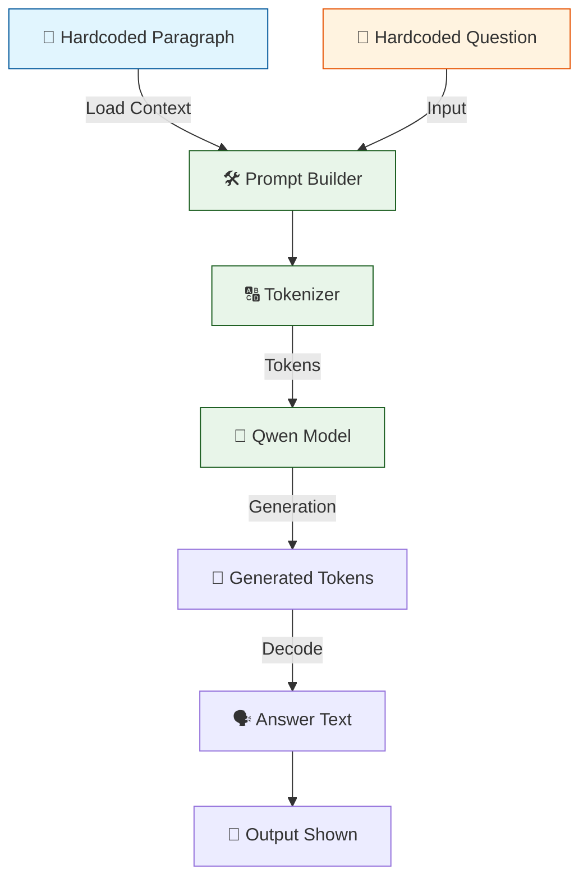
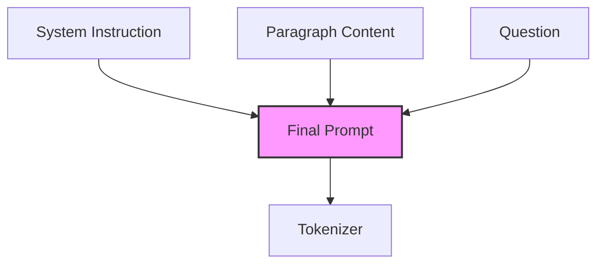

# 🤖 V1 RAG-style Closed Context QA Bot

## 🏗️ Summary

> [!NOTE] Goal For This Version 
> Build a **V1 RAG-style Closed Context QA Bot**. It is a **local question-answering pipeline** where a language model reads a fixed paragraph directly inside the script and answers a predefined question **only from that provided content**.

> [!IMPORTANT] Changes from Last Version [v0] to Current Version [v1]
> *No Previous Version*

> [!IMPORTANT] Why the changes were made (problem faced)
> *No Previous Version*

> [!IMPORTANT] How the new version solves the problem
> *No Previous Version*

---

## 🏗️ Architecture

### 🔄 Full System Flow



---

### 📦 Code

```python
from transformers import AutoTokenizer, AutoModelForCausalLM
import torch

model_name = "Qwen/Qwen2.5-0.5B-Instruct"

print("Loading tokenizer...")
tokenizer = AutoTokenizer.from_pretrained(model_name)

print("Loading model...")
model = AutoModelForCausalLM.from_pretrained(
    model_name,
    low_cpu_mem_usage=True
)

paragraph = """
i am mark and i love my friends .There are myself and 4 other people going to the mall including me.
3 went to the park.
"""

question = "who is the person who write this paragraph"

prompt = f"""
Read the paragraph carefully and answer only from it.

Paragraph:
{paragraph}

Question:
{question}

Answer:
"""

inputs = tokenizer(prompt, return_tensors="pt")

with torch.no_grad():
    outputs = model.generate(
        **inputs,
        max_new_tokens=30,
        do_sample=False,
        temperature=0.1
    )

answer = tokenizer.decode(outputs[0], skip_special_tokens=True)

print("\nRESULT:\n")
print(answer)
```

---

## 🏗️ Stepwise Architecture

### 📦 Step 1 — Import Required Libraries

```python
from transformers import AutoTokenizer, AutoModelForCausalLM
import torch
```

> [!TIP]
> **Purpose:**
> * `transformers`: Loads the tokenizer and model.
> * `torch`: Runs inference operations.

---

### 🧠 Step 2 — Define Model

```python
model_name = "Qwen/Qwen2.5-0.5B-Instruct"
```

**Purpose:** Selects the language model used for answering.
* **Model family:** Qwen
* **Size:** 0.5 Billion parameters
* **Type:** Instruction tuned

---

### 🔠 Step 3 — Load Tokenizer

```python
print("Loading tokenizer...")
tokenizer = AutoTokenizer.from_pretrained(model_name)
```

**Purpose:** Tokenizer converts human text into tokens the model understands.

*Example:*
```text
"Who is Mark?"  ➔  [token IDs]
```

---

### 📥 Step 4 — Load Model

```python
print("Loading model...")
model = AutoModelForCausalLM.from_pretrained(
    model_name,
    low_cpu_mem_usage=True
)
```

**Purpose:** Loads the neural network weights into memory efficiently (`low_cpu_mem_usage=True`). This model generates text token-by-token.

---

### 📚 Step 5 — Load External Knowledge Source

```python
paragraph = """
i am mark and i love my friends .There are myself and 4 other people going to the mall including me.
3 went to the park.
"""
```

**Purpose:** This paragraph becomes the **knowledge base**. Instead of reading from a file, the bot uses fixed text written directly inside the script.

---

### ❓ Step 6 — Define User Question

```python
question = "who is the person who write this paragraph"
```

**Purpose:** A predefined query is passed to the model.

---

### 📝 Step 7 — Build Prompt

```python
prompt = f"""
Read the paragraph carefully and answer only from it.

Paragraph:
{paragraph}

Question:
{question}

Answer:
"""
```

**Purpose:** Combines rules, the paragraph context, and the question. This becomes the final instruction sent to the model.

#### Prompt Structure Diagram



---

### 🔢 Step 8 — Convert Prompt to Tokens

```python
inputs = tokenizer(prompt, return_tensors="pt")
```

**Purpose:** Transforms prompt text into tensors for PyTorch.

---

### ⚙️ Step 9 — Generate Answer

```python
with torch.no_grad():
    outputs = model.generate(
        **inputs,
        max_new_tokens=30,
        do_sample=False,
        temperature=0.1
    )
```

**Parameters Used:**
* `max_new_tokens=30` ➔ Answer length cap
* `do_sample=False` ➔ Deterministic output
* `temperature=0.1` ➔ Very focused, low-randomness generation
* `torch.no_grad()` ➔ Saves memory by not calculating gradients (since we are not training)

**Purpose:** Model reads the prompt and generates a response.

---

### 🗣️ Step 10 — Decode Output

```python
answer = tokenizer.decode(outputs[0], skip_special_tokens=True)
```

**Purpose:** Converts generated tokens back into readable text.

---

### 🖨️ Step 11 — Print Result

```python
print("\nRESULT:\n")
print(answer)
```

**Purpose:** Displays the final generated answer on the screen.

---
