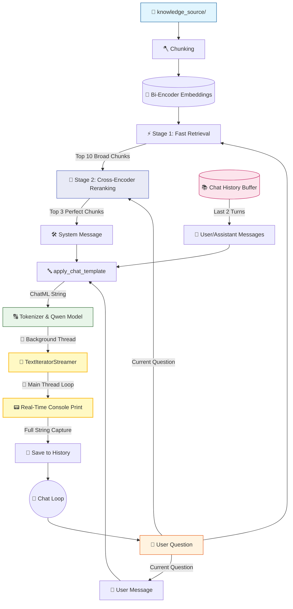

# 🤖 V10 RAG-style Closed Context QA Bot (Streaming)

## 🏗️ Summary

> [!NOTE]
> **Goal For This Version**  
> Build a **V10 RAG-style Closed Context QA Bot**. This version implements **Streaming Output (Typewriter Effect)**, providing a much more responsive and modern user experience by displaying tokens as they are generated.

> [!IMPORTANT]
> **Changes from Last Version [v9.1] to Current Version [v10]**  
> * Imported `TextIteratorStreamer` from `transformers`.
> * Imported `Thread` from `threading` to run generation in the background.
> * Refactored the generation loop to iterate over the streamer in the main thread.
> * Increased `max_new_tokens` to 150 to allow for longer, more descriptive streamed responses.
> * Integrated the streamer with the console using `print(new_text, end="", flush=True)`.

> [!IMPORTANT]
> **Why the changes were made (problem faced)**  
> In every version up to V9.1, the bot's generation step was a **blocking call**. This means when the code hit `model.generate(...)`, the entire Python program froze and waited. Nothing else could happen — no printing, no interaction, nothing — until the model had finished generating the very last token of the response. Only then would the full answer string appear all at once in the terminal.
>
> On local hardware without a GPU, generating 60–150 tokens with the Qwen model can take anywhere from 15 to 60 seconds. During this entire time, the terminal is completely blank and unresponsive. From the user's perspective, this is indistinguishable from the program crashing. They have no feedback, no progress indicator, no way to know if the bot is thinking hard or has frozen.
>
> This is a pure user experience problem. The computation time doesn't change — the bot is doing the same amount of work. But the *perceived* wait time is completely different when you're watching nothing versus watching something happen. Psychologically, staring at a blank screen for 30 seconds feels far longer than reading text that appears word by word for 30 seconds. The latter keeps you engaged; the former makes you anxious.

> [!IMPORTANT]
> **How the new version solves the problem**  
> V10 implements **streaming output** — the bot prints each word the moment the model generates it, creating a typewriter effect that feels alive and immediate.
>
> To understand how this works, we need to understand a problem first: `model.generate()` is a blocking call that only returns when it's completely finished. We can't just "peek" at intermediate results. So we use a clever two-component solution.
>
> The first component is the `TextIteratorStreamer`. Think of it as a mailbox that sits between the model and the console. As the model generates each new token, instead of holding everything internally until the end, it drops each decoded word into this mailbox in real time. The mailbox acts as a queue — a line of words waiting to be picked up.
>
> The second component is Python's **threading**. We run `model.generate()` in a separate background thread — a parallel execution track that runs alongside our main program without blocking it. The main program, now free from waiting, enters a `for new_text in streamer:` loop that continuously checks the mailbox. Every time a new word arrives in the mailbox, the loop picks it up and immediately prints it to the console with `print(new_text, end="", flush=True)`. The `end=""` prevents a newline after each word, and `flush=True` forces Python to display it instantly without buffering.
>
> The result is magical from the user's perspective — the answer appears word by word, just like typing. Simultaneously, we accumulate the words into `full_response` so that after the generation is complete, we can save the full text to the chat history for the next turn.

---

## 📖 Terminologies

| Term | What It Means |
|---|---|
| **Streaming Output** | Displaying the model's response word by word as it is generated, rather than waiting for the full response to be complete before showing anything. |
| **Blocking Call** | A function call that freezes the program until it completes. `model.generate()` without streaming is a blocking call — nothing else happens while it runs. |
| **`TextIteratorStreamer`** | A Hugging Face class that intercepts the model's token generation and makes each decoded word available in real time, one by one, like a live queue. |
| **Thread** | An independent execution track that runs in parallel with the main program. Used here to run `model.generate()` in the background so the main thread can print tokens as they arrive. |
| **`threading.Thread`** | A Python class that creates a new thread. We use it with `target=model.generate` to run generation in the background without blocking the main flow. |
| **`flush=True`** | A parameter in Python's `print()` that forces the output buffer to be flushed immediately, ensuring the text appears on screen right away instead of being held in memory. |
| **`end=""`** | A parameter in Python's `print()` that replaces the default newline character at the end of each print. Setting it to `""` means words print side by side on the same line. |
| **Typewriter Effect** | The visual effect of text appearing character by character or word by word, as if being typed in real time. Achieved here by streaming tokens directly to the console. |
| **Token Queue** | The internal buffer inside `TextIteratorStreamer` where newly generated tokens wait to be read and printed by the main thread loop. |
| **`full_response`** | A string that accumulates all streamed tokens during generation. After the loop ends, it contains the complete response, which is then saved to chat history. |

---

## 🏗️ Architecture

### 🔄 Full System Flow



---

### 📦 Code

*(Note: Loading and Retrieval functions are omitted to focus on the V10 Streaming logic).*

```python
from transformers import AutoTokenizer, AutoModelForCausalLM, TextIteratorStreamer
from threading import Thread

# ... (Previous Logic) ...

    # ---------------------------------------------
    # GENERATE (V10 Streaming Upgrade)
    # ---------------------------------------------

    print("\n⚙ Generating response...")

    # Setup the streamer
    streamer = TextIteratorStreamer(tokenizer, skip_prompt=True, skip_special_tokens=True)

    generation_kwargs = dict(
        **inputs,
        streamer=streamer,
        max_new_tokens=150, 
        do_sample=False
    )

    # Start generation in a separate thread
    thread = Thread(target=model.generate, kwargs=generation_kwargs)
    
    print("\n==============================")
    print("📌 FINAL RESULT")
    print("==============================")
    print("\n📁 Sources:", ", ".join(sources))
    print("\n🤖 Bot: ", end="", flush=True)

    start_time = time.time()
    thread.start()

    full_response = ""
    # Main thread waits for tokens and prints them as they arrive
    for new_text in streamer:
        print(new_text, end="", flush=True)
        full_response += new_text

    print(f"\n\n✅ Generation done in {time.time() - start_time:.2f}s\n")

    # Append full response to chat history for next turn
    chat_history.append({
        "user": question,
        "bot": full_response.strip()
    })
```

---

## 🏗️ Stepwise Architecture

### 🌊 Step 1 — Initialize TextIteratorStreamer (🆕 NEW IN V10)

```python
streamer = TextIteratorStreamer(tokenizer, skip_prompt=True, skip_special_tokens=True)
```

**Purpose:** Acts as a bridge between the AI model and the console. It catches every token the model generates, decodes it into a string, and puts it in a queue for us to read.

---

### 🧵 Step 2 — Multithreaded Generation (🆕 NEW IN V10)

```python
thread = Thread(target=model.generate, kwargs=generation_kwargs)
thread.start()
```

**Purpose:** Because `model.generate` is a blocking call, we run it in a background thread. This frees up our main thread to start reading from the `streamer` immediately without waiting for the model to finish.

---

### 📟 Step 3 — Real-Time Main Thread Loop (🆕 NEW IN V10)

```python
full_response = ""
for new_text in streamer:
    print(new_text, end="", flush=True)
    full_response += new_text
```

**Purpose:** This is the heart of the "typewriter effect". The main thread enters a loop that waits for the `streamer` to yield new text. As tokens arrive, they are printed instantly to the console (`flush=True`) and also saved into `full_response` so we can store it in our chat history once the model finishes.

---

## 🚀 Final One-Line Understanding

> **This architecture implements a multithreaded streaming pipeline that decodes and prints AI tokens to the console in real-time, delivering a fluid, ChatGPT-like conversational experience.**
