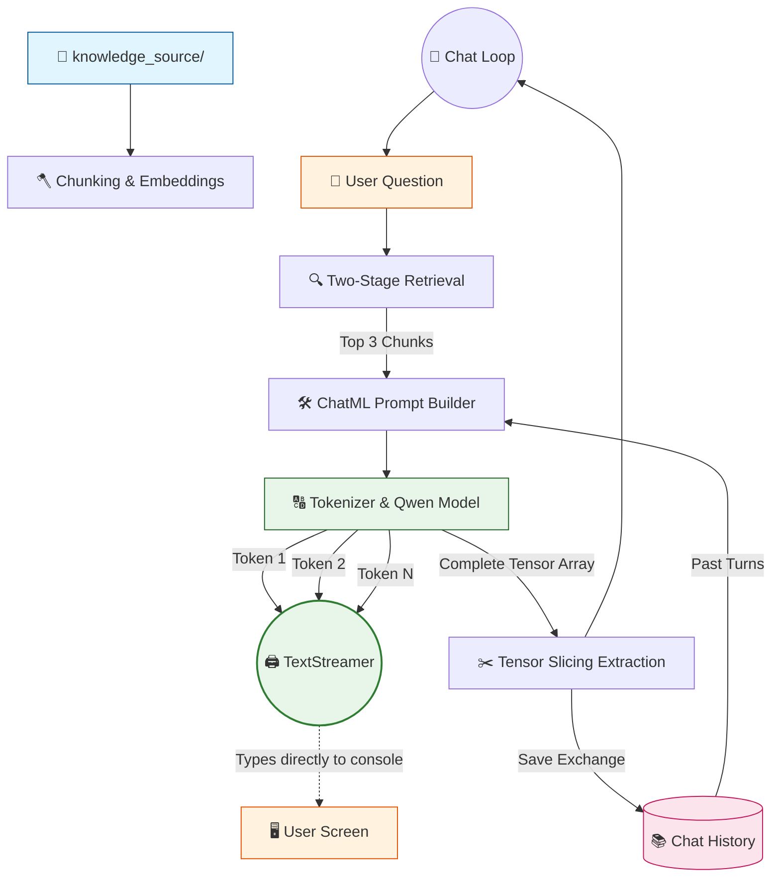

# 🤖 V10 RAG-style Closed Context QA Bot (Streaming)

## 🏗️ Summary

> [!NOTE]
> **Goal For This Version**  
> Build a **V10 RAG-style Closed Context QA Bot**. This version solves the "waiting problem" by introducing real-time token streaming (the Typewriter Effect), making the chatbot feel instantly responsive.

> [!IMPORTANT]
> **Changes from Last Version [v9.1] to Current Version [v10]**  
> * Imported `TextStreamer` from Hugging Face `transformers`.
> * Re-arranged the console output blocks so the "Final Result" header prints *before* generation starts.
> * Initialized a `streamer` object and attached it directly to the `model.generate()` loop.
> * Continued to decode the final tensor output silently in the background so the answer can still be saved to the Chat History array.

> [!IMPORTANT]
> **Why the changes were made (problem faced)**  
> In all previous versions, the model generated the entire answer silently in the background. Because local LLM generation is computationally heavy, users would have to stare at a `⚙ Generating response...` message for 40 to 60 seconds before seeing any text. This made the RAG system feel sluggish and frustrating to use.

> [!IMPORTANT]
> **How the new version solves the problem**  
> Hugging Face's `TextStreamer` hooks into the model's generation loop. The millisecond the model predicts the next word, the streamer flushes it directly to the console (`stdout`). While the total processing time remains exactly the same, the *perceived latency* drops to zero because the user can start reading the sentence immediately as it types out.

---

## 🏗️ Architecture

### 🔄 Full System Flow



---

### 📦 Code

*(Note: Loading and Retrieval functions are omitted to focus purely on the V10 Streaming mechanics).*

```python
    # ---------------------------------------------
    # GENERATE (V10: STREAMING OUTPUT)
    # ---------------------------------------------

    print("\n==============================")
    print("📌 FINAL RESULT")
    print("==============================")
    print(f"\n📁 Sources: {', '.join(sources)}")
    
    # Start the bot's response line without a newline break
    print("\n🤖 Bot: ", end="", flush=True)

    # 🆕 NEW IN V10: Initialize TextStreamer
    streamer = TextStreamer(tokenizer, skip_prompt=True, skip_special_tokens=True)

    start = time.time()

    with torch.no_grad():
        outputs = model.generate(
            **inputs,
            max_new_tokens=60,
            do_sample=False,
            streamer=streamer # Attach streamer to generate loop
        )
    
    # Cap off the stream with newlines and generation time
    print(f"\n\n[⚙️ Generation done in {time.time() - start:.2f}s]\n")

    # ---------------------------------------------
    # SAVE HISTORY
    # ---------------------------------------------
    
    # We still need to extract the final string silently to save it to our Chat History array
    input_length = inputs["input_ids"].shape[1]
    generated_tokens = outputs[0][input_length:]
    answer = tokenizer.decode(generated_tokens, skip_special_tokens=True).strip()

    chat_history.append({
        "user": question,
        "bot": answer
    })
```

---

## 🏗️ Stepwise Architecture

### 🖨️ Step 1 — Prepare the Console UI (🆕 NEW IN V10)

```python
    print("\n🤖 Bot: ", end="", flush=True)
```

**Purpose:** Because the streamer prints text directly to standard output, we have to set up the console beforehand. We print `"🤖 Bot: "` but use `end=""` so the console cursor stays on the same line, waiting for the stream to begin.

---

### 🌊 Step 2 — Initialize TextStreamer (🆕 NEW IN V10)

```python
    streamer = TextStreamer(tokenizer, skip_prompt=True, skip_special_tokens=True)
```

**Purpose:** We create a Hugging Face `TextStreamer` object. By passing `skip_prompt=True`, we tell the streamer to completely ignore the massive ChatML prompt we injected earlier and only stream the brand-new tokens the model generates. `skip_special_tokens=True` ensures we don't see messy `<|im_end|>` tags on the screen.

---

### ⚙️ Step 3 — Attach Streamer to Generation Loop (🆕 NEW IN V10)

```python
        outputs = model.generate(
            **inputs,
            max_new_tokens=60,
            do_sample=False,
            streamer=streamer
        )
```

**Purpose:** By passing the `streamer` argument into the `generate()` function, the model automatically delegates console-printing to the streamer. As PyTorch computes the tensors in the background, the streamer decodes them one by one and flushes them to the screen, creating the classic "ChatGPT Typewriter" effect.

---

### 💾 Step 4 — Silent History Save

```python
    generated_tokens = outputs[0][input_length:]
    answer = tokenizer.decode(generated_tokens, skip_special_tokens=True).strip()
```

**Purpose:** Even though the text was already printed to the screen, the `model.generate()` function still returns the full final tensor array. We must still decode this array silently in the background so we can save the final `answer` string into our Conversational Memory buffer for the next loop.

---

## 🚀 Final One-Line Understanding

> **This architecture uses Hugging Face's TextStreamer to intercept tokens during the `model.generate` loop and print them to the console in real-time, eliminating perceived latency.**
