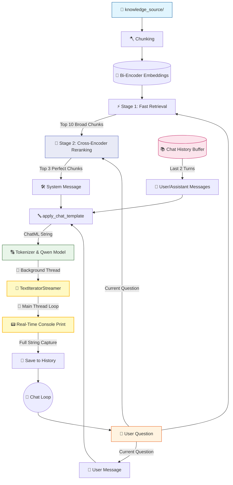

# 🤖 V10 RAG-style Closed Context QA Bot (Streaming)

## 🏗️ Summary

> [!NOTE]
> **Goal For This Version**  
> Build a **V10 RAG-style Closed Context QA Bot**. This version implements **Streaming Output (Typewriter Effect)**, providing a much more responsive and modern user experience by displaying tokens as they are generated.

> [!IMPORTANT]
> **Changes from Last Version [v9.1] to Current Version [v10]**  
> * Imported `TextIteratorStreamer` from `transformers`.
> * Imported `Thread` from `threading` to run generation in the background.
> * Refactored the generation loop to iterate over the streamer in the main thread.
> * Increased `max_new_tokens` to 150 to allow for longer, more descriptive streamed responses.
> * Integrated the streamer with the console using `print(new_text, end="", flush=True)`.

> [!IMPORTANT]
> **Why the changes were made (problem faced)**  
> In all previous versions, the user had to wait for the model to finish the *entire* generation process (which could take 40-60 seconds on local hardware) before seeing any text. This "freeze" made the app feel slow and unresponsive, even though the model was working hard in the background.

> [!IMPORTANT]
> **How the new version solves the problem**  
> Streaming allows the bot to show its work in real-time. By using a background thread for the model and a `TextIteratorStreamer` in the main thread, we can catch every word the second it is produced. This "typewriter effect" makes the 40-second wait feel almost instantaneous because the user starts reading the answer within the first few seconds.

---

## 🏗️ Architecture

### 🔄 Full System Flow



---

### 📦 Code

*(Note: Loading and Retrieval functions are omitted to focus on the V10 Streaming logic).*

```python
from transformers import AutoTokenizer, AutoModelForCausalLM, TextIteratorStreamer
from threading import Thread

# ... (Previous Logic) ...

    # ---------------------------------------------
    # GENERATE (V10 Streaming Upgrade)
    # ---------------------------------------------

    print("\n⚙ Generating response...")

    # Setup the streamer
    streamer = TextIteratorStreamer(tokenizer, skip_prompt=True, skip_special_tokens=True)

    generation_kwargs = dict(
        **inputs,
        streamer=streamer,
        max_new_tokens=150, 
        do_sample=False
    )

    # Start generation in a separate thread
    thread = Thread(target=model.generate, kwargs=generation_kwargs)
    
    print("\n==============================")
    print("📌 FINAL RESULT")
    print("==============================")
    print("\n📁 Sources:", ", ".join(sources))
    print("\n🤖 Bot: ", end="", flush=True)

    start_time = time.time()
    thread.start()

    full_response = ""
    # Main thread waits for tokens and prints them as they arrive
    for new_text in streamer:
        print(new_text, end="", flush=True)
        full_response += new_text

    print(f"\n\n✅ Generation done in {time.time() - start_time:.2f}s\n")

    # Append full response to chat history for next turn
    chat_history.append({
        "user": question,
        "bot": full_response.strip()
    })
```

---

## 🏗️ Stepwise Architecture

### 🌊 Step 1 — Initialize TextIteratorStreamer (🆕 NEW IN V10)

```python
streamer = TextIteratorStreamer(tokenizer, skip_prompt=True, skip_special_tokens=True)
```

**Purpose:** Acts as a bridge between the AI model and the console. It catches every token the model generates, decodes it into a string, and puts it in a queue for us to read.

---

### 🧵 Step 2 — Multithreaded Generation (🆕 NEW IN V10)

```python
thread = Thread(target=model.generate, kwargs=generation_kwargs)
thread.start()
```

**Purpose:** Because `model.generate` is a blocking call, we run it in a background thread. This frees up our main thread to start reading from the `streamer` immediately without waiting for the model to finish.

---

### 📟 Step 3 — Real-Time Main Thread Loop (🆕 NEW IN V10)

```python
full_response = ""
for new_text in streamer:
    print(new_text, end="", flush=True)
    full_response += new_text
```

**Purpose:** This is the heart of the "typewriter effect". The main thread enters a loop that waits for the `streamer` to yield new text. As tokens arrive, they are printed instantly to the console (`flush=True`) and also saved into `full_response` so we can store it in our chat history once the model finishes.

---

## 🚀 Final One-Line Understanding

> **This architecture implements a multithreaded streaming pipeline that decodes and prints AI tokens to the console in real-time, delivering a fluid, ChatGPT-like conversational experience.**
