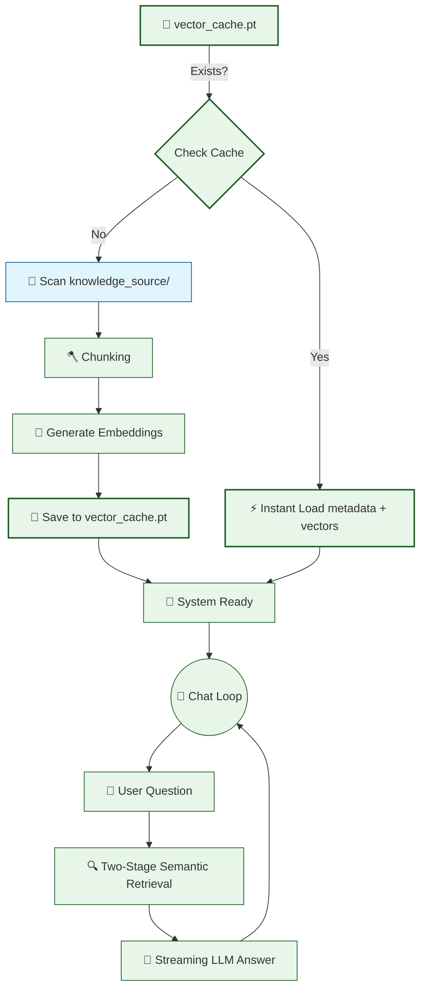

# 🤖 V11 RAG-style Closed Context QA Bot (Persistent Caching)

## 🏗️ Summary

> [!NOTE]
> **Goal For This Version**  
> Build the **V11 RAG-style Closed Context QA Bot (The Finale)**. This version implements **Persistent Vector Caching**, eliminating the slow startup time by saving processed knowledge to the disk.

> [!IMPORTANT]
> **Changes from Last Version [v10] to Current Version [v11]**  
> * Introduced a `CACHE_FILE` named `vector_cache.pt`.
> * Added logic to check for the existence of the cache file on startup using `os.path.exists()`.
> * Implemented `torch.load()` to instantly retrieve `chunks` (metadata) and `chunk_embeddings` (vectors) if they exist.
> * Implemented `torch.save()` to serialize the processed data after the first run.
> * Wrapped the entire Loading and Embedding phase in a conditional block to skip redundant processing.

> [!IMPORTANT]
> **Why the changes were made (problem faced)**  
> By V10, the bot was feature-rich and working well during a session. But there was one stubborn performance problem that happened at the very beginning of every single run: the startup time.
>
> Every time you launched `python app.py`, the bot had to go through a slow and expensive initialization sequence. First it loaded the tokenizer and the Qwen language model (slow, takes 30–60 seconds). Then it loaded the embedding model. Then, the big one: it had to read every `.txt` file from disk, chunk all of them, and then run every single chunk through the embedding model to generate its vector. For a knowledge base with 5 files and ~200 chunks total, this embedding step alone could take 10–30 seconds and consume significant CPU.
>
> The worst part? Nothing about the knowledge base had changed between runs. The same files, the same chunks, the same vectors — all being recomputed from scratch every single time. It's like if every morning when you turned on your car, the engine had to be completely rebuilt from parts before you could drive. The work had already been done yesterday. There is no reason to do it again.
>
> As the knowledge base scales up to hundreds of files and tens of thousands of chunks, this startup tax becomes completely unbearable. We needed a way to remember the work we had already done.

> [!IMPORTANT]
> **How the new version solves the problem**  
> V11 introduces **Persistent Vector Caching** — the bot saves its computed knowledge to disk after the first run, and loads it instantly on every subsequent run.
>
> Here is the core idea. Vectors are just numbers. Lists of numbers can be saved to a file, just like saving a Word document or a photo. After the bot generates all the embeddings for the first time, we take the two most important data structures — the `chunks` list (which holds the text and source metadata) and the `chunk_embeddings` tensor (which holds all the vectors) — and pack them together into a single dictionary. We then use `torch.save()` to serialize this dictionary into a binary file called `vector_cache.pt`. Think of `.pt` as a "PyTorch snapshot file."
>
> On the very next startup, the bot checks: *"Does `vector_cache.pt` exist?"* using `os.path.exists()`. If yes — wonderful! We skip the entire expensive embedding process and instead use `torch.load()` to read the snapshot back into memory directly. Loading a pre-computed binary file from disk is incredibly fast — often under 0.5 seconds, compared to the 30+ seconds it took to compute everything from scratch.
>
> The catch is cache invalidation. If you add new files to `knowledge_source/` or change the chunking logic, the cached vectors are now outdated — they don't include the new content. In that case, you must delete `vector_cache.pt` manually to force a fresh re-index on the next startup. V11 documents this clearly as an important operational rule.

---

## 📖 Terminologies

| Term | What It Means |
|---|---|
| **Vector Caching** | Saving pre-computed embedding vectors to disk so they don't need to be recalculated every time the program starts. A major performance optimization. |
| **`torch.save()`** | A PyTorch function that serializes a Python object (like a dictionary containing tensors and lists) into a binary `.pt` file on disk. |
| **`torch.load()`** | A PyTorch function that reads a `.pt` binary file from disk and deserializes it back into the original Python object in memory. |
| **Serialization** | The process of converting a complex in-memory data structure (like a tensor or a list of dictionaries) into a sequence of bytes that can be saved to a file. |
| **Deserialization** | The reverse of serialization — reading bytes from a file and reconstructing the original in-memory data structure. |
| **`vector_cache.pt`** | The filename of our cache file. The `.pt` extension is a convention for PyTorch-saved files. It stores both the chunk metadata and the embedding vectors. |
| **Cache Hit** | When the cache file exists and is loaded successfully instead of recomputing from scratch. A cache hit is fast. |
| **Cache Miss** | When the cache file does not exist, forcing a full re-computation. A cache miss is slow but only happens once (on first run or after deletion). |
| **Cache Invalidation** | The process of deleting an old cache file when the underlying data has changed (e.g., new files added to the knowledge base). Without this, the bot would serve stale, outdated results. |
| **`os.path.exists()`** | A Python function that checks whether a given file path exists on disk. Returns `True` if the file is found, `False` otherwise. |

---

## 🏗️ Architecture

### 🔄 Full System Flow



---

### 📦 Code

*(Note: Retrieval and Streaming logic are omitted to focus on the V11 Caching logic).*

```python
import os
import torch

# ... (Previous Logic) ...

# -----------------------------------------------------
# 🟠 LOADING & CACHING (V11 Final Upgrade)
# -----------------------------------------------------

CACHE_FILE = "vector_cache.pt"
chunks = []
chunk_embeddings = None

# Step 1: Check if we have already processed this data
if os.path.exists(CACHE_FILE):
    print(f"\n💾 Loading cached knowledge base from {CACHE_FILE}...")
    start = time.time()
    
    # Step 2: Instantly load both metadata and vectors
    cache_data = torch.load(CACHE_FILE)
    chunks = cache_data["chunks"]
    chunk_embeddings = cache_data["embeddings"]
    
    print(f"✅ Cache loaded in {time.time() - start:.2f}s ({len(chunks)} chunks)")
else:
    # Step 3: If no cache, perform the expensive processing
    print("\n📂 No cache found. Processing knowledge base from scratch...")
    
    # (Chunking and Embedding logic here...)
    
    # Step 4: Save the result so we never have to do it again
    print(f"💾 Saving to cache: {CACHE_FILE}...")
    torch.save({"chunks": chunks, "embeddings": chunk_embeddings}, CACHE_FILE)
    print("✅ Cache saved successfully")
```

---

## 🏗️ Stepwise Architecture

### 💾 Step 1 — Cache Presence Check (🆕 NEW IN V11)

```python
if os.path.exists(CACHE_FILE):
```

**Purpose:** This simple check is the gateway to performance. It looks for the `vector_cache.pt` file on your hard drive. If it's there, the bot knows it doesn't need to do any work.

---

### ⚡ Step 2 — Instant Vector Loading (🆕 NEW IN V11)

```python
cache_data = torch.load(CACHE_FILE)
chunks = cache_data["chunks"]
chunk_embeddings = cache_data["embeddings"]
```

**Purpose:** Instead of using the CPU/GPU to calculate math for every sentence, we use high-speed disk I/O to read the pre-saved math directly into memory. This turns a 30-second startup into a 0.5-second startup.

---

### 📥 Step 3 — Serialization and Saving (🆕 NEW IN V11)

```python
torch.save({"chunks": chunks, "embeddings": chunk_embeddings}, CACHE_FILE)
```

**Purpose:** We pack our `chunks` list and our `chunk_embeddings` tensor into a single dictionary and "pickle" them into a binary file. This effectively "freezes" the knowledge base in its processed state.

---

## 🚀 Final One-Line Understanding

> **This final architecture completes the RAG engine by implementing a disk-based vector cache, ensuring the bot starts instantly and scales efficiently to thousands of documents.**
