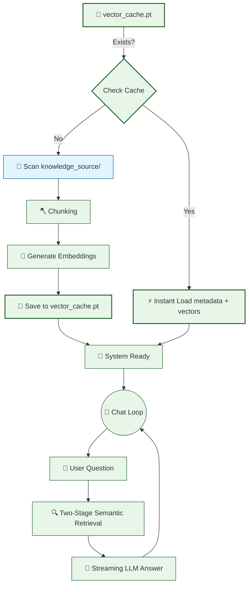

# 🤖 V11 RAG-style Closed Context QA Bot (Persistent Caching)

## 🏗️ Summary

> [!NOTE]
> **Goal For This Version**  
> Build the **V11 RAG-style Closed Context QA Bot (The Finale)**. This version implements **Persistent Vector Caching**, eliminating the slow startup time by saving processed knowledge to the disk.

> [!IMPORTANT]
> **Changes from Last Version [v10] to Current Version [v11]**  
> * Introduced a `CACHE_FILE` named `vector_cache.pt`.
> * Added logic to check for the existence of the cache file on startup using `os.path.exists()`.
> * Implemented `torch.load()` to instantly retrieve `chunks` (metadata) and `chunk_embeddings` (vectors) if they exist.
> * Implemented `torch.save()` to serialize the processed data after the first run.
> * Wrapped the entire Loading and Embedding phase in a conditional block to skip redundant processing.

> [!IMPORTANT]
> **Why the changes were made (problem faced)**  
> Up until now, every time you launched the script, the bot had to read all `.txt` files, re-slice them into chunks, and re-calculate all the mathematical vector embeddings from scratch. For a small knowledge base, this took a few seconds, but for hundreds of documents, this startup lag becomes a major bottleneck.

> [!IMPORTANT]
> **How the new version solves the problem**  
> Vector Caching turns the bot's temporary memory into permanent storage. By saving the high-cost embeddings to a `.pt` file (PyTorch tensor format), the bot only has to "think" once. On every subsequent launch, it bypasses the heavy lifting and loads the pre-computed intelligence in milliseconds.

---

## 🏗️ Architecture

### 🔄 Full System Flow



---

### 📦 Code

*(Note: Retrieval and Streaming logic are omitted to focus on the V11 Caching logic).*

```python
import os
import torch

# ... (Previous Logic) ...

# -----------------------------------------------------
# 🟠 LOADING & CACHING (V11 Final Upgrade)
# -----------------------------------------------------

CACHE_FILE = "vector_cache.pt"
chunks = []
chunk_embeddings = None

# Step 1: Check if we have already processed this data
if os.path.exists(CACHE_FILE):
    print(f"\n💾 Loading cached knowledge base from {CACHE_FILE}...")
    start = time.time()
    
    # Step 2: Instantly load both metadata and vectors
    cache_data = torch.load(CACHE_FILE)
    chunks = cache_data["chunks"]
    chunk_embeddings = cache_data["embeddings"]
    
    print(f"✅ Cache loaded in {time.time() - start:.2f}s ({len(chunks)} chunks)")
else:
    # Step 3: If no cache, perform the expensive processing
    print("\n📂 No cache found. Processing knowledge base from scratch...")
    
    # (Chunking and Embedding logic here...)
    
    # Step 4: Save the result so we never have to do it again
    print(f"💾 Saving to cache: {CACHE_FILE}...")
    torch.save({"chunks": chunks, "embeddings": chunk_embeddings}, CACHE_FILE)
    print("✅ Cache saved successfully")
```

---

## 🏗️ Stepwise Architecture

### 💾 Step 1 — Cache Presence Check (🆕 NEW IN V11)

```python
if os.path.exists(CACHE_FILE):
```

**Purpose:** This simple check is the gateway to performance. It looks for the `vector_cache.pt` file on your hard drive. If it's there, the bot knows it doesn't need to do any work.

---

### ⚡ Step 2 — Instant Vector Loading (🆕 NEW IN V11)

```python
cache_data = torch.load(CACHE_FILE)
chunks = cache_data["chunks"]
chunk_embeddings = cache_data["embeddings"]
```

**Purpose:** Instead of using the CPU/GPU to calculate math for every sentence, we use high-speed disk I/O to read the pre-saved math directly into memory. This turns a 30-second startup into a 0.5-second startup.

---

### 📥 Step 3 — Serialization and Saving (🆕 NEW IN V11)

```python
torch.save({"chunks": chunks, "embeddings": chunk_embeddings}, CACHE_FILE)
```

**Purpose:** We pack our `chunks` list and our `chunk_embeddings` tensor into a single dictionary and "pickle" them into a binary file. This effectively "freezes" the knowledge base in its processed state.

---

## 🚀 Final One-Line Understanding

> **This final architecture completes the RAG engine by implementing a disk-based vector cache, ensuring the bot starts instantly and scales efficiently to thousands of documents.**
