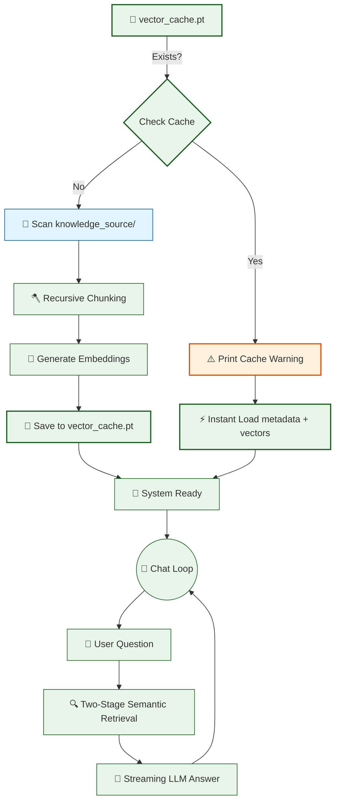

# 🤖 V12 RAG-style Closed Context QA Bot (Advanced Chunking)

## 🏗️ Summary

> [!NOTE]
> **Goal For This Version**  
> Build the **V12 RAG-style Closed Context QA Bot**. This version replaces the naïve word-count sliding window with a **sentence-aware Recursive Character Splitter**, ensuring that chunks always end at natural language boundaries (paragraphs, lines, or sentences) and never clip a fact mid-sentence.

> [!IMPORTANT]
> **Changes from Last Version [v11] to Current Version [v12]**  
> * Removed `chunk_text(text, chunk_size=250, overlap=80)` — the old word-based splitter.
> * Introduced `recursive_chunk_text(text, chunk_size=1000, overlap=200)` — a character-level recursive splitter.
> * The new function tries separators in a hierarchy: `\n\n` → `\n` → `". "` → `" "`.
> * Overlap is now character-based (trailing 200 chars of the previous chunk) rather than word-based.
> * Added a startup **cache invalidation warning** if `vector_cache.pt` is detected from a prior version.

> [!IMPORTANT]
> **Why the changes were made (problem faced)**  
> The V11 word-count splitter was separator-blind. A chunk boundary could fall in the middle of a sentence like *"The company was founded in"* — cutting before the year. This clipped fact then gets embedded and retrieved, injecting incomplete context into the LLM prompt and causing hallucinations or "Not found." responses for questions that should be answerable.

> [!IMPORTANT]
> **How the new version solves the problem**  
> The Recursive Character Splitter works top-down: it first tries to divide on `\n\n` (paragraph breaks), keeping entire paragraphs together. Only if a paragraph is still too large does it fall back to `\n`, then `. ` (sentence endings), and finally individual word spaces. This ensures every chunk is a semantically complete unit — a full sentence or paragraph — maximizing retrieval accuracy.

> [!CAUTION]
> **Cache Invalidation Required**  
> Because the chunking logic has changed, the existing `vector_cache.pt` (built with V11's word splitter) is stale. **Delete `vector_cache.pt` before running V12** to force a clean re-index. V12 will print a warning on startup if it detects an old cache file.

---

## 🏗️ Architecture

### 🔄 Full System Flow



---

### 📦 Code

*(Note: Loading, Retrieval, and Streaming logic are omitted to focus on the V12 Chunking logic.)*

```python
# 🆕 NEW IN V12: Sentence-aware Recursive Character Splitter
def recursive_chunk_text(text, chunk_size=1000, overlap=200):
    """
    Splits text recursively using a separator hierarchy:
      1. Paragraph breaks (\n\n)
      2. Line breaks (\n)
      3. Sentence endings ('. ')
      4. Word boundaries (' ')
    This prevents facts from being clipped mid-sentence.
    """
    separators = ["\n\n", "\n", ". ", " "]

    def _split(text, separators):
        if not text.strip():
            return []

        # If the text is already small enough, return it as-is
        if len(text) <= chunk_size:
            return [text.strip()]

        sep = separators[0]
        remaining_seps = separators[1:]
        parts = text.split(sep)

        chunks = []
        current = ""

        for part in parts:
            candidate = (current + sep + part).strip() if current else part.strip()

            if len(candidate) <= chunk_size:
                current = candidate
            else:
                # Flush the current buffer
                if current.strip():
                    if len(current) > chunk_size and remaining_seps:
                        chunks.extend(_split(current, remaining_seps))
                    else:
                        chunks.append(current.strip())

                # Start a new buffer with character-level overlap
                if chunks and overlap > 0:
                    overlap_text = chunks[-1][-overlap:].strip()
                    current = (overlap_text + " " + part.strip()).strip()
                else:
                    current = part.strip()

        # Flush any remaining buffer
        if current.strip():
            if len(current) > chunk_size and remaining_seps:
                chunks.extend(_split(current, remaining_seps))
            else:
                chunks.append(current.strip())

        return chunks

    return _split(text, separators)
```

---

## 🏗️ Stepwise Architecture

### 🪓 Step 1 — Separator Hierarchy Definition (🆕 NEW IN V12)

```python
separators = ["\n\n", "\n", ". ", " "]
```

**Purpose:** This ordered list is the "recipe" for how to break text. The splitter always tries the broadest, most semantically meaningful separator first. Paragraph breaks keep entire thoughts together. Only when a paragraph is too large does it try the next finer boundary.

---

### 🔁 Step 2 — Base Case: Small-Enough Text (🆕 NEW IN V12)

```python
if len(text) <= chunk_size:
    return [text.strip()]
```

**Purpose:** This is the recursion's exit condition. If the current block of text is already within the target size, it doesn't need to be split further. It is returned whole, preserving its complete semantic context.

---

### 🔁 Step 3 — Buffer-and-Flush Loop (🆕 NEW IN V12)

```python
for part in parts:
    candidate = (current + sep + part).strip() if current else part.strip()

    if len(candidate) <= chunk_size:
        current = candidate
    else:
        if current.strip():
            chunks.append(current.strip())  # Flush
        current = part.strip()             # Start fresh
```

**Purpose:** The loop accumulates parts (paragraphs, sentences, words) into a growing `current` buffer. The moment adding the next part would exceed `chunk_size`, it flushes the current buffer as a complete chunk and starts a new one. This greedy packing ensures chunks are as large as possible without overflow.

---

### 🔁 Step 4 — Recursive Fallback (🆕 NEW IN V12)

```python
if len(current) > chunk_size and remaining_seps:
    chunks.extend(_split(current, remaining_seps))
```

**Purpose:** If a single "part" (e.g., one very long paragraph) is itself larger than `chunk_size`, the function calls itself with the next finer separator. This is the "recursive" part of the name — it drills down through the hierarchy until the text fits or it reaches word-level splitting.

---

### 🔁 Step 5 — Character-Level Overlap (🆕 NEW IN V12)

```python
overlap_text = chunks[-1][-overlap:].strip()
current = (overlap_text + " " + part.strip()).strip()
```

**Purpose:** To preserve context continuity across chunk boundaries, the last `overlap` characters (200 by default) of the previous chunk are prepended to the next chunk. This ensures the retrieval model can find information that spans a boundary, without duplicating entire sentences.

---

## 🚀 Final One-Line Understanding

> **V12 replaces blind word-count splitting with a sentence-aware recursive character splitter that respects paragraph, line, and sentence boundaries — ensuring every retrieved chunk contains a complete, fact-preserving unit of information.**
