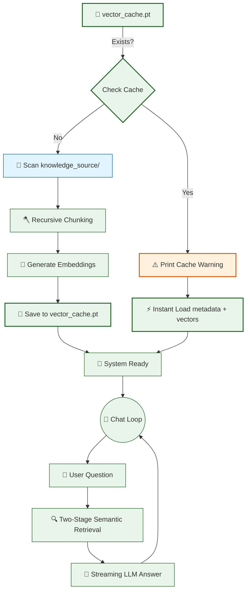

# 🤖 V12 RAG-style Closed Context QA Bot (Advanced Chunking)

## 🏗️ Summary

> [!NOTE]
> **Goal For This Version**  
> Build the **V12 RAG-style Closed Context QA Bot**. This version replaces the naïve word-count sliding window with a **sentence-aware Recursive Character Splitter**, ensuring that chunks always end at natural language boundaries (paragraphs, lines, or sentences) and never clip a fact mid-sentence.

> [!IMPORTANT]
> **Changes from Last Version [v11] to Current Version [v12]**  
> * Removed `chunk_text(text, chunk_size=250, overlap=80)` — the old word-based splitter.
> * Introduced `recursive_chunk_text(text, chunk_size=1000, overlap=200)` — a character-level recursive splitter.
> * The new function tries separators in a hierarchy: `\n\n` → `\n` → `". "` → `" "`.
> * Overlap is now character-based (trailing 200 chars of the previous chunk) rather than word-based.
> * Added a startup **cache invalidation warning** if `vector_cache.pt` is detected from a prior version.

> [!IMPORTANT]
> **Why the changes were made (problem faced)**  
> V11's chunking function used a simple word-count sliding window. Every 250 words, the window moved forward by 170 words (leaving an 80-word overlap). This approach is completely indifferent to language structure — it splits text purely based on counting words, with no regard for where sentences, paragraphs, or ideas naturally begin and end.
>
> The consequences of this can be subtle but damaging. Imagine a knowledge base entry that reads: *"The annual performance review is held in December. Employees who receive a rating of 4 or above are eligible for a bonus of 15% of their annual salary."* Now suppose the word count boundary falls right in the middle of that second sentence, creating one chunk that ends with *"Employees who receive a rating of 4 or above are eligible for a bonus of 15%"* and the next chunk that starts with *"of their annual salary."* The first chunk is now an incomplete fact — it mentions 15% but not 15% of what. The embedding model encodes this incomplete sentence and assigns it a vector. When retrieved, the LLM reads *"15%"* without context, potentially hallucinating or saying "Not found."
>
> This is called **fact-clipping** — literally cutting a fact in half by slicing text at an arbitrary position. It's like opening a book to a random page, cutting the page down the middle with scissors, and giving someone only the left half to read. They might get some useful information, but they might also get half a sentence that means nothing on its own. As knowledge bases grow larger and more complex, fact-clipping becomes an increasingly frequent problem that degrades retrieval quality silently.

> [!IMPORTANT]
> **How the new version solves the problem**  
> V12 replaces the word-count chunker with a **Recursive Character Splitter** — a smarter algorithm that respects the natural structure of language.
>
> The core philosophy shift is this: instead of asking *"how many words have I counted?"*, we ask *"where is the most natural place to split this text?"* Natural text has a built-in hierarchy of boundaries from broadest to finest: paragraphs → lines → sentences → words. We exploit this hierarchy with a recursive approach.
>
> Here is how it works step by step. We define a list of separators in order of preference: `["\n\n", "\n", ". ", " "]`. The algorithm tries the broadest separator first — double newline (`\n\n`), which marks paragraph breaks. It splits the document on these paragraph breaks and tries to accumulate paragraphs into chunks of up to 1,000 characters. If two paragraphs together fit within 1,000 characters, they stay together. If one paragraph alone is larger than 1,000 characters, the algorithm doesn't give up — it tries the next finer separator (`\n` for line breaks) and repeats the process on that paragraph. This continues recursively down through sentence boundaries (`". "`) and finally word boundaries (`" "`).
>
> The beautiful result is that chunk boundaries almost always fall at a paragraph break or a sentence period — never in the middle of a clause. A fact like *"eligible for a bonus of 15% of their annual salary"* will always appear complete in a single chunk because the algorithm will find a sentence boundary on either side of it before resorting to word splitting. The embeddings become more accurate, the retrieved context is cleaner, and the LLM's answers improve accordingly.
>
> We also move from word-level overlap (80 words) to character-level overlap (200 characters), which is more precise and consistent regardless of word length.

---

## 📖 Terminologies

| Term | What It Means |
|---|---|
| **Recursive Character Splitter** | A chunking algorithm that tries to split text using a hierarchy of separators (paragraph → line → sentence → word), recursively falling back to finer splits only when needed. |
| **Separator Hierarchy** | An ordered list of text boundaries tried from broadest to finest. For us: `\n\n` (paragraph) → `\n` (line) → `". "` (sentence) → `" "` (word). |
| **Fact-Clipping** | The problem where a chunk boundary falls in the middle of an important fact, making that fact incomplete and potentially useless for retrieval. |
| **`\n\n` (Double Newline)** | Two consecutive newline characters, typically indicating a paragraph break in plain text files. The broadest natural boundary in our separator hierarchy. |
| **Character-Level Chunking** | Measuring chunk size in characters rather than words. More precise because character counts are consistent regardless of word length. |
| **`chunk_size=1000`** | The maximum number of characters allowed in a single chunk. Roughly equivalent to 150–200 words — larger than before, giving the LLM more context per chunk. |
| **`overlap=200`** | The number of characters from the end of the previous chunk that get prepended to the start of the next chunk. Ensures context continuity at boundaries. |
| **Recursion** | A programming technique where a function calls itself with a simpler version of the problem. Used here to apply progressively finer separators until the text fits within the chunk size. |
| **Buffer-and-Flush** | The core loop pattern: accumulate text in a buffer until adding more would exceed the chunk size, then flush (emit) the buffer as a complete chunk and start a new one. |

---

## 🏗️ Architecture

### 🔄 Full System Flow



---

### 📦 Code

*(Note: Loading, Retrieval, and Streaming logic are omitted to focus on the V12 Chunking logic.)*

```python
# 🆕 NEW IN V12: Sentence-aware Recursive Character Splitter
def recursive_chunk_text(text, chunk_size=1000, overlap=200):
    """
    Splits text recursively using a separator hierarchy:
      1. Paragraph breaks (\n\n)
      2. Line breaks (\n)
      3. Sentence endings ('. ')
      4. Word boundaries (' ')
    This prevents facts from being clipped mid-sentence.
    """
    separators = ["\n\n", "\n", ". ", " "]

    def _split(text, separators):
        if not text.strip():
            return []

        # If the text is already small enough, return it as-is
        if len(text) <= chunk_size:
            return [text.strip()]

        sep = separators[0]
        remaining_seps = separators[1:]
        parts = text.split(sep)

        chunks = []
        current = ""

        for part in parts:
            candidate = (current + sep + part).strip() if current else part.strip()

            if len(candidate) <= chunk_size:
                current = candidate
            else:
                # Flush the current buffer
                if current.strip():
                    if len(current) > chunk_size and remaining_seps:
                        chunks.extend(_split(current, remaining_seps))
                    else:
                        chunks.append(current.strip())

                # Start a new buffer with character-level overlap
                if chunks and overlap > 0:
                    overlap_text = chunks[-1][-overlap:].strip()
                    current = (overlap_text + " " + part.strip()).strip()
                else:
                    current = part.strip()

        # Flush any remaining buffer
        if current.strip():
            if len(current) > chunk_size and remaining_seps:
                chunks.extend(_split(current, remaining_seps))
            else:
                chunks.append(current.strip())

        return chunks

    return _split(text, separators)
```

---

## 🏗️ Stepwise Architecture

### 🪓 Step 1 — Separator Hierarchy Definition (🆕 NEW IN V12)

```python
separators = ["\n\n", "\n", ". ", " "]
```

**Purpose:** This ordered list is the "recipe" for how to break text. The splitter always tries the broadest, most semantically meaningful separator first. Paragraph breaks keep entire thoughts together. Only when a paragraph is too large does it try the next finer boundary.

---

### 🔁 Step 2 — Base Case: Small-Enough Text (🆕 NEW IN V12)

```python
if len(text) <= chunk_size:
    return [text.strip()]
```

**Purpose:** This is the recursion's exit condition. If the current block of text is already within the target size, it doesn't need to be split further. It is returned whole, preserving its complete semantic context.

---

### 🔁 Step 3 — Buffer-and-Flush Loop (🆕 NEW IN V12)

```python
for part in parts:
    candidate = (current + sep + part).strip() if current else part.strip()

    if len(candidate) <= chunk_size:
        current = candidate
    else:
        if current.strip():
            chunks.append(current.strip())  # Flush
        current = part.strip()             # Start fresh
```

**Purpose:** The loop accumulates parts (paragraphs, sentences, words) into a growing `current` buffer. The moment adding the next part would exceed `chunk_size`, it flushes the current buffer as a complete chunk and starts a new one. This greedy packing ensures chunks are as large as possible without overflow.

---

### 🔁 Step 4 — Recursive Fallback (🆕 NEW IN V12)

```python
if len(current) > chunk_size and remaining_seps:
    chunks.extend(_split(current, remaining_seps))
```

**Purpose:** If a single "part" (e.g., one very long paragraph) is itself larger than `chunk_size`, the function calls itself with the next finer separator. This is the "recursive" part of the name — it drills down through the hierarchy until the text fits or it reaches word-level splitting.

---

### 🔁 Step 5 — Character-Level Overlap (🆕 NEW IN V12)

```python
overlap_text = chunks[-1][-overlap:].strip()
current = (overlap_text + " " + part.strip()).strip()
```

**Purpose:** To preserve context continuity across chunk boundaries, the last `overlap` characters (200 by default) of the previous chunk are prepended to the next chunk. This ensures the retrieval model can find information that spans a boundary, without duplicating entire sentences.

---

## 🚀 Final One-Line Understanding

> **V12 replaces blind word-count splitting with a sentence-aware recursive character splitter that respects paragraph, line, and sentence boundaries — ensuring every retrieved chunk contains a complete, fact-preserving unit of information.**
