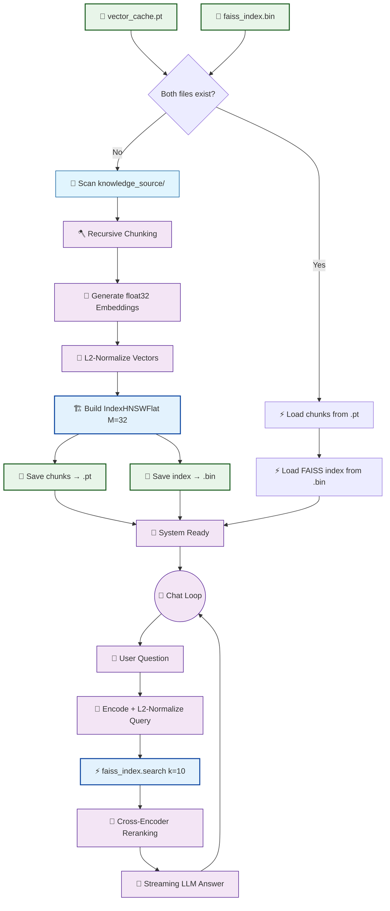

# 🤖 V13 RAG-style Closed Context QA Bot (FAISS HNSW Vector Indexing)

## 🏗️ Summary

> [!NOTE]
> **Goal For This Version**  
> Build the **V13 RAG-style Closed Context QA Bot**. This version replaces the brute-force linear cosine similarity scan with a **FAISS HNSW (Hierarchical Navigable Small World)** index, enabling sub-linear approximate nearest-neighbour (ANN) search that scales to millions of vectors.

> [!IMPORTANT]
> **Changes from Last Version [v12] to Current Version [v13]**  
> * Added `import faiss` and `import numpy as np`; removed `import torch.nn.functional as F`.
> * Introduced a **dual-file cache** system: `vector_cache.pt` (chunk metadata only) + `faiss_index.bin` (the FAISS index).
> * Cache hit now requires **both** files to be present (atomic invalidation).
> * Embeddings are now generated as `float32` NumPy arrays instead of PyTorch tensors.
> * All vectors are **L2-normalized** before indexing, making inner product equivalent to cosine similarity.
> * Built a `faiss.IndexHNSWFlat(dim, M=32, METRIC_INNER_PRODUCT)` index with `efConstruction=200`.
> * Saved the index via `faiss.write_index()` and loaded via `faiss.read_index()`.
> * Stage 1 retrieval replaced: `F.cosine_similarity + torch.topk` → `faiss_index.search(query_vec, k=10)`.

> [!IMPORTANT]
> **Why the changes were made (problem faced)**  
> V12 made a major improvement to chunking quality, but the retrieval engine underneath it still had a fundamental performance ceiling. The Stage 1 retrieval — the fast first pass that narrows thousands of chunks down to 10 candidates for the Cross-Encoder — was doing a **linear scan**.
>
> Linear scan means: for every single user query, the bot calculates the similarity between the query vector and *every single chunk embedding*, one by one, from the very first chunk to the very last. This is called an **O(n)** operation in computer science — the time it takes grows in direct proportion to the number of chunks (n). If you double the knowledge base, the scan takes twice as long. If you have 10× more content, it takes 10× longer.
>
> For a small knowledge base of 5 files and 200 chunks, this is invisible — the scan is done in milliseconds. But imagine a real enterprise deployment: 500 policy documents, 10,000 employee reports, 50,000 chunks. At that scale, a linear scan on a CPU could take 3–10 seconds *just for the retrieval step*, before the LLM even reads a single word. And this delay happens for every single question the user asks. The bottleneck is not the LLM — it's the search.
>
> This is the exact same problem that search engines solved decades ago. Google doesn't linearly scan every web page for every search query. It uses specialized index data structures that let it narrow down candidates in a fraction of the time. We need the same approach for our vector search.

> [!IMPORTANT]
> **How the new version solves the problem**  
> V13 replaces the linear scan with a **FAISS HNSW index** — a state-of-the-art data structure designed specifically for high-speed similarity search in high-dimensional vector spaces.
>
> Let's understand HNSW — Hierarchical Navigable Small World — with a simple analogy. Imagine all your chunk vectors as cities on a map, positioned based on their meaning (similar-meaning chunks are close together). The HNSW algorithm builds a system of roads connecting these cities, structured in multiple layers. The top layer has very few cities but very long highways connecting distant points. Lower layers have more cities connected by local roads.
>
> When a query arrives, the search starts at the top layer and rapidly jumps across the long highways to the general neighbourhood of the answer. It then moves down to progressively finer layers, taking local roads to get closer and closer to the exact best match. This "navigating like a GPS" strategy means the search only ever visits a small fraction of all the chunks — roughly **O(log n)** hops instead of O(n) comparisons. For 50,000 chunks, this is the difference between visiting 50,000 cities versus visiting only 10-15 strategically chosen ones.
>
> There's one important mathematical detail. FAISS HNSW can measure distance using Inner Product (dot product) or Euclidean distance, but not cosine similarity directly. We solve this elegantly: if we **L2-normalize** all our vectors before adding them to the index (scale each vector so its length equals exactly 1.0), then mathematically the Inner Product *becomes* identical to cosine similarity. So we normalize everything — both at index time and at query time — and get the exact same ranking we had in V12, just orders of magnitude faster.
>
> The cache also splits into two files: `vector_cache.pt` (chunk text and metadata) and `faiss_index.bin` (the HNSW graph structure). Both files must exist for a cache hit. If either is missing, a full re-index is triggered.

> [!CAUTION]
> **Both cache files must be deleted before running V13.**  
> The old `vector_cache.pt` stores a `"embeddings"` key that V13 no longer uses. Delete both `vector_cache.pt` AND `faiss_index.bin` (if present) to force a clean re-index with the new dual-file format.

---

## 📖 Terminologies

| Term | What It Means |
|---|---|
| **FAISS** | Facebook AI Similarity Search — an open-source library developed by Meta for extremely fast similarity search and clustering of dense vectors. Industry standard for production RAG systems. |
| **HNSW (Hierarchical Navigable Small World)** | A graph-based index algorithm that organizes vectors in a multi-layer hierarchy. At query time, it navigates the graph to find nearest neighbours without checking every vector. |
| **ANN (Approximate Nearest Neighbour)** | A search that finds vectors that are *very close* to the query vector — not necessarily the absolute closest, but close enough for practical purposes. Trades tiny amounts of accuracy for massive speed gains. |
| **O(n) Linear Scan** | An algorithm whose runtime grows proportionally with the data size n. Searching 1,000 chunks takes 10× longer than searching 100 chunks. This was V12's Stage 1 approach. |
| **O(log n)** | An algorithm whose runtime grows logarithmically — very slowly — as n increases. Searching 1,000,000 chunks barely takes longer than searching 1,000 chunks. HNSW achieves approximately this. |
| **L2 Normalization** | Scaling a vector so its length (magnitude) equals exactly 1.0. The mathematical trick that makes Inner Product equivalent to Cosine Similarity for unit-length vectors. |
| **`faiss.normalize_L2()`** | A FAISS function that L2-normalizes an array of vectors in-place (modifying them directly). Must be applied to both the index vectors and each query vector. |
| **`IndexHNSWFlat`** | The specific FAISS index class we use. "HNSW" is the graph algorithm; "Flat" means it stores the actual raw float32 vectors (no compression). |
| **`M=32`** | The number of graph connections each vector node has in the HNSW graph. Higher M = better recall but more memory. 32 is the standard recommended value. |
| **`efConstruction=200`** | Controls the quality of the HNSW graph built at index time. Higher values produce a better graph (more accurate search) at the cost of slower initial index building. A one-time cost. |
| **`efSearch=64`** | Controls the search beam width at query time. Higher values explore more of the graph (better recall) but are slower. Tunable to balance speed vs. accuracy at runtime. |
| **Dual-File Cache** | The V13 caching strategy that saves chunk metadata to `vector_cache.pt` (PyTorch format) and the FAISS index to `faiss_index.bin` (FAISS binary format) separately. Both are required for a cache hit. |
| **`faiss.write_index()` / `faiss.read_index()`** | FAISS functions for saving and loading an index to/from a binary file on disk. The FAISS format cannot be stored inside a PyTorch pickle, hence the separate file. |

---

## 🏗️ Architecture

### 🔄 Full System Flow



---

### 📦 Core Code

*(Loading, chunking, streaming, and prompt logic are omitted to focus on V13 FAISS logic.)*

```python
import faiss
import numpy as np

CACHE_FILE = "vector_cache.pt"
FAISS_INDEX_FILE = "faiss_index.bin"

# ── BUILD PATH ──────────────────────────────────────────────────────────────
# Step 1: Generate float32 NumPy embeddings (FAISS requires float32 NumPy)
embeddings_np = embedder.encode(chunk_texts, convert_to_numpy=True).astype("float32")

# Step 2: L2-normalize so inner product == cosine similarity
faiss.normalize_L2(embeddings_np)

# Step 3: Build the HNSW index
dim = embeddings_np.shape[1]                                   # 384 for MiniLM
faiss_index = faiss.IndexHNSWFlat(dim, 32, faiss.METRIC_INNER_PRODUCT)
faiss_index.hnsw.efConstruction = 200
faiss_index.add(embeddings_np)

# Step 4: Persist — two separate files
torch.save({"chunks": chunks}, CACHE_FILE)
faiss.write_index(faiss_index, FAISS_INDEX_FILE)

# ── LOAD PATH ────────────────────────────────────────────────────────────────
chunks = torch.load(CACHE_FILE)["chunks"]
faiss_index = faiss.read_index(FAISS_INDEX_FILE)

# ── QUERY PATH ───────────────────────────────────────────────────────────────
query_vec = embedder.encode([question], convert_to_numpy=True).astype("float32")
faiss.normalize_L2(query_vec)
faiss_index.hnsw.efSearch = 64
distances, indices = faiss_index.search(query_vec, k=10)
```

---

## 🏗️ Stepwise Architecture

### 📐 Step 1 — L2 Normalization (🆕 NEW IN V13)

```python
faiss.normalize_L2(embeddings_np)
```

**Purpose:** FAISS HNSW natively supports L2 (Euclidean) and Inner Product metrics. For cosine similarity, the trick is: if every vector has unit length (L2 norm = 1), then `dot(a, b) = cosine_similarity(a, b)`. By normalizing all embeddings — and every query vector at search time — we get identical ranking to V12's `F.cosine_similarity` without adding a separate cosine metric.

---

### 🏗️ Step 2 — IndexHNSWFlat Construction (🆕 NEW IN V13)

```python
faiss_index = faiss.IndexHNSWFlat(dim, 32, faiss.METRIC_INNER_PRODUCT)
faiss_index.hnsw.efConstruction = 200
faiss_index.add(embeddings_np)
```

**Purpose:** `IndexHNSWFlat` stores the raw float32 vectors plus the HNSW graph. Key parameters:
- **`dim`** — vector dimensionality (384 for `all-MiniLM-L6-v2`)
- **`M=32`** — each node's number of connections in the graph; higher M = better recall but more RAM and build time. 32 is the recommended default.
- **`efConstruction=200`** — controls graph quality during build; higher = more accurate graph. Only paid at index build time, not at search time.

---

### 💾 Step 3 — Dual-File Cache Persistence (🆕 NEW IN V13)

```python
torch.save({"chunks": chunks}, CACHE_FILE)        # chunk metadata
faiss.write_index(faiss_index, FAISS_INDEX_FILE)  # HNSW graph + vectors
```

**Purpose:** FAISS indices use their own binary format (`write_index`/`read_index`) — they cannot be embedded into a PyTorch pickle. Splitting into two files is the standard FAISS pattern. Both files are required for a valid cache; if either is missing, a full re-index is triggered.

---

### ⚡ Step 4 — HNSW Search at Query Time (🆕 NEW IN V13)

```python
faiss_index.hnsw.efSearch = 64
distances, indices = faiss_index.search(query_vec, k=10)
```

**Purpose:** `efSearch` is the query-time beam width for the HNSW graph traversal. Higher values explore more candidates (better recall) at the cost of speed. 64 is a conservative default that gives near-perfect recall. `search()` returns two 2D arrays: `distances[0]` (similarity scores) and `indices[0]` (chunk indices into the original list). FAISS pads with `-1` when `k > ntotal`, so those are filtered.

---

## 📊 Complexity Comparison

| Method | Time Complexity | RAM | Scales to |
|---|---|---|---|
| V12 — `F.cosine_similarity` linear scan | O(n) | O(n) tensors | ~10K chunks |
| V13 — FAISS HNSW | ~O(log n) | O(n) float32 + graph | ~10M chunks |

---

## 🚀 Final One-Line Understanding

> **V13 replaces the brute-force linear similarity scan with a FAISS HNSW graph index — turning O(n) retrieval into sub-linear approximate nearest-neighbour search, ready to scale to millions of vectors without changing recall quality.**
