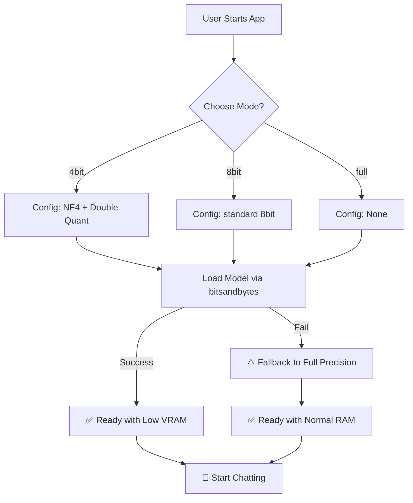

# 🤖 V14 RAG-style Closed Context QA Bot (Model Quantization)

## 🏗️ Summary

> [!NOTE]
> **Goal For This Version**  
> Build the **V14 RAG-style Closed Context QA Bot**. This version introduces **Model Quantization** via `bitsandbytes`, allowing the engine to load AI models in 4-bit or 8-bit precision. This drastically reduces VRAM requirements, enabling larger models to run on standard consumer hardware and improving overall system performance.

> [!IMPORTANT]
> **Changes from Last Version [v13] to Current Version [v14]**  
> *   Imported `BitsAndBytesConfig` from the `transformers` library.
> *   Added a new `QUANTIZATION_MODE` configuration setting (`4bit`, `8bit`, or `full`).
> *   Implemented conditional loading logic that applies the appropriate `BitsAndBytesConfig` based on the selected mode.
> *   Integrated `device_map="auto"` to allow automatic memory management across GPU and CPU.
> *   Added a robust `try-except` fallback system that reverts to Full Precision if quantization libraries are missing or if the hardware doesn't support them.
> *   Updated telemetry logs to clearly state the active quantization mode during the model loading phase.

> [!IMPORTANT]
> **Why the changes were made (problem faced)**  
> Imagine you have a giant toy box (your computer's memory), but you want to buy a toy castle (an AI model) that is even bigger than the box. Normally, you just wouldn't be able to fit it inside. This is the **Memory Wall**.
> 
> AI models like Qwen or Llama are made of billions of numbers called "parameters." By default, these numbers are stored in high precision (16-bit or 32-bit), which takes up a lot of space. Our current 0.5B model is tiny, but even it uses a significant amount of RAM. If we wanted to upgrade to a smarter model (like a 7B or 14B model), most computers would run out of memory and the program would crash immediately.
> 
> Furthermore, loading these giant models from your hard drive into your memory is slow. The bigger the model, the longer you have to wait before you can even ask your first question. We needed a way to make the models "smaller" without making them "dumber."

> [!IMPORTANT]
> **How the new version solves the problem**  
> V14 solves this using a clever trick called **Quantization**. Think of it like using **vacuum-seal bags** for your clothes when packing a suitcase.
> 
> When you vacuum-seal a big, fluffy sweater, it still does the same job of keeping you warm, but it takes up 75% less space in your bag. Quantization does the exact same thing to the AI's numbers. We take the high-precision 16-bit numbers and "squeeze" them down into smaller 4-bit versions. 
> 
> We use a specialized tool called `bitsandbytes` to handle this. It doesn't just cut the numbers; it uses a smart format called **NF4 (NormalFloat 4)** which is specifically designed to keep the most important parts of the AI's knowledge safe while discarding the extra "fluff." We also use **Double Quantization**, which is like vacuum-sealing the vacuum-sealed bags — it saves even more space!
> 
> The result is that a model that used to need 16GB of VRAM can now run on just 5GB. This means your computer can now fit a much smarter "toy castle" inside its "toy box," and it loads much faster because there is less data to move around!

---

## 📖 Terminologies

| Term | What It Means |
|---|---|
| **Quantization** | The process of reducing the precision of the model's numbers (parameters) to save memory. Like converting a high-resolution photo to a slightly lower quality to save space. |
| **Bits (4-bit / 8-bit)** | The amount of space used to store each number. Standard models use 16-bit. 4-bit uses 1/4 the space, allowing the model to be 4x smaller. |
| **VRAM (Video RAM)** | The specialized, super-fast memory on your graphics card (GPU). Quantization is primarily used to make models fit into this limited VRAM. |
| **`bitsandbytes`** | The industry-standard Python library used to perform quantization on the fly while loading a model. |
| **NF4 (NormalFloat 4)** | A high-tech "squeezing" method that is much better at preserving an AI's intelligence than regular 4-bit numbers. |
| **Double Quantization** | An extra layer of compression that quantizes the small numbers used to keep track of the larger quantized numbers. |
| **`device_map="auto"`** | A smart feature that tells the computer to automatically decide which parts of the AI should go on the GPU and which should go on the CPU. |
| **Full Precision** | Loading the model in its original, un-squeezed state (usually 16-bit). Uses the most memory but has 100% accuracy. |

---

## 🏗️ Architecture

### 🔄 Full System Flow

---

## 🚀 Final One-Line Understanding

> **V14 uses vacuum-sealing technology (Quantization) to squeeze big AI models into small memory spaces, making the bot much lighter, faster to load, and ready to support much smarter models on regular computers.**
