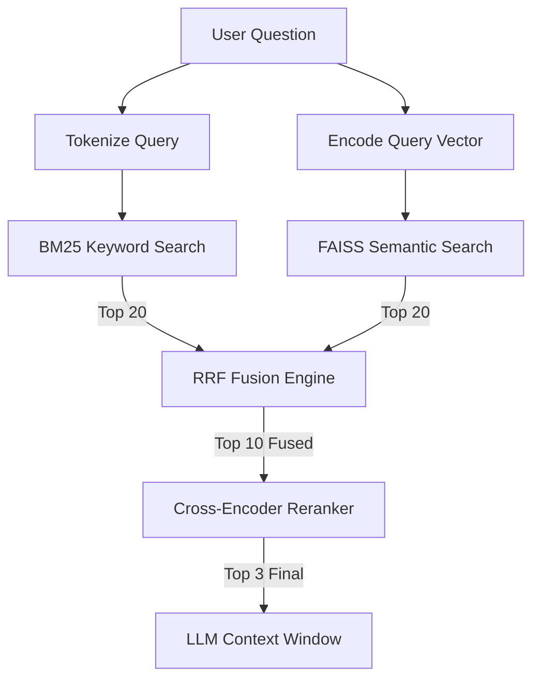

# 🤖 V15 RAG-style Closed Context QA Bot (Hybrid Search & RRF)

## 🏗️ Summary

> [!NOTE]
> **Goal For This Version**  
> Build the **V15 RAG-style Closed Context QA Bot**. This version introduces **Hybrid Search**, a retrieval strategy that combines the conceptual depth of **Semantic Search** with the precision of **Keyword Search (BM25)**. By using **Reciprocal Rank Fusion (RRF)**, the engine fuses these two perspectives into a single, high-precision candidate list for reranking.

> [!IMPORTANT]
> **Changes from Last Version [v14] to Current Version [v15]**  
> *   Implemented a custom `SimpleBM25` class for keyword-based scoring.
> *   Added a `tokenize()` utility for uniform text processing across search methods.
> *   Updated the startup sequence to build a BM25 index of the entire corpus in parallel with the FAISS vector index.
> *   Modified `retrieve_top_k` to execute two parallel search streams: Stage 1a (Semantic) and Stage 1b (Keyword).
> *   Implemented the **Reciprocal Rank Fusion (RRF)** algorithm to merge the top 20 results from both streams.
> *   The fused top 10 candidates are then passed to the Stage 2 Cross-Encoder for final reranking.
> *   Added `USE_HYBRID` and `RRF_K` configuration constants for easy tuning.

> [!IMPORTANT]
> **Why the changes were made (problem faced)**  
> Imagine you are looking for a specific Lego set in a giant warehouse. 
> 
> You have two helpers. The first helper (Semantic Search) is very smart — he understands "themes." If you ask for a "Spaceship," he will find everything that looks like it belongs in space. But he might accidentally bring you a Star Wars ship when you wanted a Classic Space ship, because they both "feel" like space. 
> 
> The second helper (Keyword Search) is a bit simpler — he only looks for exact words. If you say "Set 928," he will find every box with "928" printed on it, regardless of the theme. 
> 
> In previous versions, we only had the first helper. While he was great at understanding ideas, he often missed specific technical terms, acronyms, or serial numbers because he was looking at the "vibe" of the question instead of the exact characters. We needed a way to combine the "Theme Expert" with the "Word Spotter" to get the perfect result every time.

> [!IMPORTANT]
> **How the new version solves the problem**  
> V15 gives the bot "Double Vision" by running two searches at the same time.
> 
> When you ask a question, we first ask the **Semantic Brain** (FAISS) to find the top 20 chunks that have a similar meaning. Simultaneously, we ask the **Keyword Brain** (BM25) to find the top 20 chunks that contain the exact words you used.
> 
> To decide which chunks are actually the best, we use a mathematical referee called **Reciprocal Rank Fusion (RRF)**. RRF gives points to each chunk based on its rank (position) in both lists. 
> - If a chunk is #1 in the Semantic list and #1 in the Keyword list, it's a perfect match! 
> - If it's #2 in Semantic but #50 in Keyword, it's still very good conceptually.
> 
> RRF uses a simple formula: `1 / (60 + rank)`. This means being #1 is worth much more than being #10. We add up the points from both lists, and the chunks with the highest total points win.
> 
> By fusing these results, we get the **best of both worlds**: the bot can now understand that "VRAM" refers to "Video Memory" (Semantic) while also making sure it finds the exact paragraph that mentions the "NF4" quantization type (Keyword). This makes the bot much more reliable for technical and precise Q&A.

---

## 📖 Terminologies

| Term | What It Means |
|---|---|
| **Hybrid Search** | Combining two different ways of searching (Semantic + Keyword) to get a more accurate result than either could provide alone. |
| **BM25 (Best Matching 25)** | A math formula used to rank how well a document matches a set of keywords. It's like a smarter version of "Ctrl+F" that knows which words are rare and important. |
| **IDF (Inverse Document Frequency)** | A part of BM25 that gives more points to rare words (like "Quantization") and fewer points to common words (like "the"). |
| **Reciprocal Rank Fusion (RRF)** | A "voting" system that combines multiple ranked lists. It rewards items that appear near the top of any of the lists. |
| **Rank** | The position of a result in a list. Rank 0 is the very best result, Rank 1 is the second best, and so on. |
| **`RRF_K`** | A constant (usually 60) used in the RRF formula to prevent low-ranked items from having too much influence. |
| **Tokenization** | Breaking a sentence down into individual words (tokens) so the BM25 brain can count them. |
| **Fusion** | The act of merging two separate sets of data into one single, better set. |

---

## 🏗️ Architecture

### 🔄 Retrieval Pipeline

---

## 🚀 Final One-Line Understanding

> **V15 combines "Meaning Matching" with "Word Matching" using a RRF fusion algorithm, ensuring the bot finds both the right ideas AND the exact terms you asked for.**
