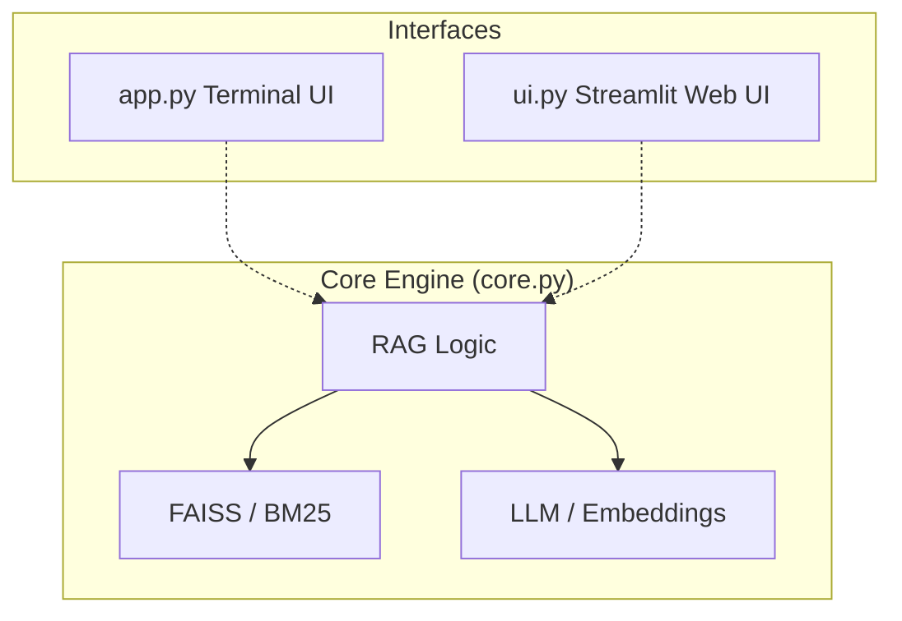

# 🤖 V16 RAG-style Closed Context QA Bot (Streamlit Web UI)

## 🏗️ Summary

> [!NOTE]
> **Goal For This Version**  
> Build the **V16 RAG-style Closed Context QA Bot**. This version marks the transition from a command-line tool to a full **Web Application**. Using **Streamlit**, we've created a premium chat dashboard that supports persistent session history, real-time streaming in the browser, and visual telemetry charts to track engine performance.

> [!IMPORTANT]
> **Changes from Last Version [v15] to Current Version [v16]**  
> *   **Refactored Logic**: Split the monolithic `app.py` into `core.py` (the engine) and `ui.py` (the web interface).
> *   **Streamlit Integration**: Built a complete web UI using the Streamlit library.
> *   **Session Management**: Implemented `st.session_state` to maintain chat history and model loading state across browser refreshes.
> *   **Resource Caching**: Used `@st.cache_resource` to ensure heavy models and FAISS indices are loaded only once in memory.
> *   **Interactive Sidebar**: Added a configuration panel for Quantization Mode and Hybrid Search toggles.
> *   **Visual Telemetry**: Integrated real-time performance tracking with `st.metric` and `st.bar_chart` to visualize retrieval vs. generation latency.
> *   **Premium Styling**: Applied custom CSS for a dark-mode, high-end "SourceIQ" aesthetic.

> [!IMPORTANT]
> **Why the changes were made (problem faced)**  
> Imagine you have been building a high-tech engine in your garage. So far, to start it, you've had to hot-wire the cables and read the speed from a tiny flickering screen (the Terminal). 
> 
> Using the terminal was great for building the engine, but it's not very friendly for actually driving. It’s hard to read long conversations, you can't easily change the "tuning" (settings) while driving, and you can't see the "dashboard" (performance data) in a way that makes sense. 
> 
> Most importantly, the terminal didn't "remember" the conversation very well visually. It was just a long scrolling wall of text. We needed to put a beautiful "car body" around our high-tech engine so it feels like a real product that anyone can use.

> [!IMPORTANT]
> **How the new version solves the problem**  
> V16 moves the engine into the **Web Browser**. We used a tool called **Streamlit** to build a professional "Dashboard" for our AI.
> 
> 1. **The Brain vs. The Face**: We separated the code. `core.py` is the engine (the brain), and `ui.py` is the website (the face). This means the bot can now have multiple "faces" — you can still use the terminal if you want, but now you have a beautiful website too!
> 
> 2. **Memory (Session State)**: We gave the website a "short-term memory." Even if you refresh the page, the bot remembers what you were talking about and keeps the chat bubbles on the screen.
> 
> 3. **The Control Panel (Sidebar)**: On the left side of the screen, we added a slide-out menu. Now, you can just click a button to change how the bot thinks (like turning Hybrid Search on or off) without having to stop the program and change the code.
> 
> 4. **Watching the Engine (Telemetry)**: Every time the bot answers, it now shows you a **Live Bar Chart**. You can see exactly how much time it spent "Searching" through your files vs. how much time it spent "Thinking" of the answer. It turns boring numbers into a colorful graph that’s easy to understand.
> 
> It’s like moving from an old-fashioned radio where you have to turn dials to a modern smartphone app with buttons and pictures!

---

## 📖 Terminologies

| Term | What It Means |
|---|---|
| **Streamlit** | A library that lets Python programmers build websites easily. It's the "magic wand" we used to turn our script into an app. |
| **UI (User Interface)** | Everything you see on the screen — the buttons, the text boxes, and the colors. It's the "face" of the app. |
| **Session State** | A digital "notepad" that the app uses to remember your chat history while you are using it. |
| **Caching (`@st.cache_resource`)** | A way to tell the computer: "I already loaded this heavy AI model, don't do it again!" It makes the app start much faster after the first time. |
| **Sidebar** | The control panel on the left side where you can change the bot's settings. |
| **Chat Bubbles** | The rounded boxes that hold your messages and the bot's answers, making it look like a real chat app. |
| **Telemetry Chart** | A visual graph that shows you how fast the bot is working. |
| **`st.chat_input`** | The text box at the bottom where you type your questions. |

---

## 🏗️ Architecture

### 🔄 Dual-Interface System

---

## 🚀 Final One-Line Understanding

> **V16 transforms the RAG engine into a beautiful web app with a control panel, chat history, and live performance charts, making it feel like a professional AI product instead of just a script.**
