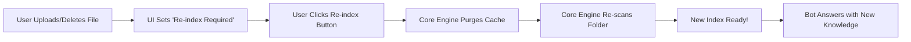

# 🤖 V17 RAG-style Closed Context QA Bot (Interactive UI Features)

## 🏗️ Summary

> [!NOTE]
> **Goal For This Version**  
> Build the **V17 RAG-style Closed Context QA Bot**. This version focuses on **User Autonomy** and **Dynamic Knowledge Management**. We have empowered the user to manage their knowledge base directly from the browser by adding a File Manager (Upload/Delete) and an interactive Source Viewer to inspect the full content of retrieved documents.

> [!IMPORTANT]
> **Changes from Last Version [v16] to Current Version [v17]**  
> *   **Sidebar File Manager**: Added `st.file_uploader` to support real-time document ingestion.
> *   **Dynamic Deletion**: Integrated a file list with delete functionality (🗑️) directly in the sidebar.
> *   **Re-indexing Logic**: Implemented `st.session_state` tracking to detect knowledge base changes and prompt for a manual re-index (force-clearing old FAISS/Vector caches).
> *   **Full Source Viewer**: Replaced static source lists with an interactive `st.selectbox` inside chat bubbles, allowing users to read the **complete text** of any source file cited by the bot.
> *   **Core Engine Upgrade**: Updated `core.py` to support `force_reindex` flags for clean, on-the-fly memory updates.

> [!IMPORTANT]
> **Why the changes were made (problem faced)**  
> Think of the AI as a student with a backpack full of notebooks. 
> 
> In V16, the backpack was zipped shut and locked. If you wanted to give the student a new notebook, you had to stop the student, go home, unlock the backpack, put the book in, and restart the whole journey. This was **static** and slow.
> 
> Furthermore, when the student answered a question based on a notebook, he would only show you one tiny sentence. You couldn't reach into the backpack and open the notebook to the actual page to see if he was telling the whole truth. We needed a way to make the "backpack" **interactive** and **transparent**.

> [!IMPORTANT]
> **How the new version solves the problem**  
> V17 turns the bot into a **Librarian with an Open Filing Cabinet**.
> 
> 1. **The In-Tray (Uploads)**: We added a slot on the left side of the screen (the sidebar) where you can drop new files. The moment you drop a file, the librarian puts it in the cabinet.
> 
> 2. **The Shredder (Deletions)**: If a file is old or wrong, you can click the little trash can icon next to it. The librarian immediately removes it from the cabinet.
> 
> 3. **The Indexer (Re-indexing)**: Because the librarian's memory (the FAISS index) needs to be organized, a yellow warning light pops up whenever the files change. You click one button, and the librarian quickly "re-indexes" everything so their memory matches the new files perfectly.
> 
> 4. **The Reading Room (Source Viewer)**: When the bot gives you an answer, it now offers you the "original books." You can pick a source from a menu, and it will show you the **entire document** in a window. This means you can check the bot's work and see the full story, not just the snippets!
> 
> It’s like moving from a bot that only knows what it was told yesterday to a bot that learns and changes with you today!

---

## 📖 Terminologies

| Term | What It Means |
|---|---|
| **Knowledge Manager** | The new sidebar section where you can see, add, and remove the files the AI knows about. |
| **Dynamic Re-indexing** | Updating the AI's memory "on the fly" when you add or remove files, without having to restart the whole program. |
| **Source Viewer** | A tool in the chat window that lets you read the full text of any document the bot used for its answer. |
| **`force_reindex`** | A command that tells the bot: "Forget everything you know, delete your old memory files, and start fresh with these new documents." |
| **File Uploader** | A "drag-and-drop" box in the sidebar for adding new text files. |
| **Citations** | The list of filenames the bot gives to show where it found its information. |

---

## 🏗️ Architecture

### 🔄 Dynamic Knowledge Loop

---

## 🚀 Final One-Line Understanding

> **V17 gives you total control over the bot's memory, allowing you to add, delete, and inspect the full text of its source files directly from the web interface.**
