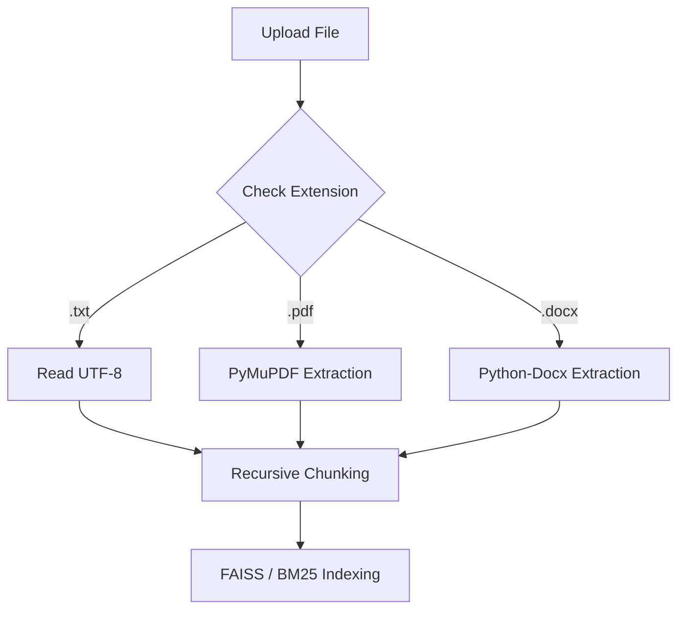

# 🤖 V18 RAG-style Closed Context QA Bot (Advanced File Support)

## 🏗️ Summary

> [!NOTE]
> **Goal For This Version**  
> Build the **V18 RAG-style Closed Context QA Bot**. This version marks a major leap in utility by allowing the engine to ingest and process **PDF** and **DOCX** files alongside standard text. We have also standardized the project with a `requirements.txt` file for easy deployment.

> [!IMPORTANT]
> **Changes from Last Version [v17] to Current Version [v18]**  
> *   **Multi-Format Ingestion**: Integrated `PyMuPDF` (fitz) and `python-docx` to handle complex document parsing.
> *   **Unified Text Extraction**: Implemented a core helper function that automatically detects file types and extracts clean text for indexing.
> *   **Visual Enhancements**: Added file-specific icons (📕 for PDF, 📘 for DOCX) in the Knowledge Manager.
> *   **Source Viewer Upgrade**: Updated the interactive Source Viewer to handle extracted text from binary formats, allowing users to inspect PDF/DOCX content in the browser.
> *   **Project Standardization**: Created a comprehensive `requirements.txt` listing all project dependencies (`transformers`, `torch`, `streamlit`, `pymupdf`, etc.).
> *   **Version Tracking**: Updated the main UI header to reflect **v18 — Multi-Format Support**.

> [!IMPORTANT]
> **Why the changes were made (problem faced)**  
> Imagine the AI student from previous versions. 
> 
> In V17, the student was very smart but could only read simple handwritten notes (text files). If you handed them a glossy **PDF report** or a professional **Word Document**, they would stare at it blankly. You had to manually type out the contents of the report into a note for them to understand it. This was a huge waste of time!
> 
> Also, if you wanted to share your student with a friend, you had to write a long list of all the different "supplies" (libraries) your friend needed to buy. If they missed even one small part, the student wouldn't work. We needed a way to make the student **multilingual** (ready to read any file) and the setup **standardized**.

> [!IMPORTANT]
> **How the new version solves the problem**  
> V18 turns the bot into a **Multilingual Document Expert**.
> 
> 1. **The New Glasses (Format Support)**: We gave the bot two new sets of "glasses." One set is specifically designed for **PDFs**, and the other is for **Word Documents**. Now, when you drop an official report or a policy document into the sidebar, the bot just swaps its glasses and starts reading immediately!
> 
> 2. **Colorful Filing (Icons)**: To keep your digital filing cabinet organized, the bot now marks your files with colors: Red (📕) for PDFs, Blue (📘) for Word, and White (📄) for simple notes.
> 
> 3. **The Shopping List (`requirements.txt`)**: We created a "Master Shopping List." Now, if you want to run this bot on a new computer, you just give it this list, and it automatically downloads every single part it needs. No more guessing!
> 
> 4. **Everything is Clear (Source Viewer)**: Even though PDFs and Word Docs are complex "binary" files that are hard for computers to "see" through, our bot's Source Viewer now pulls the text out perfectly. You can read the text of a 50-page PDF right inside the chat bubble to verify the bot's answer.
> 
> It’s like moving from a bot that could only read postcards to a bot that can read entire encyclopedias, official manuals, and business contracts!

---

## 📖 Terminologies

| Term | What It Means |
|---|---|
| **`PyMuPDF` (fitz)** | A very fast engine used to read PDF files and extract the text from the pages. |
| **`python-docx`** | A library that allows the bot to open and read Microsoft Word documents. |
| **`requirements.txt`** | A file that lists every library the project needs. It's like a "save game" for your development environment. |
| **Unified Extraction** | A single function in the code that handles all file types (`.txt`, `.pdf`, `.docx`) automatically. |
| **Binary Formats** | Complex file types like PDF and Word that contain more than just text (like images and formatting). |
| **Parsing** | The process of the bot reading a file and breaking it down into understandable chunks of text. |

---

## 🏗️ Architecture

### 🔄 Multi-Format Pipeline

---

## 🚀 Final One-Line Understanding

> **V18 transforms the RAG engine into a professional document expert that can ingest, index, and cite information from PDF and DOCX files with a single click.**
