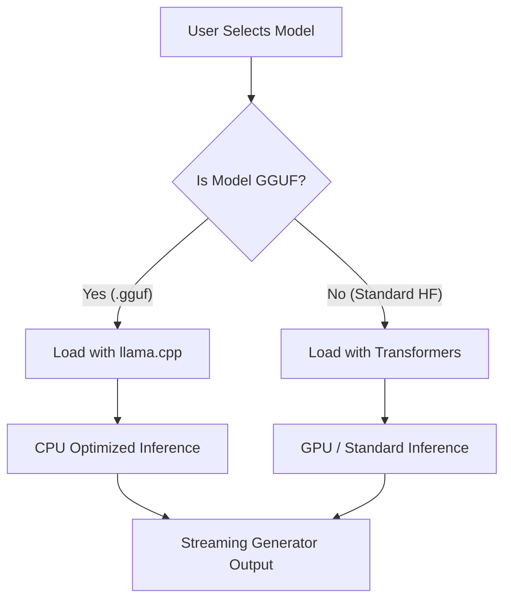

# 🤖 V19 RAG-style Closed Context QA Bot (Hybrid GGUF & CPU Optimization)

## 🏗️ Summary

> [!NOTE]
> **Goal For This Version**  
> Build the **V19 RAG-style Closed Context QA Bot**. This version transforms our engine into a true "Hybrid" system by integrating native support for **GGUF** quantized models. This unlocks the ability to run powerful Large Language Models (like Llama 3 or Mistral) locally on CPUs with massive speedups and significantly lower RAM usage.

> [!IMPORTANT]
> **Changes from Last Version [v18] to Current Version [v19]**  
> *   **GGUF Native Support**: Integrated the `llama-cpp-python` library to load and run `.gguf` model files directly.
> *   **Hybrid Loading Logic**: Updated the core engine to automatically detect if a requested model is a standard HuggingFace repo or a GGUF file, and instantly switch to the correct backend (`Transformers` vs `Llama` class).
> *   **CPU Inference Acceleration**: Shifted from pure PyTorch CPU inference (which is slow) to a heavily optimized C++ backend for GGUF files.
> *   **Streaming Generator Update**: Adjusted the text streaming logic to support the new `llama.cpp` generator alongside the standard `TextIteratorStreamer`.

> [!IMPORTANT]
> **Why the changes were made (problem faced)**  
> Imagine the AI student from previous versions running on a standard laptop (no expensive graphics card). 
> 
> In V18, our student was incredibly smart, but they had to carry all their heavy textbooks around at once. When we asked them to use a model like Phi-2, it required nearly 6 GB of RAM and took a long time to think because standard Python (`transformers`) isn't optimized for running big neural networks on standard CPUs. It was like forcing an athlete to run underwater.

> [!IMPORTANT]
> **How the new version solves the problem**  
> V19 introduces the **"Hybrid Engine"** and gives our student a massive speed boost and a lighter backpack.
> 
> 1. **The Lighter Backpack (GGUF)**: Instead of loading massive, uncompressed AI models, we now support GGUF files. These are highly compressed (quantized) versions of the same models. A model that used to take 6GB of RAM now takes less than 2GB!
> 
> 2. **Running on Solid Ground (llama.cpp)**: We installed a new "brain engine" called `llama-cpp-python`. This is written in pure, highly-optimized C++. When running a GGUF file on a CPU, this engine skips the slow Python overhead and generates words blazingly fast using the CPU's native instruction sets. **(Performance Metric: Running `Qwen/Qwen2.5-0.5B` via standard PyTorch took ~59 seconds to generate a response. With the new GGUF integration, generation time plummeted to ~7 seconds!)**
> 
> 3. **The Smart Switch (Hybrid Logic)**: The best part? The student hasn't forgotten how to use the old way. The system automatically detects what kind of model you want to use. If you have a powerful GPU and want a standard model, it uses the standard pipeline. If you are on a laptop and want a GGUF model, it automatically switches to high-speed mode.

---

## 🛠️ How to Build GGUF Support (From Scratch)

If you are building your own RAG bot and want to add native GGUF support, follow these core steps:

1. **Install the Engine**:
   You must install the Python binding for `llama.cpp`. On Windows, it is highly recommended to use pre-compiled wheels to avoid C++ build tool errors:
   ```bash
   pip install llama-cpp-python --extra-index-url https://abetlen.github.io/llama-cpp-python/whl/cpu
   ```

2. **Update the Core Logic (`core.py`)**:
   Instead of using `AutoModelForCausalLM` from the `transformers` library, you need to import `Llama` from `llama_cpp`. Add a conditional check when loading your model:
   ```python
   from llama_cpp import Llama

   if "gguf" in model_name.lower() or model_name.endswith(".gguf"):
       # Load GGUF file dynamically from HuggingFace
       self.model = Llama.from_pretrained(
           repo_id=model_name,
           filename="*q4_k_m.gguf", # Automatically grab a Q4 quantized version
           n_ctx=2048,
           n_threads=4 # Utilize CPU threads
       )
   else:
       # Standard PyTorch Transformers logic
       self.model = AutoModelForCausalLM.from_pretrained(model_name)
   ```

3. **Adjust the Generator**:
   `transformers` uses `TextIteratorStreamer`, but `llama_cpp` has its own built-in generator. You must write an `if/else` block in your `generate_stream` function so that it yields chunks correctly regardless of which model engine is active.

---

## 📖 Terminologies

| Term | What It Means |
|---|---|
| **GGUF** | (GPT-Generated Unified Format) A highly compressed file format designed specifically for fast inference of Large Language Models on CPUs. |
| **Quantization** | The process of compressing a model by reducing the precision of its weights (e.g., from 16-bit to 4-bit). This drastically lowers RAM usage. |
| **`llama-cpp-python`** | The Python binding for the `llama.cpp` library. It acts as the high-speed engine to run GGUF files. |
| **Hybrid Engine** | A system capable of using two entirely different backends (`transformers` and `llama.cpp`) depending on the type of model requested. |
| **Inference** | The act of the AI model "thinking" or generating text based on a prompt. |

---

## 🏗️ Architecture

### 🔄 Hybrid Model Loader Pipeline



---

## 🚀 Final One-Line Understanding

> **V19 upgrades the RAG engine into a Hybrid powerhouse, using highly compressed GGUF files and C++ acceleration to run advanced AI models blazingly fast on standard CPUs.**
