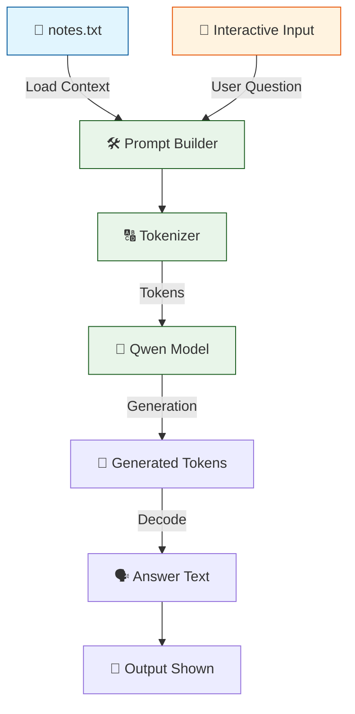
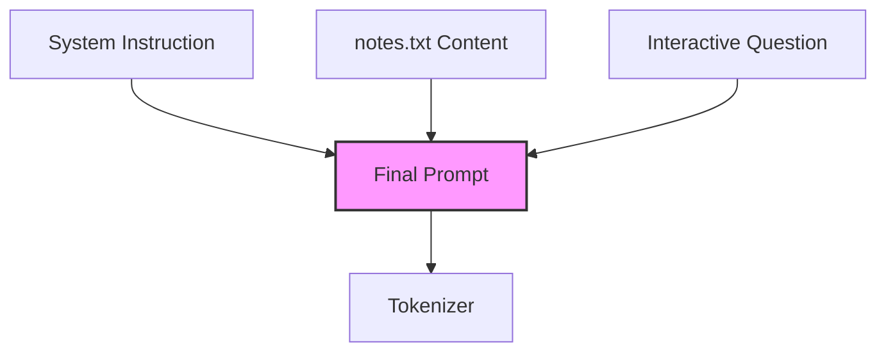

# 🤖 V2 RAG-style Closed Context QA Bot

## 🏗️ Summary

> [!NOTE]
> **Goal For This Version**  
> Build a **V2 RAG-style Closed Context QA Bot**. It is an **interactive local question-answering pipeline** where the language model reads an external text file (`notes.txt`) and answers dynamically entered user questions **only from that provided content**.

> [!IMPORTANT]
> **Changes from Last Version [v1] to Current Version [v2]**  
> * Removed the hardcoded `paragraph` and replaced it with reading context from an external file (`notes.txt`).
> * Removed the hardcoded `question` and replaced it with an interactive command-line `input()`.

> [!IMPORTANT]
> **Why the changes were made (problem faced)**  
> V1 was strictly static. Because the text and question were hardcoded directly into the script, you had to manually edit the Python code every time you wanted to test a new question or change the context. It lacked usability and interactivity.

> [!IMPORTANT]
> **How the new version solves the problem**  
> By introducing `open("notes.txt")` and `input()`, the script becomes a reusable, interactive tool. Users can now easily swap out the knowledge base by updating the `notes.txt` file and ask infinite questions via the terminal without ever touching the Python code again.

---

## 🏗️ Architecture

### 🔄 Full System Flow



---

### 📦 Code

```python
from transformers import AutoTokenizer, AutoModelForCausalLM
import torch

model_name = "Qwen/Qwen2.5-0.5B-Instruct"

print("Loading tokenizer...")
tokenizer = AutoTokenizer.from_pretrained(model_name)

print("Loading model...")
model = AutoModelForCausalLM.from_pretrained(
    model_name,
    low_cpu_mem_usage=True
)

# 🆕 NEW IN V2: Reads from external file instead of hardcoded text
with open("notes.txt", "r", encoding="utf-8") as f:
    context = f.read()

# 🆕 NEW IN V2: Interactive input instead of hardcoded question
question = input("Ask question: ")

prompt = f"""
Read the text below and answer only from it.
If answer is not present, say Not found.

Text:
{context}

Question:
{question}

Answer:
"""

inputs = tokenizer(prompt, return_tensors="pt")

with torch.no_grad():
    outputs = model.generate(
        **inputs,
        max_new_tokens=50,
        do_sample=False
    )

answer = tokenizer.decode(outputs[0], skip_special_tokens=True)

print("\nRESULT:\n")
print(answer)
```

---

## 🏗️ Stepwise Architecture

### 📦 Step 1 — Import Required Libraries

```python
from transformers import AutoTokenizer, AutoModelForCausalLM
import torch
```

> [!TIP]
> **Purpose:**
> * `transformers`: Loads the tokenizer and model.
> * `torch`: Runs inference operations.

---

### 🧠 Step 2 — Define Model

```python
model_name = "Qwen/Qwen2.5-0.5B-Instruct"
```

**Purpose:** Selects the language model used for answering.
* **Model family:** Qwen
* **Size:** 0.5 Billion parameters
* **Type:** Instruction tuned

---

### 🔠 Step 3 — Load Tokenizer

```python
print("Loading tokenizer...")
tokenizer = AutoTokenizer.from_pretrained(model_name)
```

**Purpose:** Tokenizer converts human text into tokens the model understands.

*Example:*
```text
"What is AI?"  ➔  [token IDs]
```

---

### 📥 Step 4 — Load Model

```python
print("Loading model...")
model = AutoModelForCausalLM.from_pretrained(
    model_name,
    low_cpu_mem_usage=True
)
```

**Purpose:** Loads the neural network weights into memory efficiently (`low_cpu_mem_usage=True`). This model generates text token-by-token.

---

### 📚 Step 5 — Load External Knowledge Source (🆕 NEW IN V2)

```python
with open("notes.txt", "r", encoding="utf-8") as f:
    context = f.read()
```

**Purpose:** This file (`notes.txt`) becomes the **knowledge base**. Instead of hardcoding text into the Python script, the bot dynamically reads your custom text file.

---

### ❓ Step 6 — Accept Interactive User Question (🆕 NEW IN V2)

```python
question = input("Ask question: ")
```

**Purpose:** Pauses execution and waits for the user to enter a query in the terminal.

*Example:*
```text
Ask question: What is machine learning?
```

---

### 📝 Step 7 — Build Prompt

```python
prompt = f"""
Read the text below and answer only from it.
If answer is not present, say Not found.

Text:
{context}

Question:
{question}

Answer:
"""
```

**Purpose:** Combines rules, the external file context (`notes.txt`), and the dynamic user question. This becomes the final instruction sent to the model.

#### Prompt Structure Diagram



---

### 🔢 Step 8 — Convert Prompt to Tokens

```python
inputs = tokenizer(prompt, return_tensors="pt")
```

**Purpose:** Transforms prompt text into tensors for PyTorch.

---

### ⚙️ Step 9 — Generate Answer

```python
with torch.no_grad():
    outputs = model.generate(
        **inputs,
        max_new_tokens=50,
        do_sample=False
    )
```

**Parameters Used:**
* `max_new_tokens=50` ➔ Answer length cap increased to 50
* `do_sample=False` ➔ Deterministic output
* `torch.no_grad()` ➔ Saves memory by not calculating gradients

**Purpose:** Model reads the prompt and generates a response based exclusively on the provided file context.

---

### 🗣️ Step 10 — Decode Output

```python
answer = tokenizer.decode(outputs[0], skip_special_tokens=True)
```

**Purpose:** Converts generated tokens back into readable text.

---

### 🖨️ Step 11 — Print Result

```python
print("\nRESULT:\n")
print(answer)
```

**Purpose:** Displays the final generated answer on the screen.

---

## 🚀 Final One-Line Understanding

> **This architecture is an interactive local QA chatbot that dynamically reads an external `notes.txt` file to answer live user questions.**
