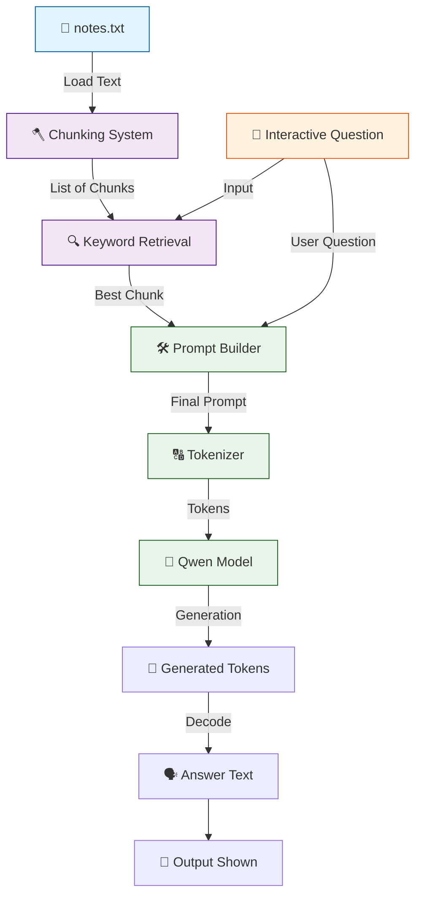

# 🤖 V3 RAG-style Closed Context QA Bot

## 🏗️ Summary

> [!NOTE]
> **Goal For This Version**  
> Build a **V3 RAG-style Closed Context QA Bot**. It implements a true **Retrieval-Augmented Generation (RAG)** pipeline by introducing **document chunking** and a basic **keyword-based retrieval system** to feed only the most relevant paragraph into the language model.

> [!IMPORTANT]
> **Changes from Last Version [v2] to Current Version [v3]**  
> * Introduced a chunking mechanism (`split("\n")`) to break the document into smaller pieces.
> * Added a keyword-overlap scoring loop to find the single most relevant chunk.
> * The prompt now receives only the `best_chunk` instead of the entire document.
> * Prints out the retrieved `best_chunk` before generating the final answer.

> [!IMPORTANT]
> **Why the changes were made (problem faced)**  
> In V2, the entire `notes.txt` file was shoved into the model's prompt. While this works for tiny notes, large documents will easily exceed the model's token context window, causing memory crashes or degraded, confused answers.

> [!IMPORTANT]
> **How the new version solves the problem**  
> By splitting the document into smaller chunks and retrieving only the highest-scoring chunk based on keyword matches, the prompt stays small, hyper-focused, and well within the model's memory limits. This is the foundational concept of real-world RAG systems.

---

## 🏗️ Architecture

### 🔄 Full System Flow



---

### 📦 Code

```python
from transformers import AutoTokenizer, AutoModelForCausalLM
import torch

model_name = "Qwen/Qwen2.5-0.5B-Instruct"

print("Loading tokenizer...")
tokenizer = AutoTokenizer.from_pretrained(model_name)

print("Loading model...")
model = AutoModelForCausalLM.from_pretrained(
    model_name,
    low_cpu_mem_usage=True
)

# Read file
with open("notes.txt", "r", encoding="utf-8") as f:
    text = f.read()

# 🆕 NEW IN V3: Split into paragraph chunks
chunks = [c.strip() for c in text.split("\n") if c.strip()]

question = input("Ask question: ").lower()

# 🆕 NEW IN V3: Score chunks by keyword overlap to find the best match
best_chunk = ""
best_score = -1

for chunk in chunks:
    score = 0
    for word in question.split():
        if word in chunk.lower():
            score += 1

    if score > best_score:
        best_score = score
        best_chunk = chunk

# 🆕 NEW IN V3: Inject only the best_chunk into the prompt
prompt = f"""
Answer only using the context below.
If answer not found, say Not found.

Context:
{best_chunk}

Question:
{question}

Answer:
"""

inputs = tokenizer(prompt, return_tensors="pt")

with torch.no_grad():
    outputs = model.generate(
        **inputs,
        max_new_tokens=50,
        do_sample=False
    )

answer = tokenizer.decode(outputs[0], skip_special_tokens=True)

# 🆕 NEW IN V3: Display the retrieved context for transparency
print("\nBEST CHUNK:\n")
print(best_chunk)

print("\nRESULT:\n")
print(answer)
```

---

## 🏗️ Stepwise Architecture

### 📦 Step 1 — Import Required Libraries

```python
from transformers import AutoTokenizer, AutoModelForCausalLM
import torch
```

> [!TIP]
> **Purpose:**
> * `transformers`: Loads the tokenizer and model.
> * `torch`: Runs inference operations.

---

### 🧠 Step 2 — Define Model

```python
model_name = "Qwen/Qwen2.5-0.5B-Instruct"
```

**Purpose:** Selects the language model used for answering.

---

### 🔠 Step 3 — Load Tokenizer

```python
print("Loading tokenizer...")
tokenizer = AutoTokenizer.from_pretrained(model_name)
```

**Purpose:** Tokenizer converts human text into tokens the model understands.

---

### 📥 Step 4 — Load Model

```python
print("Loading model...")
model = AutoModelForCausalLM.from_pretrained(
    model_name,
    low_cpu_mem_usage=True
)
```

**Purpose:** Loads the neural network weights into memory efficiently.

---

### 📚 Step 5 — Load External Knowledge Source

```python
with open("notes.txt", "r", encoding="utf-8") as f:
    text = f.read()
```

**Purpose:** Reads the raw text from the external `notes.txt` file.

---

### 🪓 Step 6 — Split Text Into Chunks (🆕 NEW IN V3)

```python
chunks = [c.strip() for c in text.split("\n") if c.strip()]
```

**Purpose:** Splits the massive block of text into smaller, individual paragraphs using newline characters (`\n`). This prepares the data so we only search for relevant pieces instead of reading everything at once.

---

### ❓ Step 7 — Accept Interactive User Question

```python
question = input("Ask question: ").lower()
```

**Purpose:** Pauses execution to take the user's question, converting it to lowercase for easier text matching later.

---

### 🔍 Step 8 — Retrieve Best Chunk via Keyword Overlap (🆕 NEW IN V3)

```python
best_chunk = ""
best_score = -1

for chunk in chunks:
    score = 0
    for word in question.split():
        if word in chunk.lower():
            score += 1

    if score > best_score:
        best_score = score
        best_chunk = chunk
```

**Purpose:** Loops through every paragraph. It scores each chunk by counting how many words from the user's question appear in it. The paragraph with the highest score is saved as `best_chunk`.

---

### 📝 Step 9 — Build Prompt with Best Chunk (🆕 NEW IN V3)

```python
prompt = f"""
Answer only using the context below.
If answer not found, say Not found.

Context:
{best_chunk}

Question:
{question}

Answer:
"""
```

**Purpose:** Combines rules, the user's question, and **only the highest-scoring chunk** (`best_chunk`). This protects the model from reading irrelevant data and saves token memory.

---

### 🔢 Step 10 — Convert Prompt to Tokens

```python
inputs = tokenizer(prompt, return_tensors="pt")
```

**Purpose:** Transforms prompt text into tensors for PyTorch.

---

### ⚙️ Step 11 — Generate Answer

```python
with torch.no_grad():
    outputs = model.generate(
        **inputs,
        max_new_tokens=50,
        do_sample=False
    )
```

**Purpose:** Model reads the prompt and generates a response based exclusively on the narrowed-down chunk.

---

### 🗣️ Step 12 — Decode Output

```python
answer = tokenizer.decode(outputs[0], skip_special_tokens=True)
```

**Purpose:** Converts generated tokens back into readable text.

---

### 🖨️ Step 13 — Print Context & Final Result (🆕 NEW IN V3)

```python
print("\nBEST CHUNK:\n")
print(best_chunk)

print("\nRESULT:\n")
print(answer)
```

**Purpose:** Prints the retrieved `best_chunk` so the user can see exactly what text the AI read, followed by the final generated answer.

---

## 🚀 Final One-Line Understanding

> **This architecture splits a file into pieces, uses basic word-matching to find the best piece, and feeds only that specific piece to the AI to answer the user's question.**
