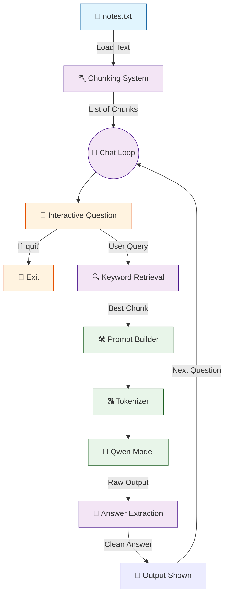

# 🤖 V4 RAG-style Closed Context QA Bot

## 🏗️ Summary

> [!NOTE]
> **Goal For This Version**  
> Build a **V4 RAG-style Closed Context QA Bot**. It introduces a **Continuous Chat Loop** and **Output Post-Processing** to create a true, fluid conversational experience rather than a one-off execution script.

> [!IMPORTANT]
> **Changes from Last Version [v3] to Current Version [v4]**  
> * Wrapped the question, retrieval, and generation logic inside a continuous `while True:` loop.
> * Added a `quit` command to gracefully exit the loop.
> * Added string manipulation to cleanly extract the model's response (`split("Answer:")[-1]`).
> * Removed the raw context printing to make the console output look like a clean chat interface.

> [!IMPORTANT]
> **Why the changes were made (problem faced)**  
> Imagine every time you wanted to ask your friend a question, they had to go to sleep, wake up, brush their teeth, eat breakfast, and then get ready — just to answer you. That is what V3 felt like. Every single time you ran the script, Python had to load the **entire AI model** from scratch off the hard drive into RAM. For the Qwen 0.5B model, this process takes a significant amount of time — sometimes over a minute.
>
> So in V3, if you asked a question and wanted to ask a follow-up, you had to close the program, wait for it to completely restart, wait for the model to slowly load back into memory, and *then* ask your next question. This made the bot practically unusable for any kind of real back-and-forth conversation.
>
> There was a second problem too. When older open-source models generate text, they sometimes don't cleanly separate their answer from the rest of the prompt. Instead of just printing `"The CEO is Alice."`, the model would spit out the entire prompt context — the instructions, the question, everything — and *then* the answer somewhere buried at the end. This made the output look like a wall of messy, confusing text rather than a friendly chat reply.

> [!IMPORTANT]
> **How the new version solves the problem**  
> The solution to the first problem is beautifully simple: we wrap the entire question-answer pipeline inside a `while True:` loop.
>
> Think of `while True:` like a revolving door. Once the model loads, it sits at the revolving door's entrance and says "I'm ready." You walk through, ask a question, get your answer, and the door brings you right back to the entrance for your next question. The model **never goes back to sleep**. It stays loaded in your computer's RAM the entire time, ready and waiting. This is the single biggest UX improvement in V4 — the bot transforms from a one-shot script into a true interactive chatbot.
>
> We also solve the messy output problem with a clever trick. We know that the prompt always ends with the word `"Answer:"` right before the model is supposed to speak. So after the model generates its full output string, we simply split that string on the word `"Answer:"` and take everything that comes *after* it. It's like tearing a piece of paper right after the word "Answer:" and throwing away the top half — only the relevant response remains. This gives the user a clean, professional-looking chat interface every single time.

---

## 📖 Terminologies

| Term | What It Means |
|---|---|
| **`while True:` Loop** | A loop in Python that runs forever unless explicitly broken. It is the mechanism that keeps the chatbot alive and waiting for the next question without needing to restart. |
| **RAM (Random Access Memory)** | The fast, temporary memory your computer uses to run programs. Loading the AI model into RAM once and keeping it there is much faster than reloading it from the hard drive every time. |
| **Model Loading** | The process of reading the AI model's billions of parameters (numerical weights) from storage into RAM so the computer can use them for computation. This is the slow part of startup. |
| **`break` Statement** | A command in Python that immediately stops a loop. The `quit` check uses `break` to exit the `while True:` loop gracefully. |
| **Answer Extraction** | The post-processing step where we take the model's raw output and trim away everything except the actual answer text. Done using Python's `.split("Answer:")[-1]`. |
| **`[-1]`** | Python list indexing that grabs the *last* item. When we split on `"Answer:"`, the piece after the last occurrence is the actual answer, so `[-1]` grabs exactly that. |
| **Post-Processing** | Any manipulation we do to the AI's raw output *after* it is generated. Cleaning up the text, removing the prompt echo, and trimming whitespace are all forms of post-processing. |

---

## 🏗️ Architecture

### 🔄 Full System Flow



---

### 📦 Code

```python
from transformers import AutoTokenizer, AutoModelForCausalLM
import torch

model_name = "Qwen/Qwen2.5-0.5B-Instruct"

print("Loading tokenizer...")
tokenizer = AutoTokenizer.from_pretrained(model_name)

print("Loading model...")
model = AutoModelForCausalLM.from_pretrained(
    model_name,
    low_cpu_mem_usage=True
)

# Read notes once
with open("notes.txt", "r", encoding="utf-8") as f:
    text = f.read()

# Make chunks (1 line = 1 chunk)
chunks = [c.strip() for c in text.split("\n") if c.strip()]

print("\nRAG Chatbot Ready!")
print("Type 'quit' to exit.\n")

# 🆕 NEW IN V4: Infinite chat loop
while True:
    question = input("You: ").strip()

    # 🆕 NEW IN V4: Exit condition
    if question.lower() == "quit":
        print("Goodbye.")
        break

    # Retrieve best chunk
    best_chunk = ""
    best_score = -1

    for chunk in chunks:
        score = 0
        for word in question.lower().split():
            if word in chunk.lower():
                score += 1

        if score > best_score:
            best_score = score
            best_chunk = chunk

    prompt = f"""
Answer only using the context below.


Context:
{best_chunk}

Question:
{question}

Answer:
"""

    inputs = tokenizer(prompt, return_tensors="pt")

    with torch.no_grad():
        outputs = model.generate(
            **inputs,
            max_new_tokens=40,
            do_sample=False
        )

    answer = tokenizer.decode(outputs[0], skip_special_tokens=True)

    # 🆕 NEW IN V4: Clean up the output by splitting at 'Answer:'
    if "Answer:" in answer:
        answer = answer.split("Answer:")[-1].strip()

    print("\nBot:", answer)
    print()
```

---

## 🏗️ Stepwise Architecture

### 📦 Step 1 — Import Required Libraries

```python
from transformers import AutoTokenizer, AutoModelForCausalLM
import torch
```

> [!TIP]
> **Purpose:**
> * `transformers`: Loads the tokenizer and model.
> * `torch`: Runs inference operations.

---

### 🧠 Step 2 — Define Model

```python
model_name = "Qwen/Qwen2.5-0.5B-Instruct"
```

**Purpose:** Selects the language model used for answering.

---

### 🔠 Step 3 — Load Tokenizer & Model

```python
print("Loading tokenizer...")
tokenizer = AutoTokenizer.from_pretrained(model_name)

print("Loading model...")
model = AutoModelForCausalLM.from_pretrained(
    model_name,
    low_cpu_mem_usage=True
)
```

**Purpose:** Loads the neural network weights into memory efficiently.

---

### 📚 Step 4 — Load Knowledge Source & Chunk Text

```python
with open("notes.txt", "r", encoding="utf-8") as f:
    text = f.read()

chunks = [c.strip() for c in text.split("\n") if c.strip()]
```

**Purpose:** Reads the raw text from the external file and splits it into individual paragraph chunks. *Note: This happens outside the chat loop so we only do it once!*

---

### 🔄 Step 5 — Initialize Continuous Chat Loop (🆕 NEW IN V4)

```python
print("\nRAG Chatbot Ready!")
print("Type 'quit' to exit.\n")

while True:
    question = input("You: ").strip()
    
    if question.lower() == "quit":
        print("Goodbye.")
        break
```

**Purpose:** Enters an infinite `while True:` loop. This prevents the script from closing, allowing the user to rapidly ask questions. It also provides a manual `quit` command to gracefully break the loop and exit the program.

---

### 🔍 Step 6 — Retrieve Best Chunk

```python
    best_chunk = ""
    best_score = -1

    for chunk in chunks:
        score = 0
        for word in question.lower().split():
            if word in chunk.lower():
                score += 1

        if score > best_score:
            best_score = score
            best_chunk = chunk
```

**Purpose:** Dynamically scores each chunk against the new question asked in the current loop iteration.

---

### 📝 Step 7 — Build Prompt with Best Chunk

```python
    prompt = f"""
Answer only using the context below.


Context:
{best_chunk}

Question:
{question}

Answer:
"""
```

**Purpose:** Combines rules, the user's question, and the highest-scoring chunk.

---

### 🔢 Step 8 — Convert Prompt to Tokens & Generate Answer

```python
    inputs = tokenizer(prompt, return_tensors="pt")

    with torch.no_grad():
        outputs = model.generate(
            **inputs,
            max_new_tokens=40,
            do_sample=False
        )
```

**Purpose:** Model reads the prompt and generates a response based exclusively on the narrowed-down chunk.

---

### 🧹 Step 9 — Decode Output & Extract Clean Answer (🆕 NEW IN V4)

```python
    answer = tokenizer.decode(outputs[0], skip_special_tokens=True)

    if "Answer:" in answer:
        answer = answer.split("Answer:")[-1].strip()
```

**Purpose:** Often, the language model outputs the entire prompt context back to you before providing its answer. By splitting the string at the exact word `"Answer:"` and taking everything after it (`[-1]`), we strip away the messy prompt and isolate only the AI's pure response.

---

### 🖨️ Step 10 — Print Final Result & Loop

```python
    print("\nBot:", answer)
    print()
```

**Purpose:** Prints the clean answer prefixed with `"Bot:"` to simulate a chat interface. The script then automatically jumps back to Step 5, waiting for the user's next input!

---

## 🚀 Final One-Line Understanding

> **This architecture wraps the retrieval and generation logic inside a continuous `while True` loop and uses string manipulation to ensure a clean, fluid conversational chatbot experience.**
