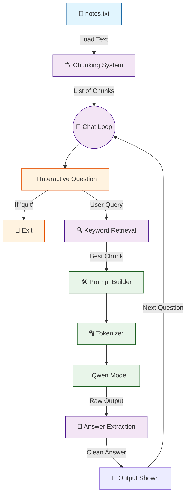

# 🤖 V4 RAG-style Closed Context QA Bot

## 🏗️ Summary

> [!NOTE]
> **Goal For This Version**  
> Build a **V4 RAG-style Closed Context QA Bot**. It introduces a **Continuous Chat Loop** and **Output Post-Processing** to create a true, fluid conversational experience rather than a one-off execution script.

> [!IMPORTANT]
> **Changes from Last Version [v3] to Current Version [v4]**  
> * Wrapped the question, retrieval, and generation logic inside a continuous `while True:` loop.
> * Added a `quit` command to gracefully exit the loop.
> * Added string manipulation to cleanly extract the model's response (`split("Answer:")[-1]`).
> * Removed the raw context printing to make the console output look like a clean chat interface.

> [!IMPORTANT]
> **Why the changes were made (problem faced)**  
> In V3, the script would answer a single question and instantly terminate. You had to constantly restart the Python script and wait for the model to slowly load into memory just to ask a follow-up question. Furthermore, open-source models sometimes echo the prompt back to the user, making the output look messy.

> [!IMPORTANT]
> **How the new version solves the problem**  
> The `while True:` loop keeps the model loaded in memory, allowing for an endless, rapid chatbot experience. By extracting only the text that comes *after* "Answer:", we guarantee a clean, user-friendly reply every single time.

---

## 🏗️ Architecture

### 🔄 Full System Flow



---

### 📦 Code

```python
from transformers import AutoTokenizer, AutoModelForCausalLM
import torch

model_name = "Qwen/Qwen2.5-0.5B-Instruct"

print("Loading tokenizer...")
tokenizer = AutoTokenizer.from_pretrained(model_name)

print("Loading model...")
model = AutoModelForCausalLM.from_pretrained(
    model_name,
    low_cpu_mem_usage=True
)

# Read notes once
with open("notes.txt", "r", encoding="utf-8") as f:
    text = f.read()

# Make chunks (1 line = 1 chunk)
chunks = [c.strip() for c in text.split("\n") if c.strip()]

print("\nRAG Chatbot Ready!")
print("Type 'quit' to exit.\n")

# 🆕 NEW IN V4: Infinite chat loop
while True:
    question = input("You: ").strip()

    # 🆕 NEW IN V4: Exit condition
    if question.lower() == "quit":
        print("Goodbye.")
        break

    # Retrieve best chunk
    best_chunk = ""
    best_score = -1

    for chunk in chunks:
        score = 0
        for word in question.lower().split():
            if word in chunk.lower():
                score += 1

        if score > best_score:
            best_score = score
            best_chunk = chunk

    prompt = f"""
Answer only using the context below.


Context:
{best_chunk}

Question:
{question}

Answer:
"""

    inputs = tokenizer(prompt, return_tensors="pt")

    with torch.no_grad():
        outputs = model.generate(
            **inputs,
            max_new_tokens=40,
            do_sample=False
        )

    answer = tokenizer.decode(outputs[0], skip_special_tokens=True)

    # 🆕 NEW IN V4: Clean up the output by splitting at 'Answer:'
    if "Answer:" in answer:
        answer = answer.split("Answer:")[-1].strip()

    print("\nBot:", answer)
    print()
```

---

## 🏗️ Stepwise Architecture

### 📦 Step 1 — Import Required Libraries

```python
from transformers import AutoTokenizer, AutoModelForCausalLM
import torch
```

> [!TIP]
> **Purpose:**
> * `transformers`: Loads the tokenizer and model.
> * `torch`: Runs inference operations.

---

### 🧠 Step 2 — Define Model

```python
model_name = "Qwen/Qwen2.5-0.5B-Instruct"
```

**Purpose:** Selects the language model used for answering.

---

### 🔠 Step 3 — Load Tokenizer & Model

```python
print("Loading tokenizer...")
tokenizer = AutoTokenizer.from_pretrained(model_name)

print("Loading model...")
model = AutoModelForCausalLM.from_pretrained(
    model_name,
    low_cpu_mem_usage=True
)
```

**Purpose:** Loads the neural network weights into memory efficiently.

---

### 📚 Step 4 — Load Knowledge Source & Chunk Text

```python
with open("notes.txt", "r", encoding="utf-8") as f:
    text = f.read()

chunks = [c.strip() for c in text.split("\n") if c.strip()]
```

**Purpose:** Reads the raw text from the external file and splits it into individual paragraph chunks. *Note: This happens outside the chat loop so we only do it once!*

---

### 🔄 Step 5 — Initialize Continuous Chat Loop (🆕 NEW IN V4)

```python
print("\nRAG Chatbot Ready!")
print("Type 'quit' to exit.\n")

while True:
    question = input("You: ").strip()
    
    if question.lower() == "quit":
        print("Goodbye.")
        break
```

**Purpose:** Enters an infinite `while True:` loop. This prevents the script from closing, allowing the user to rapidly ask questions. It also provides a manual `quit` command to gracefully break the loop and exit the program.

---

### 🔍 Step 6 — Retrieve Best Chunk

```python
    best_chunk = ""
    best_score = -1

    for chunk in chunks:
        score = 0
        for word in question.lower().split():
            if word in chunk.lower():
                score += 1

        if score > best_score:
            best_score = score
            best_chunk = chunk
```

**Purpose:** Dynamically scores each chunk against the new question asked in the current loop iteration.

---

### 📝 Step 7 — Build Prompt with Best Chunk

```python
    prompt = f"""
Answer only using the context below.


Context:
{best_chunk}

Question:
{question}

Answer:
"""
```

**Purpose:** Combines rules, the user's question, and the highest-scoring chunk.

---

### 🔢 Step 8 — Convert Prompt to Tokens & Generate Answer

```python
    inputs = tokenizer(prompt, return_tensors="pt")

    with torch.no_grad():
        outputs = model.generate(
            **inputs,
            max_new_tokens=40,
            do_sample=False
        )
```

**Purpose:** Model reads the prompt and generates a response based exclusively on the narrowed-down chunk.

---

### 🧹 Step 9 — Decode Output & Extract Clean Answer (🆕 NEW IN V4)

```python
    answer = tokenizer.decode(outputs[0], skip_special_tokens=True)

    if "Answer:" in answer:
        answer = answer.split("Answer:")[-1].strip()
```

**Purpose:** Often, the language model outputs the entire prompt context back to you before providing its answer. By splitting the string at the exact word `"Answer:"` and taking everything after it (`[-1]`), we strip away the messy prompt and isolate only the AI's pure response.

---

### 🖨️ Step 10 — Print Final Result & Loop

```python
    print("\nBot:", answer)
    print()
```

**Purpose:** Prints the clean answer prefixed with `"Bot:"` to simulate a chat interface. The script then automatically jumps back to Step 5, waiting for the user's next input!

---

## 🚀 Final One-Line Understanding

> **This architecture wraps the retrieval and generation logic inside a continuous `while True` loop and uses string manipulation to ensure a clean, fluid conversational chatbot experience.**
