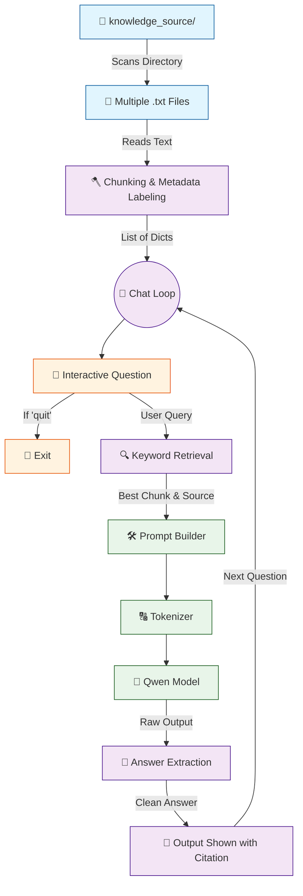

# 🤖 V5 RAG-style Closed Context QA Bot

## 🏗️ Summary

> [!NOTE]
> **Goal For This Version**  
> Build a **V5 RAG-style Closed Context QA Bot**. This version upgrades the bot into a multi-document system by introducing **directory parsing** and **source citation**. It loads an entire folder of files and tells the user exactly which file the answer came from.

> [!IMPORTANT]
> **Changes from Last Version [v4] to Current Version [v5]**  
> * Imported the `os` module to iterate through all `.txt` files in a `knowledge_source` folder.
> * Upgraded the `chunks` data structure from a list of strings to a list of dictionaries containing metadata (`{"source": filename, "text": line}`).
> * Upgraded the retrieval loop to track the `best_source` alongside the best scoring text.
> * Added a citation output `print(f"\nSource: {best_source}")` before delivering the AI's answer.

> [!IMPORTANT]
> **Why the changes were made (problem faced)**  
> V4 was a single-file bot. Imagine a librarian who can only help you if all the world's knowledge is written into one big notebook. The moment you need information from a second book, they are helpless. That is the limitation V4 had — it was hardcoded to read a single `notes.txt` file.
>
> In the real world, a company's knowledge base isn't one file. It's dozens or even hundreds of files — an HR policy document, a technical specification, an employee profiles directory, a product manual. Having to manually merge all of these into one giant `notes.txt` every time you add new information is tedious, error-prone, and does not scale at all.
>
> The second problem was accountability. When V4 gave you an answer, you had no idea *where* that answer came from. Did it come from the HR policy? The technical spec? The employee profile? You couldn't tell. This is a serious issue in professional environments where you need to be able to fact-check and audit the AI's responses. A bot that can't show its sources is a bot you can't fully trust.

> [!IMPORTANT]
> **How the new version solves the problem**  
> V5 solves both problems in one elegant upgrade. Instead of opening a single hardcoded file, the bot now looks inside an entire folder called `knowledge_source/`. It uses Python's `os.listdir()` to get a list of every file in that directory, loops through each one, reads it, chunks it, and adds those chunks to the master knowledge pool.
>
> This means adding new knowledge to the bot is now as simple as dropping a new `.txt` file into the folder. No code changes required — just add the file and restart. The bot automatically discovers and ingests it on the next startup.
>
> To solve the accountability problem, we upgrade our chunk data structure. Previously, each chunk was just a plain string of text. Now, each chunk is stored as a **Python dictionary** — a container that holds multiple pieces of information together, like a labelled box. Each box has two compartments: `"text"` (the actual paragraph content) and `"source"` (the filename it came from). When the bot finds the best matching chunk and generates its answer, it can now look at the `"source"` field and tell the user exactly which file it read. This citation feature transforms the bot from a black box into a transparent, auditable tool.

---

## 📖 Terminologies

| Term | What It Means |
|---|---|
| **`os` module** | A Python library that lets your code interact with the operating system — things like listing files in a folder, building file paths, and checking if a file exists. |
| **`os.listdir()`** | A function that returns a list of all file and folder names inside a given directory. Used here to discover all `.txt` files automatically. |
| **Dictionary (Python)** | A data structure that stores pairs of keys and values, like `{"source": "hr.txt", "text": "..."}`. It lets you attach labels to data so you can look it up by name later. |
| **Metadata** | Extra information attached to a piece of data that describes it. The `"source"` filename is metadata — it describes *where* the text chunk came from without being part of the text itself. |
| **Knowledge Base** | The collection of all documents and information that the RAG bot uses to answer questions. In our case, it's the `knowledge_source/` folder. |
| **Citation** | Telling the user which specific document the answer came from. Like a bibliography in an essay — it shows your work and allows fact-checking. |
| **`os.path.join()`** | A function that safely combines a folder path and a filename into a full file path that works on any operating system. |
| **Auditability** | The ability to trace back where a result came from and verify its accuracy. Source citations make the bot auditable. |

---

## 🏗️ Architecture

### 🔄 Full System Flow



---

### 📦 Code

```python
from transformers import AutoTokenizer, AutoModelForCausalLM
import torch
import os

model_name = "Qwen/Qwen2.5-0.5B-Instruct"

print("Loading tokenizer...")
tokenizer = AutoTokenizer.from_pretrained(model_name)

print("Loading model...")
model = AutoModelForCausalLM.from_pretrained(
    model_name,
    low_cpu_mem_usage=True
)

# 🆕 NEW IN V5: Load all chunks from data folder with metadata
chunks = []
folder = "knowledge_source"

for filename in os.listdir(folder):
    path = os.path.join(folder, filename)

    if filename.endswith(".txt"):
        with open(path, "r", encoding="utf-8") as f:
            text = f.read()

        for line in text.split("\n"):
            line = line.strip()
            if line:
                chunks.append({
                    "source": filename,
                    "text": line
                })

print("\nRAG Chatbot Ready!")
print("Type 'quit' to exit.\n")

while True:
    question = input("You: ").strip()

    if question.lower() == "quit":
        print("Goodbye.")
        break

    # 🆕 NEW IN V5: Track the source filename as well
    best_chunk = ""
    best_source = ""
    best_score = -1

    for item in chunks:
        chunk = item["text"]

        score = 0
        for word in question.lower().split():
            if word in chunk.lower():
                score += 1

        if score > best_score:
            best_score = score
            best_chunk = chunk
            best_source = item["source"]

    prompt = f"""
Answer only using the context below.

Context:
{best_chunk}

Question:
{question}

Answer:
"""

    inputs = tokenizer(prompt, return_tensors="pt")

    with torch.no_grad():
        outputs = model.generate(
            **inputs,
            max_new_tokens=40,
            do_sample=False
        )

    answer = tokenizer.decode(outputs[0], skip_special_tokens=True)

    if "Answer:" in answer:
        answer = answer.split("Answer:")[-1].strip()

    # 🆕 NEW IN V5: Print citation source
    print(f"\nSource: {best_source}")
    print("Bot:", answer)
    print()
```

---

## 🏗️ Stepwise Architecture

### 📦 Step 1 — Import Required Libraries

```python
from transformers import AutoTokenizer, AutoModelForCausalLM
import torch
import os
```

> [!TIP]
> **Purpose:**
> * `transformers`: Loads the tokenizer and model.
> * `torch`: Runs inference operations.
> * `os` (**🆕 NEW**): Allows the script to interact with the operating system and read directories.

---

### 🧠 Step 2 — Define Model

```python
model_name = "Qwen/Qwen2.5-0.5B-Instruct"
```

**Purpose:** Selects the language model used for answering.

---

### 🔠 Step 3 — Load Tokenizer & Model

```python
print("Loading tokenizer...")
tokenizer = AutoTokenizer.from_pretrained(model_name)

print("Loading model...")
model = AutoModelForCausalLM.from_pretrained(
    model_name,
    low_cpu_mem_usage=True
)
```

**Purpose:** Loads the neural network weights into memory efficiently.

---

### 📁 Step 4 — Load Directory & Extract Metadata Chunks (🆕 NEW IN V5)

```python
chunks = []
folder = "knowledge_source"

for filename in os.listdir(folder):
    path = os.path.join(folder, filename)

    if filename.endswith(".txt"):
        with open(path, "r", encoding="utf-8") as f:
            text = f.read()

        for line in text.split("\n"):
            line = line.strip()
            if line:
                chunks.append({
                    "source": filename,
                    "text": line
                })
```

**Purpose:** Iterates through every `.txt` file inside the `knowledge_source` folder. Instead of just saving strings, it creates a dictionary mapping the text chunk directly to the filename it came from (`"source": filename`). This creates a searchable **metadata database**.

---

### 🔄 Step 5 — Initialize Continuous Chat Loop

```python
print("\nRAG Chatbot Ready!")
print("Type 'quit' to exit.\n")

while True:
    question = input("You: ").strip()
    
    if question.lower() == "quit":
        print("Goodbye.")
        break
```

**Purpose:** Enters an infinite `while True:` loop for fluid conversational flow.

---

### 🔍 Step 6 — Retrieve Best Chunk & Source Citation (🆕 NEW IN V5)

```python
    best_chunk = ""
    best_source = ""
    best_score = -1

    for item in chunks:
        chunk = item["text"]

        score = 0
        for word in question.lower().split():
            if word in chunk.lower():
                score += 1

        if score > best_score:
            best_score = score
            best_chunk = chunk
            best_source = item["source"]
```

**Purpose:** The loop now extracts the text from the `item` dictionary. When it finds the highest scoring text, it saves *both* the `best_chunk` (for the prompt) and the `best_source` (for citation display).

---

### 📝 Step 7 — Build Prompt with Best Chunk

```python
    prompt = f"""
Answer only using the context below.

Context:
{best_chunk}

Question:
{question}

Answer:
"""
```

**Purpose:** Combines rules, the user's question, and the highest-scoring chunk.

---

### 🔢 Step 8 — Convert Prompt to Tokens & Generate Answer

```python
    inputs = tokenizer(prompt, return_tensors="pt")

    with torch.no_grad():
        outputs = model.generate(
            **inputs,
            max_new_tokens=40,
            do_sample=False
        )
```

**Purpose:** Model reads the prompt and generates a response exclusively from the best chunk.

---

### 🧹 Step 9 — Decode Output & Extract Clean Answer

```python
    answer = tokenizer.decode(outputs[0], skip_special_tokens=True)

    if "Answer:" in answer:
        answer = answer.split("Answer:")[-1].strip()
```

**Purpose:** Strips away the messy prompt context and isolates only the AI's generated response.

---

### 🖨️ Step 10 — Print Final Result with Citation (🆕 NEW IN V5)

```python
    print(f"\nSource: {best_source}")
    print("Bot:", answer)
    print()
```

**Purpose:** Prints the exact filename (`best_source`) that the model used to derive its answer before showing the response. This guarantees transparency and allows the user to audit the bot's accuracy!

---

## 🚀 Final One-Line Understanding

> **This architecture scales the retrieval system to handle multiple files in a directory, storing them as dictionaries so it can explicitly cite the source document when answering a user's question.**
