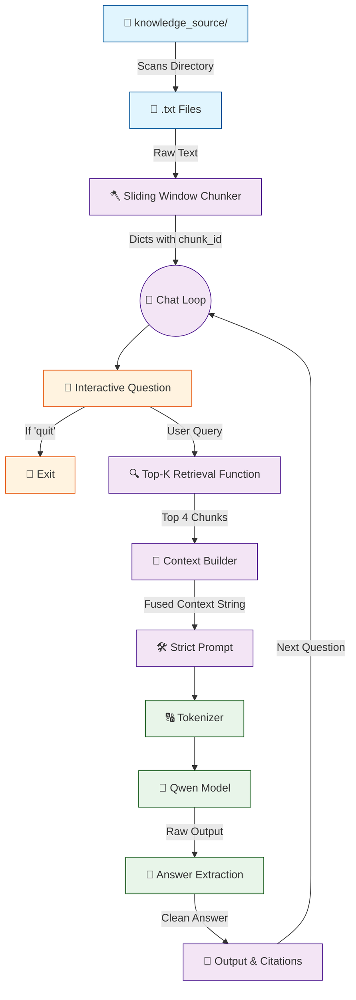

# 🤖 V6 RAG-style Closed Context QA Bot

## 🏗️ Summary

> [!NOTE]
> **Goal For This Version**  
> Build a **V6 RAG-style Closed Context QA Bot**. This version graduates the bot into an **Advanced RAG Pipeline**. It implements robust sliding-window chunking, Top-K multi-document retrieval, strict anti-hallucination prompting, and detailed backend telemetry.

> [!IMPORTANT]
> **Changes from Last Version [v5] to Current Version [v6]**  
> * Replaced single-line splits with a `chunk_text()` sliding window algorithm (250 words, 80 word overlap).
> * Upgraded retrieval to pull the **Top-K** ($K=4$) highest scoring chunks instead of just one.
> * Updated context builder to combine multiple chunks into one string with metadata tags `[Source: X | chunk Y]`.
> * Re-engineered the prompt into a "Strict Assistant" framework to prevent hallucinations.
> * Added heavy telemetry (`time.time()`) to track execution speeds, context sizes, and token counts.

> [!IMPORTANT]
> **Why the changes were made (problem faced)**  
> V5 had four separate problems that all appeared at the same time as the knowledge base grew larger and more complex.
>
> **Problem 1 — Broken sentences.** V5 split text by individual lines (`text.split("\n")`). But well-written documents have paragraphs, not just single sentences per line. When a paragraph spans two lines, splitting by newline rips it in half. The AI would receive half a fact — like reading a textbook where every other sentence is missing. The retrieved chunk was often incomplete and made the answer unreliable.
>
> **Problem 2 — Only one chunk.** V5 retrieved only the single best-matching chunk. But many questions require synthesizing information from multiple places. Imagine asking *"What is the company's remote work and salary policy?"* — that information might live in two different files. Giving the model only one chunk means it can only answer half the question. The other half of the answer simply does not exist in its context.
>
> **Problem 3 — Hallucinations under pressure.** When we started feeding the model more content (multiple chunks), the raw, unstructured prompt became confusing. The model had no strict rules about what to do when it didn't know something, so it made answers up. This is called hallucination, and it is the most dangerous failure mode of any AI system.
>
> **Problem 4 — The frozen screen problem.** As the knowledge base grew and retrieval + generation took longer, the terminal would go completely silent for 30-60 seconds. Users had no way to tell if the program crashed or if it was simply thinking. This made the tool feel broken even when it was working perfectly.

> [!IMPORTANT]
> **How the new version solves the problem**  
> V6 is a significant architectural upgrade that tackles all four problems simultaneously.
>
> **Solution 1 — Sliding Window Chunker.** Instead of splitting by newlines, we introduce a proper `chunk_text()` function. It operates at the word level and uses a "sliding window" strategy. Picture a physical window sliding along a very long sentence written on the wall. The window shows 250 words at a time. When you slide it forward, you don't jump all the way to a new position — you move it by just 170 words, leaving 80 words visible from the previous position. This overlap of 80 words acts as a bridge between chunks, ensuring that any sentence or idea that falls near a boundary is still fully captured in at least one of the two chunks on either side.
>
> **Solution 2 — Top-K Retrieval.** Instead of keeping only the single best match, the retrieval function now scores all chunks, sorts them, and returns the top K (where K=4 by default). All four chunks are then concatenated into a single context string and injected into the prompt together. Now the model can read from multiple parts of multiple files in one go.
>
> **Solution 3 — Strict Prompt Engineering.** The prompt is rewritten to give the model very clear rules: answer using only the provided context, and if the answer isn't there, say *"I don't know based on the provided data."* Giving the model an explicit "out" — a safe thing to say when it genuinely doesn't know — dramatically reduces hallucination. The model no longer feels compelled to guess.
>
> **Solution 4 — Telemetry Logging.** We add `time.time()` calls around every major operation. Every time the bot does something — loading, chunking, retrieving, generating — it prints a timestamped status message. The user can now watch the bot's thought process in real-time, line by line, and never wonder if it has crashed.

---

## 📖 Terminologies

| Term | What It Means |
|---|---|
| **Sliding Window Chunking** | A way of dividing text into chunks where each new chunk overlaps slightly with the previous one. This overlap prevents important sentences from being cut in half at a boundary. |
| **Overlap** | The number of words shared between two consecutive chunks. An overlap of 80 means the last 80 words of one chunk become the first 80 words of the next chunk. |
| **Top-K Retrieval** | Instead of finding just the single best result, Top-K returns the K highest-scoring results. K=4 means we retrieve the 4 most relevant chunks. |
| **Context String** | The combined block of text (made from all retrieved chunks) that gets injected into the prompt for the AI to read and answer from. |
| **Hallucination** | When an AI model generates text that sounds confident and plausible but is factually incorrect or completely made up. It's the AI equivalent of confidently lying. |
| **Strict Prompt** | A prompt that includes explicit rules and constraints for the model. For example: "Answer ONLY from the context. If you don't know, say X." This reduces hallucination and keeps the model grounded. |
| **Telemetry** | Real-time logging and measurement of a system's internal operations. Here, it means printing timestamps and status messages so you can see what the bot is doing at every step. |
| **`time.time()`** | A Python function that returns the current time in seconds. By calling it before and after an operation and subtracting, you get how long that operation took. |
| **`set()`** | A Python data structure that automatically removes duplicates. Used to collect all source filenames and print each one only once, even if multiple chunks came from the same file. |

---

## 🏗️ Architecture

### 🔄 Full System Flow



---

### 📦 Code

```python
from transformers import AutoTokenizer, AutoModelForCausalLM
import torch
import os
import time

model_name = "Qwen/Qwen2.5-0.5B-Instruct"

# -----------------------------
# 🟢 LOADING PHASE
# -----------------------------

print("🔄 Loading tokenizer...")
tokenizer = AutoTokenizer.from_pretrained(model_name)
print("✅ Tokenizer loaded")

print("🔄 Loading model (this may take time)...")
model = AutoModelForCausalLM.from_pretrained(
    model_name,
    low_cpu_mem_usage=True
)
print("✅ Model loaded")


# -----------------------------
# 🟢 CHUNKING FUNCTION
# -----------------------------

def chunk_text(text, chunk_size=250, overlap=80):
    words = text.split()
    chunks = []

    start = 0

    while start < len(words):
        end = start + chunk_size
        chunk = " ".join(words[start:end]).strip()

        if chunk:
            chunks.append(chunk)

        start += chunk_size - overlap

    return chunks


# -----------------------------
# 🟢 DATA LOADING
# -----------------------------

print("\n📂 Loading knowledge base...")

chunks = []
folder = "knowledge_source"

file_count = 0

for filename in os.listdir(folder):
    if not filename.endswith(".txt"):
        continue

    file_count += 1
    print(f"📄 Reading file: {filename}")

    path = os.path.join(folder, filename)

    with open(path, "r", encoding="utf-8") as f:
        text = f.read()

    print(f"✂ Chunking file: {filename}")
    text_chunks = chunk_text(text)

    for i, chunk in enumerate(text_chunks):
        chunks.append({
            "source": filename,
            "chunk_id": i,
            "text": chunk
        })

print(f"✅ Loaded {len(chunks)} chunks from {file_count} files")


# -----------------------------
# 🟢 RETRIEVAL (WITH LOGS)
# -----------------------------

def retrieve_top_k(question, k=2):
    print("\n🔍 Retrieving relevant chunks...")

    start_time = time.time()

    scored = []
    q_words = set(question.lower().split())

    print(f"🧠 Query words: {q_words}")

    for i, item in enumerate(chunks):
        chunk = item["text"].lower()

        score = sum(1 for word in q_words if word in chunk)

        scored.append((score, item))

        # lightweight progress indicator
        if i % 500 == 0 and i > 0:
            print(f"   ...scanned {i}/{len(chunks)} chunks")

    print("📊 Sorting results...")

    scored.sort(key=lambda x: x[0], reverse=True)

    top_k = [item for score, item in scored[:k] if score > 0]

    print(f"✅ Retrieved {len(top_k)} relevant chunks in {time.time() - start_time:.2f}s")

    return top_k


# -----------------------------
# 🟢 CHAT LOOP
# -----------------------------

print("\n🤖 RAG Chatbot Ready! Type 'quit' to exit.\n")

while True:
    question = input("You: ").strip()

    if question.lower() == "quit":
        print("👋 Goodbye.")
        break

    print("\n==============================")
    print("📥 QUESTION RECEIVED")
    print("==============================")

    print("🧾 Question:", question)

    # -------------------------
    # RETRIEVAL PHASE
    # -------------------------

    top_chunks = retrieve_top_k(question, k=4)

    # -------------------------
    # CONTEXT BUILDING
    # -------------------------

    print("\n🧱 Building context...")

    context = ""
    sources = set()

    for c in top_chunks:
        context += f"\n[Source: {c['source']} | chunk {c['chunk_id']}]\n{c['text']}\n"
        sources.add(c["source"])

    print(f"📚 Context size: {len(context)} characters")

    # -------------------------
    # PROMPT CREATION
    # -------------------------

    print("\n🧠 Creating prompt...")

    prompt = f"""
You are a strict assistant.

Answer ONLY using the context below.
If the answer is not in the context, say: "I don't know based on the provided data."

Context:
{context}

Question:
{question}

Answer:
"""

    print(f"📏 Prompt length: {len(prompt)} characters")

    # -------------------------
    # TOKENIZATION
    # -------------------------

    print("\n🔤 Tokenizing input...")

    inputs = tokenizer(prompt, return_tensors="pt")

    print(f"🧮 Input tokens: {inputs['input_ids'].shape[1]}")

    # -------------------------
    # GENERATION
    # -------------------------

    print("\n⚙ Generating response (model is thinking)...")

    start = time.time()

    with torch.no_grad():
        outputs = model.generate(
            **inputs,
            max_new_tokens=120,
            do_sample=False
        )

    print(f"✅ Generation done in {time.time() - start:.2f}s")

    # -------------------------
    # DECODING
    # -------------------------

    print("\n📝 Decoding output...")

    answer = tokenizer.decode(outputs[0], skip_special_tokens=True)

    if "Answer:" in answer:
        answer = answer.split("Answer:")[-1].strip()

    # -------------------------
    # OUTPUT
    # -------------------------

    print("\n==============================")
    print("📌 FINAL RESULT")
    print("==============================")

    print("\n📁 Sources:", ", ".join(sources))
    print("\n🤖 Bot:", answer)
    print("\n")
```

---

## 🏗️ Stepwise Architecture

### 📦 Step 1 — Import Libraries

```python
from transformers import AutoTokenizer, AutoModelForCausalLM
import torch
import os
import time
```

> [!TIP]
> **Purpose:**
> * `time` (**🆕 NEW IN V6**): Added to measure execution speeds for retrieval and generation telemetry.

---

### 🔠 Step 2 — Load Tokenizer & Model

```python
print("🔄 Loading tokenizer...")
tokenizer = AutoTokenizer.from_pretrained(model_name)

print("🔄 Loading model (this may take time)...")
model = AutoModelForCausalLM.from_pretrained(
    model_name,
    low_cpu_mem_usage=True
)
```

**Purpose:** Loads AI weights. Added console print statements so the user knows what is happening during the long loading phase.

---

### 🪓 Step 3 — Sliding Window Chunking Function (🆕 NEW IN V6)

```python
def chunk_text(text, chunk_size=250, overlap=80):
    words = text.split()
    chunks = []
    start = 0

    while start < len(words):
        end = start + chunk_size
        chunk = " ".join(words[start:end]).strip()
        if chunk:
            chunks.append(chunk)
        start += chunk_size - overlap

    return chunks
```

**Purpose:** Prevents context loss by cutting the text into 250-word blocks, while carrying over 80 words into the next block. This "overlap" ensures sentences and ideas aren't sliced in half.

---

### 📁 Step 4 — Load Directory & Apply Sliding Window (🆕 NEW IN V6)

```python
    print(f"✂ Chunking file: {filename}")
    text_chunks = chunk_text(text)

    for i, chunk in enumerate(text_chunks):
        chunks.append({
            "source": filename,
            "chunk_id": i,
            "text": chunk
        })
```

**Purpose:** Iterates through the `.txt` files and passes the text through the new `chunk_text()` algorithm. It now saves a `chunk_id` alongside the filename to pinpoint exactly which part of the file the data came from.

---

### 🔍 Step 5 — Top-K Retrieval Function (🆕 NEW IN V6)

```python
def retrieve_top_k(question, k=2):
    # Keyword scoring logic...
    scored.sort(key=lambda x: x[0], reverse=True)
    top_k = [item for score, item in scored[:k] if score > 0]
    return top_k
```

**Purpose:** Instead of finding a single best chunk, this function ranks all chunks and returns an array of the top $K$ most relevant chunks. It also utilizes `time.time()` to log how fast the search happens.

---

### 🔄 Step 6 — Chat Loop & Execute Retrieval

```python
    # -------------------------
    # RETRIEVAL PHASE
    # -------------------------
    top_chunks = retrieve_top_k(question, k=4)
```

**Purpose:** In the continuous chat loop, we pass the user's question to the new retrieval function, asking it to pull the top 4 chunks (`k=4`) from the database.

---

### 🧱 Step 7 — Build Multi-Chunk Context (🆕 NEW IN V6)

```python
    context = ""
    sources = set()

    for c in top_chunks:
        context += f"\n[Source: {c['source']} | chunk {c['chunk_id']}]\n{c['text']}\n"
        sources.add(c["source"])
```

**Purpose:** Iterates over the 4 retrieved chunks and stitches them into a single massive `context` string. It injects explicit metadata tags (like `[Source: hr.txt | chunk 2]`) directly into the text so the AI knows the boundaries and origin of each block.

---

### 📝 Step 8 — Strict System Prompt Creation (🆕 NEW IN V6)

```python
    prompt = f"""
You are a strict assistant.

Answer ONLY using the context below.
If the answer is not in the context, say: "I don't know based on the provided data."

Context:
{context}
...
"""
```

**Purpose:** Because the model is now receiving a large, potentially messy multi-chunk context, it needs strict rules. Giving the model a designated "out" ("I don't know") drastically reduces hallucinations.

---

### ⚙️ Step 9 — Generate Answer with Telemetry

```python
    start = time.time()

    with torch.no_grad():
        outputs = model.generate(
            **inputs,
            max_new_tokens=120,
            do_sample=False
        )

    print(f"✅ Generation done in {time.time() - start:.2f}s")
```

**Purpose:** The model generates the answer based on the 4 chunks. `max_new_tokens` was increased to 120 to allow for larger, synthesized answers. The `start` and `time.time()` logs tell the user exactly how many seconds it took to think.

---

### 🖨️ Step 10 — Output Clean Answer & Multiple Citations

```python
    print("\n📁 Sources:", ", ".join(sources))
    print("\n🤖 Bot:", answer)
```

**Purpose:** Prints the AI's response alongside a deduplicated list (`set()`) of all the distinct files it used to build its answer.

---

## 🚀 Final One-Line Understanding

> **This architecture uses sliding window chunking and Top-K retrieval to feed multiple pieces of context into a strictly prompted model, tracked by extensive telemetry logs.**
