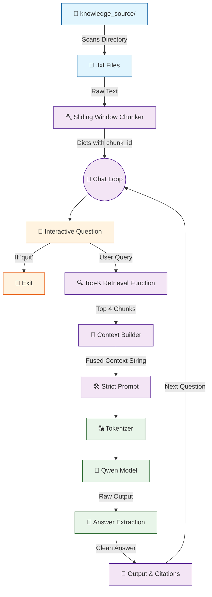

# 🤖 V6 RAG-style Closed Context QA Bot

## 🏗️ Summary

> [!NOTE]
> **Goal For This Version**  
> Build a **V6 RAG-style Closed Context QA Bot**. This version graduates the bot into an **Advanced RAG Pipeline**. It implements robust sliding-window chunking, Top-K multi-document retrieval, strict anti-hallucination prompting, and detailed backend telemetry.

> [!IMPORTANT]
> **Changes from Last Version [v5] to Current Version [v6]**  
> * Replaced single-line splits with a `chunk_text()` sliding window algorithm (250 words, 80 word overlap).
> * Upgraded retrieval to pull the **Top-K** ($K=4$) highest scoring chunks instead of just one.
> * Updated context builder to combine multiple chunks into one string with metadata tags `[Source: X | chunk Y]`.
> * Re-engineered the prompt into a "Strict Assistant" framework to prevent hallucinations.
> * Added heavy telemetry (`time.time()`) to track execution speeds, context sizes, and token counts.

> [!IMPORTANT]
> **Why the changes were made (problem faced)**  
> **1.** Splitting by single lines (V5) shattered the context; paragraphs were torn in half. **2.** Retrieving only 1 chunk meant the bot couldn't synthesize answers that required reading multiple paragraphs or files. **3.** Without strict prompting, feeding the model a massive block of 4 chunks confused it, causing hallucinations. **4.** As the logic grew heavier, the console would "freeze" while thinking, leaving the user wondering if it crashed.

> [!IMPORTANT]
> **How the new version solves the problem**  
> **1.** The sliding window guarantees sentences and concepts stay intact across chunk boundaries. **2.** Top-K retrieval allows the model to "read" multiple relevant pieces of the database at once. **3.** The strict prompt forces the model to stay grounded and gives it permission to say "I don't know." **4.** The telemetry prints real-time updates so the user knows exactly what the backend is doing.

---

## 🏗️ Architecture

### 🔄 Full System Flow



---

### 📦 Code

```python
from transformers import AutoTokenizer, AutoModelForCausalLM
import torch
import os
import time

model_name = "Qwen/Qwen2.5-0.5B-Instruct"

# -----------------------------
# 🟢 LOADING PHASE
# -----------------------------

print("🔄 Loading tokenizer...")
tokenizer = AutoTokenizer.from_pretrained(model_name)
print("✅ Tokenizer loaded")

print("🔄 Loading model (this may take time)...")
model = AutoModelForCausalLM.from_pretrained(
    model_name,
    low_cpu_mem_usage=True
)
print("✅ Model loaded")


# -----------------------------
# 🟢 CHUNKING FUNCTION
# -----------------------------

def chunk_text(text, chunk_size=250, overlap=80):
    words = text.split()
    chunks = []

    start = 0

    while start < len(words):
        end = start + chunk_size
        chunk = " ".join(words[start:end]).strip()

        if chunk:
            chunks.append(chunk)

        start += chunk_size - overlap

    return chunks


# -----------------------------
# 🟢 DATA LOADING
# -----------------------------

print("\n📂 Loading knowledge base...")

chunks = []
folder = "knowledge_source"

file_count = 0

for filename in os.listdir(folder):
    if not filename.endswith(".txt"):
        continue

    file_count += 1
    print(f"📄 Reading file: {filename}")

    path = os.path.join(folder, filename)

    with open(path, "r", encoding="utf-8") as f:
        text = f.read()

    print(f"✂ Chunking file: {filename}")
    text_chunks = chunk_text(text)

    for i, chunk in enumerate(text_chunks):
        chunks.append({
            "source": filename,
            "chunk_id": i,
            "text": chunk
        })

print(f"✅ Loaded {len(chunks)} chunks from {file_count} files")


# -----------------------------
# 🟢 RETRIEVAL (WITH LOGS)
# -----------------------------

def retrieve_top_k(question, k=2):
    print("\n🔍 Retrieving relevant chunks...")

    start_time = time.time()

    scored = []
    q_words = set(question.lower().split())

    print(f"🧠 Query words: {q_words}")

    for i, item in enumerate(chunks):
        chunk = item["text"].lower()

        score = sum(1 for word in q_words if word in chunk)

        scored.append((score, item))

        # lightweight progress indicator
        if i % 500 == 0 and i > 0:
            print(f"   ...scanned {i}/{len(chunks)} chunks")

    print("📊 Sorting results...")

    scored.sort(key=lambda x: x[0], reverse=True)

    top_k = [item for score, item in scored[:k] if score > 0]

    print(f"✅ Retrieved {len(top_k)} relevant chunks in {time.time() - start_time:.2f}s")

    return top_k


# -----------------------------
# 🟢 CHAT LOOP
# -----------------------------

print("\n🤖 RAG Chatbot Ready! Type 'quit' to exit.\n")

while True:
    question = input("You: ").strip()

    if question.lower() == "quit":
        print("👋 Goodbye.")
        break

    print("\n==============================")
    print("📥 QUESTION RECEIVED")
    print("==============================")

    print("🧾 Question:", question)

    # -------------------------
    # RETRIEVAL PHASE
    # -------------------------

    top_chunks = retrieve_top_k(question, k=4)

    # -------------------------
    # CONTEXT BUILDING
    # -------------------------

    print("\n🧱 Building context...")

    context = ""
    sources = set()

    for c in top_chunks:
        context += f"\n[Source: {c['source']} | chunk {c['chunk_id']}]\n{c['text']}\n"
        sources.add(c["source"])

    print(f"📚 Context size: {len(context)} characters")

    # -------------------------
    # PROMPT CREATION
    # -------------------------

    print("\n🧠 Creating prompt...")

    prompt = f"""
You are a strict assistant.

Answer ONLY using the context below.
If the answer is not in the context, say: "I don't know based on the provided data."

Context:
{context}

Question:
{question}

Answer:
"""

    print(f"📏 Prompt length: {len(prompt)} characters")

    # -------------------------
    # TOKENIZATION
    # -------------------------

    print("\n🔤 Tokenizing input...")

    inputs = tokenizer(prompt, return_tensors="pt")

    print(f"🧮 Input tokens: {inputs['input_ids'].shape[1]}")

    # -------------------------
    # GENERATION
    # -------------------------

    print("\n⚙ Generating response (model is thinking)...")

    start = time.time()

    with torch.no_grad():
        outputs = model.generate(
            **inputs,
            max_new_tokens=120,
            do_sample=False
        )

    print(f"✅ Generation done in {time.time() - start:.2f}s")

    # -------------------------
    # DECODING
    # -------------------------

    print("\n📝 Decoding output...")

    answer = tokenizer.decode(outputs[0], skip_special_tokens=True)

    if "Answer:" in answer:
        answer = answer.split("Answer:")[-1].strip()

    # -------------------------
    # OUTPUT
    # -------------------------

    print("\n==============================")
    print("📌 FINAL RESULT")
    print("==============================")

    print("\n📁 Sources:", ", ".join(sources))
    print("\n🤖 Bot:", answer)
    print("\n")
```

---

## 🏗️ Stepwise Architecture

### 📦 Step 1 — Import Libraries

```python
from transformers import AutoTokenizer, AutoModelForCausalLM
import torch
import os
import time
```

> [!TIP]
> **Purpose:**
> * `time` (**🆕 NEW IN V6**): Added to measure execution speeds for retrieval and generation telemetry.

---

### 🔠 Step 2 — Load Tokenizer & Model

```python
print("🔄 Loading tokenizer...")
tokenizer = AutoTokenizer.from_pretrained(model_name)

print("🔄 Loading model (this may take time)...")
model = AutoModelForCausalLM.from_pretrained(
    model_name,
    low_cpu_mem_usage=True
)
```

**Purpose:** Loads AI weights. Added console print statements so the user knows what is happening during the long loading phase.

---

### 🪓 Step 3 — Sliding Window Chunking Function (🆕 NEW IN V6)

```python
def chunk_text(text, chunk_size=250, overlap=80):
    words = text.split()
    chunks = []
    start = 0

    while start < len(words):
        end = start + chunk_size
        chunk = " ".join(words[start:end]).strip()
        if chunk:
            chunks.append(chunk)
        start += chunk_size - overlap

    return chunks
```

**Purpose:** Prevents context loss by cutting the text into 250-word blocks, while carrying over 80 words into the next block. This "overlap" ensures sentences and ideas aren't sliced in half.

---

### 📁 Step 4 — Load Directory & Apply Sliding Window (🆕 NEW IN V6)

```python
    print(f"✂ Chunking file: {filename}")
    text_chunks = chunk_text(text)

    for i, chunk in enumerate(text_chunks):
        chunks.append({
            "source": filename,
            "chunk_id": i,
            "text": chunk
        })
```

**Purpose:** Iterates through the `.txt` files and passes the text through the new `chunk_text()` algorithm. It now saves a `chunk_id` alongside the filename to pinpoint exactly which part of the file the data came from.

---

### 🔍 Step 5 — Top-K Retrieval Function (🆕 NEW IN V6)

```python
def retrieve_top_k(question, k=2):
    # Keyword scoring logic...
    scored.sort(key=lambda x: x[0], reverse=True)
    top_k = [item for score, item in scored[:k] if score > 0]
    return top_k
```

**Purpose:** Instead of finding a single best chunk, this function ranks all chunks and returns an array of the top $K$ most relevant chunks. It also utilizes `time.time()` to log how fast the search happens.

---

### 🔄 Step 6 — Chat Loop & Execute Retrieval

```python
    # -------------------------
    # RETRIEVAL PHASE
    # -------------------------
    top_chunks = retrieve_top_k(question, k=4)
```

**Purpose:** In the continuous chat loop, we pass the user's question to the new retrieval function, asking it to pull the top 4 chunks (`k=4`) from the database.

---

### 🧱 Step 7 — Build Multi-Chunk Context (🆕 NEW IN V6)

```python
    context = ""
    sources = set()

    for c in top_chunks:
        context += f"\n[Source: {c['source']} | chunk {c['chunk_id']}]\n{c['text']}\n"
        sources.add(c["source"])
```

**Purpose:** Iterates over the 4 retrieved chunks and stitches them into a single massive `context` string. It injects explicit metadata tags (like `[Source: hr.txt | chunk 2]`) directly into the text so the AI knows the boundaries and origin of each block.

---

### 📝 Step 8 — Strict System Prompt Creation (🆕 NEW IN V6)

```python
    prompt = f"""
You are a strict assistant.

Answer ONLY using the context below.
If the answer is not in the context, say: "I don't know based on the provided data."

Context:
{context}
...
"""
```

**Purpose:** Because the model is now receiving a large, potentially messy multi-chunk context, it needs strict rules. Giving the model a designated "out" ("I don't know") drastically reduces hallucinations.

---

### ⚙️ Step 9 — Generate Answer with Telemetry

```python
    start = time.time()

    with torch.no_grad():
        outputs = model.generate(
            **inputs,
            max_new_tokens=120,
            do_sample=False
        )

    print(f"✅ Generation done in {time.time() - start:.2f}s")
```

**Purpose:** The model generates the answer based on the 4 chunks. `max_new_tokens` was increased to 120 to allow for larger, synthesized answers. The `start` and `time.time()` logs tell the user exactly how many seconds it took to think.

---

### 🖨️ Step 10 — Output Clean Answer & Multiple Citations

```python
    print("\n📁 Sources:", ", ".join(sources))
    print("\n🤖 Bot:", answer)
```

**Purpose:** Prints the AI's response alongside a deduplicated list (`set()`) of all the distinct files it used to build its answer.

---

## 🚀 Final One-Line Understanding

> **This architecture uses sliding window chunking and Top-K retrieval to feed multiple pieces of context into a strictly prompted model, tracked by extensive telemetry logs.**
