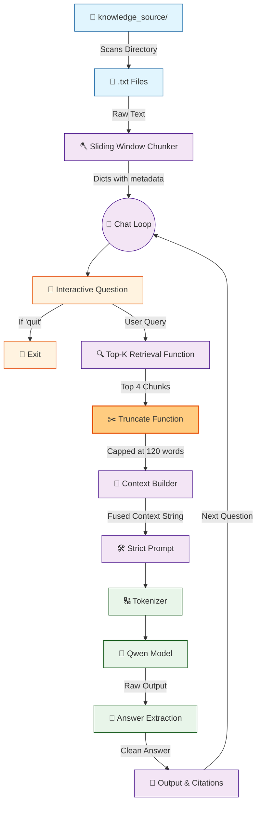

# 🤖 V6.1 RAG-style Closed Context QA Bot (Patch Update)

## 🏗️ Summary

> [!NOTE]
> **Goal For This Version**  
> Build a **V6.1 Patch** for the RAG chatbot. This version is an optimization patch designed to handle **Context Bloat** and speed up generation by introducing a hard word limit truncation and reducing unnecessary token parameters.

> [!IMPORTANT]
> **Changes from Last Version [v6] to Current Version [v6.1]**  
> * Introduced a `truncate(text, max_words=120)` function.
> * Wrapped the retrieved text chunks in the `truncate()` function during context building.
> * Simplified the metadata prompt tag by removing the `| chunk {chunk_id}` part.
> * Reduced `max_new_tokens` during model generation from 120 down to 60.

> [!IMPORTANT]
> **Why the changes were made (problem faced)**  
> V6's Top-K retrieval was a big step forward, but it introduced a new performance problem called **Prompt Bloat**. Here's what was happening: each of the 4 retrieved chunks could be up to 250 words long (the full sliding window size). When you combine 4 chunks of 250 words each, that's potentially 1,000 words of raw context text crammed into the prompt *before* the model even reads the question.
>
> Think of it like a student preparing notes for an exam. Instead of writing compact bullet points, they photocopy entire chapters and staple them together. By the time they sit down to answer a question, they're flipping through pages and pages of notes to find one relevant sentence. It wastes time and mental energy.
>
> The `chunk_id` metadata tag (`[Source: hr.txt | chunk 2]`) was adding to the clutter too. While it seemed useful for debugging, the AI model didn't actually need to know which specific chunk number it was reading — it just needed to know the file. The extra text was visual noise that made the context harder for the model to parse.
>
> Finally, having `max_new_tokens=120` was too generous. For factual Q&A with closed context, the answer is almost always one or two sentences. Giving the model permission to write 120 tokens meant it would sometimes ramble on unnecessarily, appending tangential information that wasn't asked for.

> [!IMPORTANT]
> **How the new version solves the problem**  
> V6.1 is a precision tuning patch — small changes, big impact.
>
> The most important addition is the `truncate()` function. It is beautifully simple. It takes any long string of text and cuts it off at exactly 120 words. Think of it as a hard stop — like a bouncer at the door who says *"Sorry, only 120 words may enter."* Every chunk that goes into the context must pass through this function first. So instead of each chunk contributing up to 250 words, it now contributes at most 120 words. Four chunks × 120 words = 480 words maximum, instead of the previous 1,000 words. The prompt shrinks dramatically, processing gets faster, and the model is less overwhelmed.
>
> The metadata simplification is also important. We remove `| chunk {chunk_id}` from the source tag, leaving just `[Source: hr.txt]`. This cleaner format is easier for the model to parse when reading the context.
>
> Dropping `max_new_tokens` from 120 to 60 forces the model to be more disciplined and concise. For a closed-context Q&A bot that reads a specific paragraph and answers a specific question, 60 tokens is more than enough. This also makes generation noticeably faster.

---

## 📖 Terminologies

| Term | What It Means |
|---|---|
| **Prompt Bloat** | When the prompt becomes unnecessarily large, consuming too many tokens and making it harder for the model to focus on what matters. Like giving someone a 10-page document when a 1-page summary would do. |
| **Truncation** | Cutting a piece of text at a specific length. The `truncate()` function enforces a hard word limit so no single chunk can overwhelm the context. |
| **`max_new_tokens`** | A generation parameter that limits how many new tokens the model is allowed to produce. A lower value means shorter, more concise answers and faster generation. |
| **Token Budget** | The total number of tokens available in the context window. Every word in the prompt spends some of this budget; a bloated prompt leaves fewer tokens available for the answer. |
| **Patch Release** | A minor version update (like 6.0 → 6.1) that fixes specific issues or tunes performance without adding entirely new features. |
| **`chunk_id`** | A number assigned to each chunk based on its position in the source file. Chunk 0 is the first chunk, chunk 1 is the second, and so on. Removed in V6.1 as unnecessary metadata noise. |

---

## 🏗️ Architecture

### 🔄 Full System Flow



---

### 📦 Code

```python
from transformers import AutoTokenizer, AutoModelForCausalLM
import torch
import os
import time

model_name = "Qwen/Qwen2.5-0.5B-Instruct"

# -----------------------------
# 🟢 LOADING PHASE
# -----------------------------
print("🔄 Model RAGBOT V6 Running........")
print("🔄 Loading tokenizer...")
tokenizer = AutoTokenizer.from_pretrained(model_name)
print("✅ Tokenizer loaded")

print("🔄 Loading model (this may take time)...")
model = AutoModelForCausalLM.from_pretrained(
    model_name,
    low_cpu_mem_usage=True
)
print("✅ Model loaded")


# -----------------------------
# 🟢 CHUNKING FUNCTION
# -----------------------------

def chunk_text(text, chunk_size=250, overlap=80):
    words = text.split()
    chunks = []

    start = 0

    while start < len(words):
        end = start + chunk_size
        chunk = " ".join(words[start:end]).strip()

        if chunk:
            chunks.append(chunk)

        start += chunk_size - overlap

    return chunks


# -----------------------------
# 🟢 DATA LOADING
# -----------------------------

print("\n📂 Loading knowledge base...")

chunks = []
folder = "knowledge_source"

file_count = 0

for filename in os.listdir(folder):
    if not filename.endswith(".txt"):
        continue

    file_count += 1
    print(f"📄 Reading file: {filename}")

    path = os.path.join(folder, filename)

    with open(path, "r", encoding="utf-8") as f:
        text = f.read()

    print(f"✂ Chunking file: {filename}")
    text_chunks = chunk_text(text)

    for i, chunk in enumerate(text_chunks):
        chunks.append({
            "source": filename,
            "chunk_id": i,
            "text": chunk
        })

print(f"✅ Loaded {len(chunks)} chunks from {file_count} files")


# -----------------------------
# 🟢 RETRIEVAL (WITH LOGS)
# -----------------------------
# 🆕 NEW IN V6.1: Truncation safety valve
def truncate(text, max_words=120):
    return " ".join(text.split()[:max_words])

def retrieve_top_k(question, k=2):
    print("\n🔍 Retrieving relevant chunks...")

    start_time = time.time()

    scored = []
    q_words = set(question.lower().split())

    print(f"🧠 Query words: {q_words}")

    for i, item in enumerate(chunks):
        chunk = item["text"].lower()

        score = sum(1 for word in q_words if word in chunk)

        scored.append((score, item))

        # lightweight progress indicator
        if i % 500 == 0 and i > 0:
            print(f"   ...scanned {i}/{len(chunks)} chunks")

    print("📊 Sorting results...")

    scored.sort(key=lambda x: x[0], reverse=True)

    top_k = [item for score, item in scored[:k] if score > 0]

    print(f"✅ Retrieved {len(top_k)} relevant chunks in {time.time() - start_time:.2f}s")

    return top_k


# -----------------------------
# 🟢 CHAT LOOP
# -----------------------------

print("\n🤖 RAG Chatbot Ready! Type 'quit' to exit.\n")

while True:
    question = input("You: ").strip()

    if question.lower() == "quit":
        print("👋 Goodbye.")
        break

    print("\n==============================")
    print("📥 QUESTION RECEIVED")
    print("==============================")

    print("🧾 Question:", question)

    # -------------------------
    # RETRIEVAL PHASE
    # -------------------------

    top_chunks = retrieve_top_k(question, k=4)

    # -------------------------
    # CONTEXT BUILDING
    # -------------------------

    print("\n🧱 Building context...")

    context = ""
    sources = set()

    for c in top_chunks:
        # 🆕 NEW IN V6.1: Simplified tag and applied truncation
        context += f"\n[Source: {c['source']}]\n{truncate(c['text'])}\n"
        sources.add(c["source"])

    print(f"📚 Context size: {len(context)} characters")

    # -------------------------
    # PROMPT CREATION
    # -------------------------

    print("\n🧠 Creating prompt...")

    prompt = f"""
You are a strict assistant.

Answer ONLY using the context below.
If the answer is not in the context, say: "I don't know based on the provided data."

Context:
{context}

Question:
{question}

Answer:
"""

    print(f"📏 Prompt length: {len(prompt)} characters")

    # -------------------------
    # TOKENIZATION
    # -------------------------

    print("\n🔤 Tokenizing input...")

    inputs = tokenizer(prompt, return_tensors="pt")

    print(f"🧮 Input tokens: {inputs['input_ids'].shape[1]}")

    # -------------------------
    # GENERATION
    # -------------------------

    print("\n⚙ Generating response (model is thinking)...")

    start = time.time()

    with torch.no_grad():
        # 🆕 NEW IN V6.1: Dropped max_new_tokens to 60
        outputs = model.generate(
            **inputs,
            max_new_tokens=60,
            do_sample=False
        )

    print(f"✅ Generation done in {time.time() - start:.2f}s")

    # -------------------------
    # DECODING
    # -------------------------

    print("\n📝 Decoding output...")

    answer = tokenizer.decode(outputs[0], skip_special_tokens=True)

    if "Answer:" in answer:
        answer = answer.split("Answer:")[-1].strip()

    # -------------------------
    # OUTPUT
    # -------------------------

    print("\n==============================")
    print("📌 FINAL RESULT")
    print("==============================")

    print("\n📁 Sources:", ", ".join(sources))
    print("\n🤖 Bot:", answer)
    print("\n")
```

---

## 🏗️ Stepwise Architecture

*(Note: Basic steps from V6 like Model Loading, Data Chunking, and Top-K retrieval are omitted for brevity to focus solely on the V6.1 Patch mechanics).*

### ✂️ Step 1 — Define Truncation Safety Valve (🆕 NEW IN V6.1)

```python
def truncate(text, max_words=120):
    return " ".join(text.split()[:max_words])
```

**Purpose:** A simple helper function that takes a long string of text and cuts it off exactly at `max_words`. This ensures no single retrieved chunk can spiral out of control and eat up the model's token limits.

---

### 🧱 Step 2 — Build Truncated Context (🆕 NEW IN V6.1)

```python
    context = ""
    sources = set()

    for c in top_chunks:
        context += f"\n[Source: {c['source']}]\n{truncate(c['text'])}\n"
        sources.add(c["source"])
```

**Purpose:** During the context building loop, it applies the `truncate()` function to every chunk right before injecting it into the prompt. Furthermore, the overly complex `| chunk {c['chunk_id']}` tag was removed, leaving a cleaner, simpler citation format for the language model to read.

---

### ⚙️ Step 3 — Generate Response with Strict Token Cap (🆕 NEW IN V6.1)

```python
    with torch.no_grad():
        outputs = model.generate(
            **inputs,
            max_new_tokens=60,
            do_sample=False
        )
```

**Purpose:** `max_new_tokens` was dropped from `120` down to `60`. This prevents the model from rambling on unnecessarily, forcing it to deliver a concise, punchy answer. It also slightly improves generation speed.

---

## 🚀 Final One-Line Understanding

> **This patch (V6.1) introduces a strict word-truncation filter and lower generation caps to prevent prompt bloat and keep the bot responding rapidly with concise answers.**
