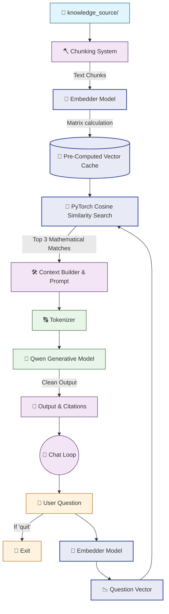

# 🤖 V7 RAG-style Closed Context QA Bot

## 🏗️ Summary

> [!NOTE]
> **Goal For This Version**  
> Build a **V7 RAG-style Closed Context QA Bot**. This version replaces the fragile word-counting search algorithm with a state-of-the-art **Semantic Retrieval System** powered by Neural Vector Embeddings.

> [!IMPORTANT]
> **Changes from Last Version [v6.1] to Current Version [v7]**  
> * Imported `sentence-transformers` and PyTorch's `torch.nn.functional`.
> * Loaded a dedicated embedding model: `all-MiniLM-L6-v2`.
> * Converted the entire chunked knowledge base into a mathematical matrix of Vector Embeddings during the loading phase.
> * Completely removed the `for word in q_words:` loop.
> * Replaced keyword matching with high-speed PyTorch `F.cosine_similarity` to mathematically calculate the conceptual distance between the question and the chunks.

> [!IMPORTANT]
> **Why the changes were made (problem faced)**  
> V6.1's keyword retrieval system had a fundamental philosophical flaw: it could only understand exact words, not ideas. Let's make this concrete with an example. Suppose your HR document contains the sentence: *"Employees are entitled to 10 days of paid sick leave per annum."* Now a user asks: *"What is the medical time-off policy?"* 
>
> The keyword matcher looks for the words "medical", "time-off", and "policy" in every chunk. None of those exact words appear in the sentence about sick leave. So the keyword scorer gives that chunk a score of zero — literally zero relevance. The bot concludes there is no relevant information and says it doesn't know. But the answer is sitting right there in the document! The bot simply could not bridge the gap between different words that mean the same thing.
>
> This is the fundamental limitation of **lexical search** (matching by letters and words). Language is rich with synonyms, paraphrases, and conceptual associations. *"Sick leave"* means the same as *"medical time-off"*. *"Compensation"* means the same as *"salary"*. *"Terminated"* and *"fired"* are the same event. A system that only looks at exact characters cannot understand any of these connections.
>
> As the knowledge base grows to cover a broad range of topics, this problem compounds rapidly. The bot becomes increasingly unreliable — not because the information isn't there, but because its word-matching brain can't connect the user's vocabulary to the document's vocabulary.

> [!IMPORTANT]
> **How the new version solves the problem**  
> V7 replaces keyword matching with a fundamentally different approach: **semantic search using neural vector embeddings**.
>
> Here's the core idea explained simply. Every word, sentence, or paragraph has a *meaning*. What if we could translate that meaning into a sequence of numbers — a mathematical coordinate in a high-dimensional space? Words with similar meanings would land at nearby coordinates, and words with very different meanings would land far apart. This is exactly what an **embedding model** does.
>
> We load a second, small AI model called `all-MiniLM-L6-v2`. Its entire job — it does nothing else — is to read a piece of text and convert it into a list of 384 numbers (called a **vector**). These 384 numbers collectively represent the semantic meaning of that text. During startup, we pass every single chunk in our knowledge base through this model, creating a 384-number vector for each one. We stack all these vectors into a large matrix called `chunk_embeddings`.
>
> Now when a user asks a question, we run that question through the same embedding model too. The question becomes its own 384-number vector. Then we compare the question vector to every chunk vector using a mathematical operation called **cosine similarity**. Think of two arrows drawn from the center of a circle — if they point in the same direction, they are very similar. If they point in completely opposite directions, they are very different. Cosine similarity measures the angle between those arrows and gives a score between -1 and 1.
>
> The beautiful result? *"Sick leave"* and *"medical time-off"* produce vectors that point in nearly the same direction, so they score very high cosine similarity. The bot now retrieves the right chunk even when the user's words are completely different from the document's words. This is semantic understanding — the bot comprehends *meaning*, not just characters.

---

## 📖 Terminologies

| Term | What It Means |
|---|---|
| **Semantic Search** | Searching based on the *meaning* of text rather than exact word matches. Understands that "salary" and "compensation" are related, even without shared letters. |
| **Vector Embedding** | A list of numbers (a vector) that represents the meaning of a piece of text. Similar texts produce similar vectors. Generated by a neural embedding model. |
| **Embedding Model** | A specialized neural network whose only job is to convert text into vectors. We use `all-MiniLM-L6-v2` from Sentence Transformers — it's fast, small, and highly accurate. |
| **`all-MiniLM-L6-v2`** | The specific embedding model we use. "MiniLM" means it's a miniature language model; "L6" means it has 6 transformer layers; "v2" is the second improved version. It produces 384-dimensional vectors. |
| **Vector** | A list of numbers representing a point in multi-dimensional space. Two vectors that are "close" to each other in that space have similar meanings. |
| **Cosine Similarity** | A mathematical formula that measures the angle between two vectors. A score of 1.0 means identical meaning/direction; 0.0 means unrelated; -1.0 means opposite. |
| **`chunk_embeddings`** | A matrix (a 2D array of numbers) where each row is the 384-number vector of one chunk. This is the "encoded" version of the entire knowledge base. |
| **`torch.topk()`** | A PyTorch function that quickly finds the K highest values in a list and returns their values and positions (indices). Used to find the top-scoring chunks after computing similarities. |
| **Lexical Search** | The old approach: searching by matching exact characters and words. Fast and simple but cannot understand synonyms or paraphrases. V6 and earlier used this approach. |
| **Bi-Encoder** | A type of embedding architecture where the question and each document are encoded *separately* into vectors, then compared. Fast but less precise than a Cross-Encoder (introduced in V9). |

---

## 🏗️ Architecture

### 🔄 Full System Flow



---

### 📦 Code

```python
from transformers import AutoTokenizer, AutoModelForCausalLM
from sentence_transformers import SentenceTransformer
import torch
import torch.nn.functional as F
import os
import time

# =====================================================
# 🧠 RAGBOT V7
# Level 2 — Semantic Retrieval (Embeddings)
# Keeps same terminal style + same Qwen model
# =====================================================

model_name = "Qwen/Qwen2.5-0.5B-Instruct"
embed_model_name = "sentence-transformers/all-MiniLM-L6-v2"

# -----------------------------------------------------
# 🟢 LOADING PHASE
# -----------------------------------------------------

print("🔄 RAGBOT V7 Running........")

print("🔄 Loading tokenizer...")
tokenizer = AutoTokenizer.from_pretrained(model_name)
print("✅ Tokenizer loaded")

print("🔄 Loading Qwen model...")
model = AutoModelForCausalLM.from_pretrained(
    model_name,
    low_cpu_mem_usage=True
)
print("✅ Qwen model loaded")

# 🆕 NEW IN V7: Loading the tiny, fast embedding model
print("🔄 Loading embedding model...")
embedder = SentenceTransformer(embed_model_name)
print("✅ Embedding model loaded")


# -----------------------------------------------------
# 🟢 CHUNKING
# -----------------------------------------------------

def chunk_text(text, chunk_size=250, overlap=80):
    words = text.split()
    chunks = []
    start = 0

    while start < len(words):
        end = start + chunk_size
        chunk = " ".join(words[start:end]).strip()

        if chunk:
            chunks.append(chunk)

        start += chunk_size - overlap

    return chunks

def truncate(text, max_words=120):
    return " ".join(text.split()[:max_words])


# -----------------------------------------------------
# 🟢 LOAD KNOWLEDGE BASE
# -----------------------------------------------------

print("\n📂 Loading knowledge base...")

chunks = []
folder = "knowledge_source"
file_count = 0

for filename in os.listdir(folder):
    if not filename.endswith(".txt"):
        continue

    file_count += 1
    print(f"📄 Reading file: {filename}")

    path = os.path.join(folder, filename)

    with open(path, "r", encoding="utf-8") as f:
        text = f.read()

    print(f"✂ Chunking file: {filename}")
    text_chunks = chunk_text(text)

    for i, chunk in enumerate(text_chunks):
        chunks.append({
            "source": filename,
            "chunk_id": i,
            "text": chunk
        })

print(f"✅ Loaded {len(chunks)} chunks from {file_count} files")


# -----------------------------------------------------
# 🟠 LEVEL 2 — GENERATE CHUNK EMBEDDINGS (🆕 NEW IN V7)
# -----------------------------------------------------

print("\n🧠 Creating embeddings for all chunks...")

chunk_texts = [item["text"] for item in chunks]

start = time.time()

# Convert all text chunks into mathematical vectors in one massive batch
chunk_embeddings = embedder.encode(
    chunk_texts,
    convert_to_tensor=True,
    show_progress_bar=True
)

print(f"✅ Chunk embeddings ready in {time.time() - start:.2f}s")


# -----------------------------------------------------
# 🟠 SEMANTIC RETRIEVAL (🆕 NEW IN V7)
# -----------------------------------------------------

def retrieve_top_k(question, k=3):
    print("\n🔍 Semantic retrieval started...")

    start = time.time()

    # Embed query (convert question to vector)
    query_embedding = embedder.encode(
        question,
        convert_to_tensor=True
    )

    # Calculate Cosine Similarity between question vector and ALL chunk vectors
    scores = F.cosine_similarity(
        query_embedding.unsqueeze(0),
        chunk_embeddings
    )

    # Rapidly grab the highest K scores using PyTorch
    top_scores, top_indices = torch.topk(scores, k=min(k, len(chunks)))

    results = []

    for score, idx in zip(top_scores, top_indices):
        item = chunks[idx.item()].copy()
        item["score"] = float(score.item())
        results.append(item)

    print(f"✅ Retrieved {len(results)} chunks in {time.time() - start:.2f}s")

    return results


# -----------------------------------------------------
# 🟢 CHAT LOOP
# -----------------------------------------------------

print("\n🤖 RAGBOT V7 Ready! Type 'quit' to exit.\n")

while True:
    question = input("You: ").strip()

    if question.lower() == "quit":
        print("👋 Goodbye.")
        break

    if not question:
        continue

    print("\n==============================")
    print("📥 QUESTION RECEIVED")
    print("==============================")
    print("🧾 Question:", question)

    # ---------------------------------------------
    # RETRIEVE TOP CHUNKS
    # ---------------------------------------------

    top_chunks = retrieve_top_k(question, k=3)

    if not top_chunks:
        print("❌ No relevant context found.\n")
        continue

    # ---------------------------------------------
    # BUILD CONTEXT
    # ---------------------------------------------

    print("\n🧱 Building context...")

    context = ""
    sources = set()

    for c in top_chunks:
        # 🆕 NEW IN V7: Now displays the mathematical 'Score' to show confidence!
        context += (
            f"\n[Source: {c['source']} | Score: {c['score']:.3f}]\n"
            f"{truncate(c['text'])}\n"
        )
        sources.add(c["source"])

    print(f"📚 Context size: {len(context)} characters")

    # ---------------------------------------------
    # PROMPT
    # ---------------------------------------------

    print("\n🧠 Creating prompt...")

    prompt = f"""
You are a strict assistant.

Answer ONLY using the context below.
If the answer is not clearly present, say:
"I don't know based on the provided data."

Context:
{context}

Question:
{question}

Answer:
"""

    print(f"📏 Prompt length: {len(prompt)} characters")

    # ---------------------------------------------
    # TOKENIZE
    # ---------------------------------------------

    print("\n🔤 Tokenizing input...")

    inputs = tokenizer(prompt, return_tensors="pt")

    print(f"🧮 Input tokens: {inputs['input_ids'].shape[1]}")

    # ---------------------------------------------
    # GENERATE
    # ---------------------------------------------

    print("\n⚙ Generating response...")

    start = time.time()

    with torch.no_grad():
        outputs = model.generate(
            **inputs,
            max_new_tokens=60,
            do_sample=False
        )

    print(f"✅ Generation done in {time.time() - start:.2f}s")

    # ---------------------------------------------
    # DECODE
    # ---------------------------------------------

    answer = tokenizer.decode(outputs[0], skip_special_tokens=True)

    if "Answer:" in answer:
        answer = answer.split("Answer:")[-1].strip()

    # ---------------------------------------------
    # OUTPUT
    # ---------------------------------------------

    print("\n==============================")
    print("📌 FINAL RESULT")
    print("==============================")

    print("\n📁 Sources:", ", ".join(sources))
    print("\n🤖 Bot:", answer)
    print()
```

---

## 🏗️ Stepwise Architecture

*(Note: Basic steps like File Loading and Tokenization are omitted to focus purely on the massive V7 Semantic Search upgrade mechanics).*

### 🧠 Step 1 — Load Embedding Model (🆕 NEW IN V7)

```python
embed_model_name = "sentence-transformers/all-MiniLM-L6-v2"
embedder = SentenceTransformer(embed_model_name)
```

**Purpose:** Loads a secondary, specialized AI model whose only job is to understand the mathematical *meaning* of text. `all-MiniLM-L6-v2` is lightning fast and highly accurate for mapping sentences to semantic vector spaces.

---

### 🧮 Step 2 — Generate Database Embeddings (🆕 NEW IN V7)

```python
chunk_texts = [item["text"] for item in chunks]

chunk_embeddings = embedder.encode(
    chunk_texts,
    convert_to_tensor=True,
    show_progress_bar=True
)
```

**Purpose:** Once the text files are cut into sliding-window chunks, this loop passes ALL of them through the `embedder`. It spits out a matrix (`chunk_embeddings`) where every chunk is now represented as a multi-dimensional array of numbers. This happens **once** during startup so searches are instant later.

---

### 📈 Step 3 — Vectorize the Question (🆕 NEW IN V7)

```python
def retrieve_top_k(question, k=3):
    query_embedding = embedder.encode(
        question,
        convert_to_tensor=True
    )
```

**Purpose:** Inside the chat loop, when the user types a question, that question is also passed through the embedder to create a `query_embedding` vector. This puts the question and the data chunks on the exact same mathematical playing field.

---

### 📐 Step 4 — Semantic Search via Cosine Similarity (🆕 NEW IN V7)

```python
    scores = F.cosine_similarity(
        query_embedding.unsqueeze(0),
        chunk_embeddings
    )
```

**Purpose:** Replaces the archaic `if word in chunk:` word-counting loop. `F.cosine_similarity` compares the angle between the question's vector and the chunk matrix. If the vectors point in the same direction, they share the same *conceptual meaning*, even if they share zero vocabulary! This operation leverages PyTorch tensor math, scanning thousands of chunks in milliseconds.

---

### 🏆 Step 5 — Retrieve Top K Best Matches

```python
    top_scores, top_indices = torch.topk(scores, k=min(k, len(chunks)))

    results = []
    for score, idx in zip(top_scores, top_indices):
        item = chunks[idx.item()].copy()
        item["score"] = float(score.item())
        results.append(item)
```

**Purpose:** Uses PyTorch's native `topk` sorting algorithm to rapidly slice out the highest scoring matches, appending the exact similarity `score` back to the dictionary for debugging and context transparency.

---

## 🚀 Final One-Line Understanding

> **This architecture drops exact word-matching in favor of PyTorch-driven Vector Embeddings and Cosine Similarity, enabling the bot to search entire directories based on semantic meaning and conceptual synonyms.**
