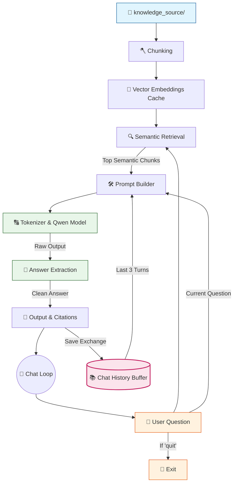

# 🤖 V8 RAG-style Closed Context QA Bot

## 🏗️ Summary

> [!NOTE]
> **Goal For This Version**  
> Build a **V8 RAG-style Closed Context QA Bot**. This version introduces **Conversational Memory (Chat History)**, allowing the model to remember past exchanges so you can ask natural follow-up questions.

> [!IMPORTANT]
> **Changes from Last Version [v7] to Current Version [v8]**  
> * Initialized a `chat_history = []` buffer list outside the main chat loop.
> * Formatted a `history_text` string that pulls the last 3 User/Bot exchanges.
> * Injected `{history_text}` directly into the system prompt right before the Context block.
> * Added logic to append `{"user": question, "bot": answer}` to the `chat_history` list at the end of every turn.

> [!IMPORTANT]
> **Why the changes were made (problem faced)**  
> V7 was a brilliant upgrade for *finding* information, but it had a serious conversational blind spot. The bot had no memory whatsoever. Every single question it received was processed as if it had just been switched on for the very first time. It had no recollection of the previous turn, the turn before that, or anything that had been discussed in the current session.
>
> This created a frustrating experience the moment a conversation became multi-turn. Imagine this exchange: You ask, *"Who is the CEO of the company?"* and the bot correctly answers *"Alice Vanguard."* Great. Then you naturally follow up with *"What is her educational background?"* The bot receives this second question in complete isolation. It has no idea who "her" refers to. It searches the knowledge base for chunks related to "her educational background" — a very generic query — and either retrieves the wrong information or says it doesn't know. The pronoun "her" is meaningless without context.
>
> This problem is called **context blindness** — the inability of a stateless system to resolve references to prior conversation turns. For a system that's supposed to work like a helpful assistant, this is a critical failure. Real human conversations are built on shared context — people constantly refer back to what was just said, using pronouns and shorthand that only make sense in the context of recent exchanges.

> [!IMPORTANT]
> **How the new version solves the problem**  
> V8 gives the bot a **rolling short-term memory** by introducing a `chat_history` buffer — a simple Python list that accumulates past conversations.
>
> Here is how it works in plain language. After the bot generates and delivers an answer, that entire exchange (the user's question and the bot's response) gets saved as a small dictionary — like writing it down in a notepad. This notepad is the `chat_history` list. It grows with every turn of conversation.
>
> Then, at the start of building the prompt for the *next* question, the bot doesn't just build context from the retrieved chunks. It also opens its notepad and reads the last 3 entries. It formats those entries into a neat block of text: "User said this, Bot said that. User said this, Bot said that." This block is called `history_text`, and it gets injected directly into the prompt right above the knowledge base context.
>
> Now, when the model reads the prompt for the follow-up question *"What is her educational background?"*, it first reads the conversation history and sees: *"User asked: Who is the CEO? Bot answered: Alice Vanguard."* With that context in hand, the model can now correctly infer that "her" refers to Alice Vanguard, retrieves the right information, and gives a coherent, contextually aware answer.
>
> We limit the history to the last 3 exchanges (`chat_history[-3:]`) to prevent it from growing indefinitely. If we kept the entire conversation history forever, it would eventually bloat the prompt and exhaust the model's context window — the very problem we solved back in V3.

---

## 📖 Terminologies

| Term | What It Means |
|---|---|
| **Conversational Memory** | The ability of a chatbot to remember what was said in previous turns of the current conversation and use that context when answering new questions. |
| **Chat History Buffer** | A list (`chat_history`) that stores past Q&A pairs from the current session. Acts as the bot's short-term memory. |
| **Rolling Buffer** | A data structure that keeps only the most recent N items. When it's full and a new item is added, the oldest one is discarded. Our history keeps the last 3 turns. |
| **`[-3:]` (Python Slice)** | Python list slicing syntax that returns the last 3 items from a list. `chat_history[-3:]` means "give me the 3 most recent exchanges." |
| **Context Blindness** | The failure of a stateless system to resolve references (like pronouns) that only make sense in the context of prior conversation turns. |
| **Pronoun Resolution** | The ability to understand what words like "her", "it", "they", or "that" refer to based on earlier context. Requires conversational memory. |
| **Stateless** | A system that treats every input as completely independent, with no memory of prior interactions. V7 and earlier were stateless. |
| **Stateful** | A system that maintains information across interactions. V8 becomes stateful by keeping the chat history buffer. |
| **`history_text`** | A formatted string of recent conversation turns that gets injected into the prompt so the model can "read" what was previously discussed. |

---

## 🏗️ Architecture

### 🔄 Full System Flow



---

### 📦 Code

```python
from transformers import AutoTokenizer, AutoModelForCausalLM
from sentence_transformers import SentenceTransformer
import torch
import torch.nn.functional as F
import os
import time

# =====================================================
# 🧠 RAGBOT V8
# Level 2 — Semantic Retrieval + Conversational Memory
# Keeps same terminal style + same Qwen model
# =====================================================

model_name = "Qwen/Qwen2.5-0.5B-Instruct"
embed_model_name = "sentence-transformers/all-MiniLM-L6-v2"

# -----------------------------------------------------
# 🟢 LOADING PHASE
# -----------------------------------------------------
print("🔄 RAGBOT V8 Running........")

print("🔄 Loading tokenizer...")
tokenizer = AutoTokenizer.from_pretrained(model_name)
print("✅ Tokenizer loaded")

print("🔄 Loading Qwen model...")
model = AutoModelForCausalLM.from_pretrained(
    model_name,
    low_cpu_mem_usage=True
)
print("✅ Qwen model loaded")

print("🔄 Loading embedding model...")
embedder = SentenceTransformer(embed_model_name)
print("✅ Embedding model loaded")


# -----------------------------------------------------
# 🟢 CHUNKING
# -----------------------------------------------------
def chunk_text(text, chunk_size=250, overlap=80):
    words = text.split()
    chunks = []
    start = 0

    while start < len(words):
        end = start + chunk_size
        chunk = " ".join(words[start:end]).strip()
        if chunk:
            chunks.append(chunk)
        start += chunk_size - overlap

    return chunks

def truncate(text, max_words=120):
    return " ".join(text.split()[:max_words])


# -----------------------------------------------------
# 🟢 LOAD KNOWLEDGE BASE
# -----------------------------------------------------
print("\n📂 Loading knowledge base...")

chunks = []
folder = "knowledge_source"
file_count = 0

for filename in os.listdir(folder):
    if not filename.endswith(".txt"):
        continue

    file_count += 1
    print(f"📄 Reading file: {filename}")
    path = os.path.join(folder, filename)
    with open(path, "r", encoding="utf-8") as f:
        text = f.read()

    print(f"✂ Chunking file: {filename}")
    text_chunks = chunk_text(text)

    for i, chunk in enumerate(text_chunks):
        chunks.append({
            "source": filename,
            "chunk_id": i,
            "text": chunk
        })

print(f"✅ Loaded {len(chunks)} chunks from {file_count} files")


# -----------------------------------------------------
# 🟠 LEVEL 2 — GENERATE CHUNK EMBEDDINGS
# -----------------------------------------------------
print("\n🧠 Creating embeddings for all chunks...")

chunk_texts = [item["text"] for item in chunks]
start = time.time()
chunk_embeddings = embedder.encode(
    chunk_texts,
    convert_to_tensor=True,
    show_progress_bar=True
)

print(f"✅ Chunk embeddings ready in {time.time() - start:.2f}s")


# -----------------------------------------------------
# 🟠 SEMANTIC RETRIEVAL
# -----------------------------------------------------
def retrieve_top_k(question, k=3):
    print("\n🔍 Semantic retrieval started...")
    start = time.time()

    query_embedding = embedder.encode(
        question,
        convert_to_tensor=True
    )

    scores = F.cosine_similarity(
        query_embedding.unsqueeze(0),
        chunk_embeddings
    )

    top_scores, top_indices = torch.topk(scores, k=min(k, len(chunks)))

    results = []
    for score, idx in zip(top_scores, top_indices):
        item = chunks[idx.item()].copy()
        item["score"] = float(score.item())
        results.append(item)

    print(f"✅ Retrieved {len(results)} chunks in {time.time() - start:.2f}s")
    return results


# -----------------------------------------------------
# 🟢 CHAT LOOP
# -----------------------------------------------------

print("\n🤖 RAGBOT V8 Ready! Type 'quit' to exit.\n")

# 🆕 NEW IN V8: Initialize rolling chat history buffer
chat_history = []

while True:
    question = input("You: ").strip()

    if question.lower() == "quit":
        print("👋 Goodbye.")
        break

    if not question:
        continue

    print("\n==============================")
    print("📥 QUESTION RECEIVED")
    print("==============================")
    print("🧾 Question:", question)

    # ---------------------------------------------
    # RETRIEVE TOP CHUNKS
    # ---------------------------------------------
    top_chunks = retrieve_top_k(question, k=3)

    if not top_chunks:
        print("❌ No relevant context found.\n")
        continue

    # ---------------------------------------------
    # BUILD CONTEXT
    # ---------------------------------------------
    print("\n🧱 Building context...")

    context = ""
    sources = set()

    for c in top_chunks:
        context += (
            f"\n[Source: {c['source']} | Score: {c['score']:.3f}]\n"
            f"{truncate(c['text'])}\n"
        )
        sources.add(c["source"])

    print(f"📚 Context size: {len(context)} characters")

    # 🆕 NEW IN V8: Format recent chat history
    history_text = ""
    if chat_history:
        history_text = "\n--- Recent Chat History ---\n"
        # Keep only the last 3 exchanges to prevent context bloat
        for entry in chat_history[-3:]:
            history_text += f"User: {entry['user']}\nBot: {entry['bot']}\n"

    # ---------------------------------------------
    # PROMPT
    # ---------------------------------------------
    print("\n🧠 Creating prompt...")

    prompt = f"""
You are a strict assistant.

Answer ONLY using the context below.
If the answer is not clearly present, say:
"I don't know based on the provided data."
{history_text}
Context:
{context}

Question:
{question}

Answer:
"""

    print(f"📏 Prompt length: {len(prompt)} characters")

    # ---------------------------------------------
    # TOKENIZE
    # ---------------------------------------------
    print("\n🔤 Tokenizing input...")

    inputs = tokenizer(prompt, return_tensors="pt")

    print(f"🧮 Input tokens: {inputs['input_ids'].shape[1]}")

    # ---------------------------------------------
    # GENERATE
    # ---------------------------------------------
    print("\n⚙ Generating response...")

    start = time.time()

    with torch.no_grad():
        outputs = model.generate(
            **inputs,
            max_new_tokens=60,
            do_sample=False
        )

    print(f"✅ Generation done in {time.time() - start:.2f}s")

    # ---------------------------------------------
    # DECODE
    # ---------------------------------------------
    answer = tokenizer.decode(outputs[0], skip_special_tokens=True)

    if "Answer:" in answer:
        answer = answer.split("Answer:")[-1].strip()

    # 🆕 NEW IN V8: Append current exchange to history
    chat_history.append({
        "user": question,
        "bot": answer
    })

    # ---------------------------------------------
    # OUTPUT
    # ---------------------------------------------
    print("\n==============================")
    print("📌 FINAL RESULT")
    print("==============================")

    print("\n📁 Sources:", ", ".join(sources))
    print("\n🤖 Bot:", answer)
    print()
```

---

## 🏗️ Stepwise Architecture

*(Note: Semantic Search mapping functions have been omitted to focus purely on the V8 Memory upgrade mechanics).*

### 📚 Step 1 — Initialize Memory Buffer (🆕 NEW IN V8)

```python
chat_history = []

while True:
```

**Purpose:** Defined an empty list outside the `while True:` loop. This array acts as the bot's short-term memory, surviving across infinite user inputs.

---

### 📝 Step 2 — Format History Text (🆕 NEW IN V8)

```python
    history_text = ""
    if chat_history:
        history_text = "\n--- Recent Chat History ---\n"
        for entry in chat_history[-3:]:
            history_text += f"User: {entry['user']}\nBot: {entry['bot']}\n"
```

**Purpose:** Before building the final prompt, the script checks if there is any memory stored. If so, it loops through the history. It uses Python slicing `[-3:]` to grab only the last 3 exchanges, ensuring the memory string doesn't grow infinitely large and crash the token limit.

---

### 💉 Step 3 — Inject Memory into Prompt (🆕 NEW IN V8)

```python
    prompt = f"""
You are a strict assistant.

Answer ONLY using the context below.
...
{history_text}
Context:
{context}

Question:
{question}
"""
```

**Purpose:** Drops the `history_text` string directly into the system prompt right above the context window. Now, when the model reads the prompt, it gets a recap of the conversation right before attempting to answer the new question.

---

### 💾 Step 4 — Save Conversation Turn (🆕 NEW IN V8)

```python
    chat_history.append({
        "user": question,
        "bot": answer
    })
```

**Purpose:** After the AI generates a clean, extracted answer, the script saves both the user's raw query and the AI's final answer as a dictionary into the `chat_history` list so it can be remembered for the next loop iteration.

---

## 🚀 Final One-Line Understanding

> **This architecture implements conversational memory by saving Q&A pairs to a list and injecting the last 3 turns into the prompt, allowing the model to answer follow-up questions.**
