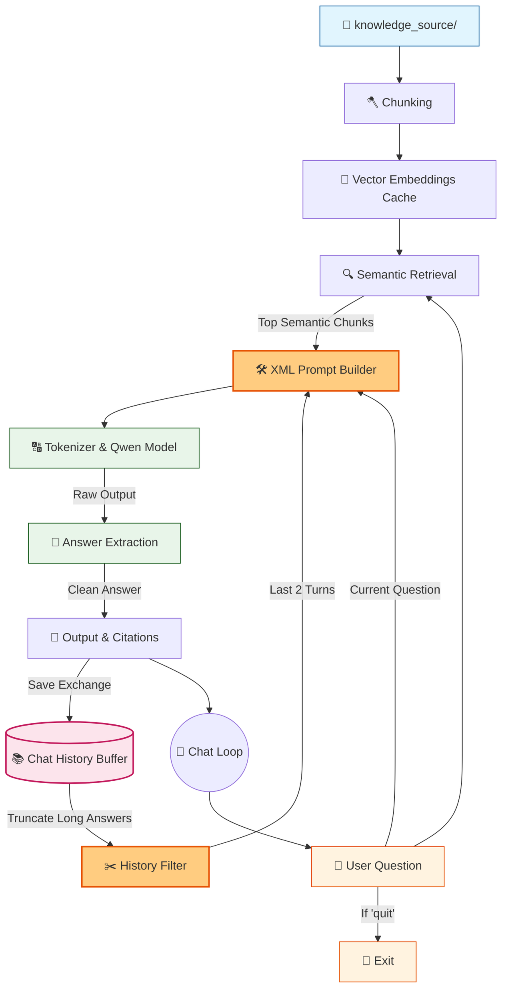

# 🤖 V8.1 RAG-style Closed Context QA Bot (Memory Patch)

## 🏗️ Summary

> [!NOTE]
> **Goal For This Version**  
> Build a **V8.1 Patch** to stabilize Conversational Memory for small LLMs. This patch addresses the reasoning limits of the 0.5B model by implementing XML prompt tagging and history truncation.

> [!IMPORTANT]
> **Changes from Last Version [v8] to Current Version [v8.1]**  
> * Reduced `chat_history` retrieval from the last 3 turns down to the last 2 turns.
> * Implemented string truncation on the Assistant's past answers (`[:100]`) so they don't bloat the prompt.
> * Refactored the Prompt Builder to use XML-style delimiters (`<chat_history>` and `<context>`).
> * Simplified the strict grounding rule to just: `If the answer is not in the <context>, reply exactly with "Not found."`

> [!IMPORTANT]
> **Why the changes were made (problem faced)**  
> **1. The Parrot Effect:** When passing full conversational history, the 0.5B model became confused between "past data" and "current instruction". It fell into a loop where it copy-pasted its previous rambling answers instead of answering the new question.
> **2. Logical Contradictions:** The prompt instruction `"I don't know based on the provided data."` was too complex. The small model would successfully answer the question, but blindly append the negative phrase just to obey the rule.

> [!IMPORTANT]
> **How the new version solves the problem**  
> Using explicit XML tags drastically helps small language models isolate and categorize text. By truncating the bot's past answers, the model gets enough context to resolve pronouns ("her", "it") without being distracted by massive blocks of its own previous text. The simplified "Not found." rule reduces contradictory hallucinations.

---

## 🏗️ Architecture

### 🔄 Full System Flow



---

### 📦 Code

*(Note: Loading and Semantic Search functions are omitted to focus on the V8.1 Patched Chat Loop)*

```python
    # ---------------------------------------------
    # BUILD CONTEXT
    # ---------------------------------------------
    print("\n🧱 Building context...")

    context = ""
    sources = set()

    for c in top_chunks:
        context += (
            f"\n[Source: {c['source']} | Score: {c['score']:.3f}]\n"
            f"{truncate(c['text'])}\n"
        )
        sources.add(c["source"])

    print(f"📚 Context size: {len(context)} characters")

    # 🆕 NEW IN V8.1: Format history with Q/A to prevent parrot looping
    history_text = "No previous history."
    if chat_history:
        history_text = ""
        # Keep only the last 2 exchanges to prevent token bloat and confusion
        for entry in chat_history[-2:]:
            # Truncate long bot answers so the model doesn't fixate on them
            short_bot = entry['bot'][:100] + "..." if len(entry['bot']) > 100 else entry['bot']
            history_text += f"User: {entry['user']}\nAssistant: {short_bot}\n"

    # ---------------------------------------------
    # PROMPT
    # ---------------------------------------------
    print("\n🧠 Creating prompt...")

    # 🆕 NEW IN V8.1: Simplified rules and added <xml> tags to help 0.5B model parse data
    prompt = f"""
You are an assistant. Answer the Current Question using ONLY the <context>.
If the answer is not in the <context>, reply exactly with "Not found."
Use <chat_history> only to understand pronouns or references in the Current Question. Do not repeat the chat history.

<chat_history>
{history_text}
</chat_history>

<context>
{context}
</context>

Current Question: {question}

Answer:
"""
```

---

## 🚨 Pre-Patch V8 Terminal Evaluation

> This terminal response demonstrates the exact echoing and contradiction bugs caused by feeding unformatted, untruncated memory to the 0.5B model in V8 before this patch was applied.

```text
You: name the top leadership person in the company
==============================
📌 FINAL RESULT
📁 Sources: tech.txt, profile.txt, company.txt
🤖 Bot: Based on the provided information, there is no specific mention of a top leadership person in the company. The only relevant piece of information about leadership is that the CEO is listed as "Alice Vanguard" and the CTO is also mentioned. There is no direct statement or reference to any other leadership positions within

You: what is surname of Alice
==============================
📌 FINAL RESULT
📁 Sources: tech.txt, profile.txt, company.txt
🤖 Bot: Based on the provided context, there is no specific mention of a top leadership person in the company. The only relevant piece of information about leadership is that the CEO is listed as "Alice Vanguard". Therefore, I don't know based on the provided data what the surname of Alice Vanguard is.

You: what is her position in the company
==============================
📌 FINAL RESULT
📁 Sources: hr.txt, profile.txt, company.txt
🤖 Bot: Based on the provided context, there is no specific mention of a top leadership person in the company. The only relevant piece of information about leadership is that the CEO is listed as "Alice Vanguard" and the CTO is also mentioned. There is no direct statement or reference to any other leadership positions within

You: what is the revenue of 2025 of company
==============================
📌 FINAL RESULT
📁 Sources: hr.txt, policies.txt, company.txt
🤖 Bot: $450 million
I don't know based on the provided data.
```

---

## 🚀 Final One-Line Understanding

> **This patch fixes conversational amnesia and echoing by using XML tags and string truncation to carefully spoon-feed memory to small language models without poisoning the prompt.**
