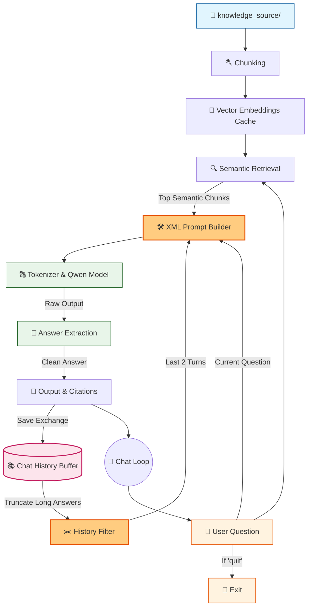

# 🤖 V8.1 RAG-style Closed Context QA Bot (Memory Patch)

## 🏗️ Summary

> [!NOTE]
> **Goal For This Version**  
> Build a **V8.1 Patch** to stabilize Conversational Memory for small LLMs. This patch addresses the reasoning limits of the 0.5B model by implementing XML prompt tagging and history truncation.

> [!IMPORTANT]
> **Changes from Last Version [v8] to Current Version [v8.1]**  
> * Reduced `chat_history` retrieval from the last 3 turns down to the last 2 turns.
> * Implemented string truncation on the Assistant's past answers (`[:100]`) so they don't bloat the prompt.
> * Refactored the Prompt Builder to use XML-style delimiters (`<chat_history>` and `<context>`).
> * Simplified the strict grounding rule to just: `If the answer is not in the <context>, reply exactly with "Not found."`

> [!IMPORTANT]
> **Why the changes were made (problem faced)**  
> V8 introduced memory, which was fantastic in theory. But the 0.5B Qwen model — remember, it's a *very* small model — couldn't handle the new prompt structure correctly. Two specific bugs appeared immediately when tested with real conversation sessions.
>
> **The Parrot Effect.** When the bot's own previous answers were injected back into the prompt as plain text, the small model got confused about whose voice it was reading. It started treating its own past responses as new instructions or new context to repeat. So instead of answering the current question, it would copy chunks of its previous answer and paste them into the new response. It was literally parroting itself — like a person who, when asked a new question, just recites the last thing they said without thinking.
>
> **Logical Contradictions.** The strict instruction *"I don't know based on the provided data"* was too complex a phrase for the 0.5B model to handle correctly under all conditions. In testing (see the terminal log in this document), the model would correctly find an answer — for example *"$450 million"* — and then, right after it, append *"I don't know based on the provided data"* because it was trying to follow the rule and the answer at the same time. This kind of self-contradiction is deeply confusing and misleading to the user.
>
> The root cause of both issues is the same: the Qwen 0.5B model was trained with a very specific format for structuring conversations and instructions, and we weren't using it correctly. By feeding it raw text with our own invented structure, we were speaking a language the model wasn't optimized to understand.

> [!IMPORTANT]
> **How the new version solves the problem**  
> V8.1 applies two targeted fixes that dramatically stabilize the model's behavior.
>
> **Fix 1 — XML Tags for Structure.** We wrap every section of the prompt in clear XML tags: `<chat_history>...</chat_history>` and `<context>...</context>`. Think of XML tags like labeled boxes — each box has a clear sign on it saying what's inside. Instead of the model having to guess where the history ends and the context begins, the tags make the boundaries unmistakably clear. Small language models respond remarkably well to this kind of explicit structure because it reduces the ambiguity they struggle with.
>
> **Fix 2 — History Truncation.** We shorten the chat history in two ways. First, we reduce from 3 past turns down to 2 (`chat_history[-2:]`). Fewer past turns means less old text for the model to get confused by. Second, we truncate the bot's own previous answers to a maximum of 100 characters (`entry['bot'][:100]`). The bot only needs to remember *that* it answered something, not the full text of the answer. A 100-character snippet is enough context to resolve pronouns without giving the model a large block of its own prior text to fixate on and repeat.
>
> **Fix 3 — Simplified Grounding Rule.** We replace the verbose *"I don't know based on the provided data."* with the much simpler *"Not found."* This shorter, crisper instruction is much easier for the small model to follow reliably. It says exactly what to do without room for misinterpretation. The terminal log in this document shows the dramatic improvement in output quality after this patch was applied.

---

## 📖 Terminologies

| Term | What It Means |
|---|---|
| **The Parrot Effect** | A failure mode where a small language model repeats its own previous answers instead of reasoning through the new question. Caused by unstructured history injection. |
| **XML Tags** | Markup notation like `<tag>content</tag>` that wraps text in clearly labelled boundaries. Used here to tell the model exactly what type of information each section contains. |
| **Prompt Poisoning** | When the prompt's structure is so confusing or conflicting that the model produces incorrect, contradictory, or parroted outputs. History without proper delimiters can poison the prompt. |
| **Logical Contradiction** | When the model's output contains two conflicting statements simultaneously — for example, giving a correct answer *and* saying "Not found" in the same response. |
| **0.5B Model** | A language model with approximately 500 million parameters (numerical weights). This is considered a very small model. Smaller models are more prone to prompt confusion than larger ones. |
| **Answer Truncation (`[:100]`)** | Python string slicing that takes only the first 100 characters of a string. Applied to the bot's past answers in history to prevent them from dominating the prompt. |
| **Instruction Tuning** | The process of fine-tuning a language model on examples of instructions and responses so it learns to follow directions. Instruction-tuned models expect a specific prompt format. |
| **"Not found."** | The simplified grounding rule introduced in V8.1. Short and unambiguous — telling the model exactly what single phrase to say when the answer isn't in the context. |

---

## 🏗️ Architecture

### 🔄 Full System Flow



---

### 📦 Code

*(Note: Loading and Semantic Search functions are omitted to focus on the V8.1 Patched Chat Loop)*

```python
    # ---------------------------------------------
    # BUILD CONTEXT
    # ---------------------------------------------
    print("\n🧱 Building context...")

    context = ""
    sources = set()

    for c in top_chunks:
        context += (
            f"\n[Source: {c['source']} | Score: {c['score']:.3f}]\n"
            f"{truncate(c['text'])}\n"
        )
        sources.add(c["source"])

    print(f"📚 Context size: {len(context)} characters")

    # 🆕 NEW IN V8.1: Format history with Q/A to prevent parrot looping
    history_text = "No previous history."
    if chat_history:
        history_text = ""
        # Keep only the last 2 exchanges to prevent token bloat and confusion
        for entry in chat_history[-2:]:
            # Truncate long bot answers so the model doesn't fixate on them
            short_bot = entry['bot'][:100] + "..." if len(entry['bot']) > 100 else entry['bot']
            history_text += f"User: {entry['user']}\nAssistant: {short_bot}\n"

    # ---------------------------------------------
    # PROMPT
    # ---------------------------------------------
    print("\n🧠 Creating prompt...")

    # 🆕 NEW IN V8.1: Simplified rules and added <xml> tags to help 0.5B model parse data
    prompt = f"""
You are an assistant. Answer the Current Question using ONLY the <context>.
If the answer is not in the <context>, reply exactly with "Not found."
Use <chat_history> only to understand pronouns or references in the Current Question. Do not repeat the chat history.

<chat_history>
{history_text}
</chat_history>

<context>
{context}
</context>

Current Question: {question}

Answer:
"""
```

---

## 🚨 Pre-Patch V8 Terminal Evaluation

> This terminal response demonstrates the exact echoing and contradiction bugs caused by feeding unformatted, untruncated memory to the 0.5B model in V8 before this patch was applied.

```text
You: name the top leadership person in the company
==============================
📌 FINAL RESULT
📁 Sources: tech.txt, profile.txt, company.txt
🤖 Bot: Based on the provided information, there is no specific mention of a top leadership person in the company. The only relevant piece of information about leadership is that the CEO is listed as "Alice Vanguard" and the CTO is also mentioned. There is no direct statement or reference to any other leadership positions within

You: what is surname of Alice
==============================
📌 FINAL RESULT
📁 Sources: tech.txt, profile.txt, company.txt
🤖 Bot: Based on the provided context, there is no specific mention of a top leadership person in the company. The only relevant piece of information about leadership is that the CEO is listed as "Alice Vanguard". Therefore, I don't know based on the provided data what the surname of Alice Vanguard is.

You: what is her position in the company
==============================
📌 FINAL RESULT
📁 Sources: hr.txt, profile.txt, company.txt
🤖 Bot: Based on the provided context, there is no specific mention of a top leadership person in the company. The only relevant piece of information about leadership is that the CEO is listed as "Alice Vanguard" and the CTO is also mentioned. There is no direct statement or reference to any other leadership positions within

You: what is the revenue of 2025 of company
==============================
📌 FINAL RESULT
📁 Sources: hr.txt, policies.txt, company.txt
🤖 Bot: $450 million
I don't know based on the provided data.
```

---

## 🚀 Final One-Line Understanding

> **This patch fixes conversational amnesia and echoing by using XML tags and string truncation to carefully spoon-feed memory to small language models without poisoning the prompt.**
