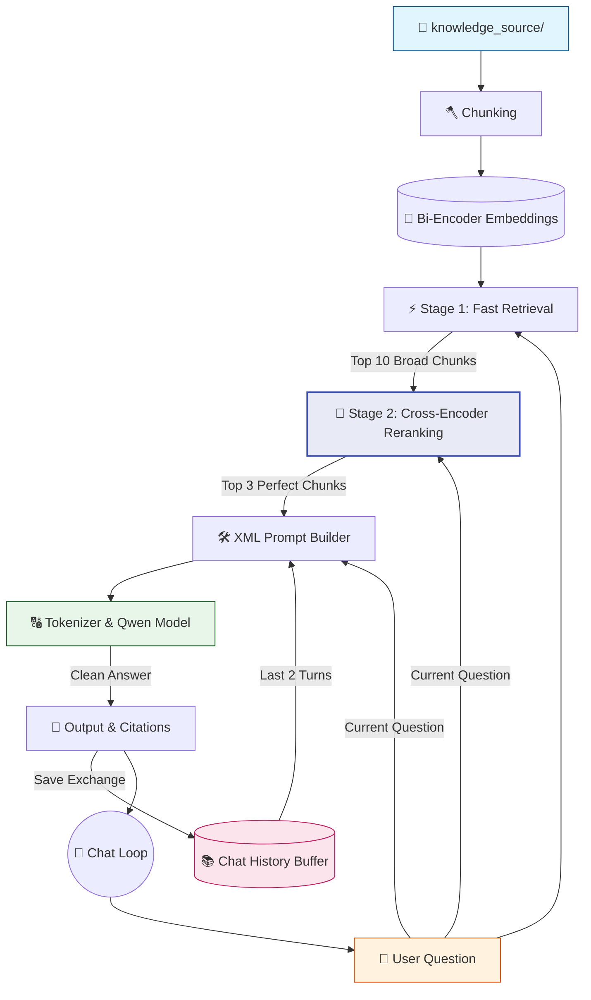

# 🤖 V9 RAG-style Closed Context QA Bot (Reranking)

## 🏗️ Summary

> [!NOTE]
> **Goal For This Version**  
> Build a **V9 RAG-style Closed Context QA Bot**. This version elevates the retrieval engine to an enterprise grade by implementing **Two-Stage Retrieval** using a highly accurate Cross-Encoder for reranking.

> [!IMPORTANT]
> **Changes from Last Version [v8.1] to Current Version [v9]**  
> * Imported `CrossEncoder` from the `sentence-transformers` library.
> * Loaded a dedicated secondary reranking model: `cross-encoder/ms-marco-MiniLM-L-6-v2`.
> * **Stage 1:** Over-fetch exactly 10 broad chunks using the lightning-fast Bi-Encoder (Cosine Similarity) from V7.
> * **Stage 2:** Pass the User's question and those 10 specific chunks simultaneously into the Cross-Encoder.
> * Resort the 10 chunks based on the Cross-Encoder's rigorous relevance score, and return only the absolute top 3 to the Qwen model.

> [!IMPORTANT]
> **Why the changes were made (problem faced)**  
> The V7/V8 Bi-Encoder (which calculates distance between two independent vectors) is incredibly fast, but it can be easily fooled. It often surfaces chunks that share conceptual vocabulary but lack true relevance to the nuanced intent of the user's question. This results in the generative model receiving "muddy" or irrelevant context.

> [!IMPORTANT]
> **How the new version solves the problem**  
> A Cross-Encoder is fundamentally different from a Bi-Encoder. It feeds both the question AND the document text into the transformer *at the exact same time*, allowing the AI's attention mechanism to directly compare words between the two sentences. This yields a massively more accurate relevance score. Because Cross-Encoders are very slow, we use a "Two-Stage" pipeline: The fast Bi-Encoder filters 10,000 chunks down to 10 in milliseconds, and the slow Cross-Encoder meticulously sorts those 10 to find the perfect 3.

---

## 🏗️ Architecture

### 🔄 Full System Flow



---

### 📦 Code

*(Note: Loading and prompt-building logic are omitted to focus purely on the V9 Two-Stage Retrieval Upgrade).*

```python
from transformers import AutoTokenizer, AutoModelForCausalLM
from sentence_transformers import SentenceTransformer, CrossEncoder
import torch
import torch.nn.functional as F
import os
import time

# =====================================================
# 🧠 RAGBOT V9
# Level 3 — Two-Stage Retrieval (Cross-Encoder Reranking)
# Keeps same terminal style + same Qwen model
# =====================================================

model_name = "Qwen/Qwen2.5-0.5B-Instruct"
embed_model_name = "sentence-transformers/all-MiniLM-L6-v2"
cross_encoder_model_name = "cross-encoder/ms-marco-MiniLM-L-6-v2"

# -----------------------------------------------------
# 🟢 LOADING PHASE
# -----------------------------------------------------

print("🔄 RAGBOT V9 Running........")

# ... (Tokenizer and Qwen Model Loading) ...

print("🔄 Loading embedding model (Bi-Encoder)...")
embedder = SentenceTransformer(embed_model_name)
print("✅ Embedding model loaded")

# 🆕 NEW IN V9: Load Cross-Encoder for reranking
print("🔄 Loading reranker model (Cross-Encoder)...")
cross_encoder = CrossEncoder(cross_encoder_model_name)
print("✅ Reranker model loaded")


# -----------------------------------------------------
# 🟠 SEMANTIC RETRIEVAL (V9 TWO-STAGE)
# -----------------------------------------------------

def retrieve_top_k(question, k=3):
    print("\n🔍 Stage 1: Fast Semantic Retrieval (Bi-Encoder)...")
    start = time.time()

    query_embedding = embedder.encode(
        question,
        convert_to_tensor=True
    )

    scores = F.cosine_similarity(
        query_embedding.unsqueeze(0),
        chunk_embeddings
    )

    # 🆕 NEW IN V9: Retrieve top 10 chunks initially
    top_scores, top_indices = torch.topk(scores, k=min(10, len(chunks)))

    initial_results = []
    for score, idx in zip(top_scores, top_indices):
        item = chunks[idx.item()].copy()
        initial_results.append(item)

    print(f"✅ Stage 1 retrieved {len(initial_results)} broad chunks in {time.time() - start:.2f}s")

    # 🆕 NEW IN V9: Stage 2 - Cross-Encoder Reranking
    print("🎯 Stage 2: Cross-Encoder Reranking...")
    rerank_start = time.time()

    cross_inp = [[question, item["text"]] for item in initial_results]
    cross_scores = cross_encoder.predict(cross_inp)

    # Attach new scores and sort
    for i in range(len(initial_results)):
        initial_results[i]["score"] = float(cross_scores[i])
    
    initial_results.sort(key=lambda x: x["score"], reverse=True)

    # Select the absolute best 'k' chunks
    final_results = initial_results[:k]

    print(f"✅ Stage 2 reranked and selected top {k} chunks in {time.time() - rerank_start:.2f}s")
    
    return final_results
```

---

## 🏗️ Stepwise Architecture

### 🧠 Step 1 — Load Reranker Model (🆕 NEW IN V9)

```python
cross_encoder = CrossEncoder(cross_encoder_model_name)
```

**Purpose:** Loads a secondary, specialized AI model whose only job is to evaluate if a chunk is actually relevant to a specific question. `ms-marco-MiniLM` is trained specifically on Bing search queries to determine paragraph relevance.

---

### ⚡ Step 2 — Stage 1 Fast Retrieval (🆕 NEW IN V9)

```python
    top_scores, top_indices = torch.topk(scores, k=min(10, len(chunks)))
```

**Purpose:** We use the exact same cosine-similarity logic from V7. However, instead of grabbing the top 3, we over-fetch and grab the **top 10**. This ensures we cast a wide enough net to catch the correct answer, even if the Bi-Encoder ranked it at #8.

---

### 🎯 Step 3 — Stage 2 Cross-Encoder Reranking (🆕 NEW IN V9)

```python
    cross_inp = [[question, item["text"]] for item in initial_results]
    cross_scores = cross_encoder.predict(cross_inp)
```

**Purpose:** We build a nested array pairing the user's `question` with every single one of the 10 `text` chunks. We pass this array into `cross_encoder.predict()`. The model reads both texts simultaneously and spits out a highly accurate scalar score for each pair. 

---

### 🏆 Step 4 — Resort and Slice (🆕 NEW IN V9)

```python
    for i in range(len(initial_results)):
        initial_results[i]["score"] = float(cross_scores[i])
    
    initial_results.sort(key=lambda x: x["score"], reverse=True)
    final_results = initial_results[:k]
```

**Purpose:** We overwrite the old Bi-Encoder score with the new, highly accurate Cross-Encoder score. We then sort the 10 chunks from highest to lowest based on this new metric, and finally slice off the top `k` (3) to be injected into the prompt. 

---

## 🚀 Final One-Line Understanding

> **This architecture uses a fast Bi-Encoder to filter thousands of documents down to 10, and a heavy Cross-Encoder to meticulously rerank those 10 into the perfect top 3 for the generative model.**
