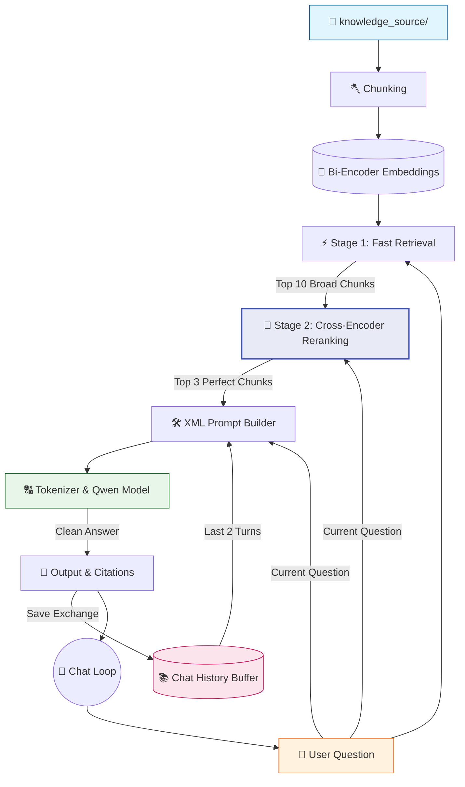

# 🤖 V9 RAG-style Closed Context QA Bot (Reranking)

## 🏗️ Summary

> [!NOTE]
> **Goal For This Version**  
> Build a **V9 RAG-style Closed Context QA Bot**. This version elevates the retrieval engine to an enterprise grade by implementing **Two-Stage Retrieval** using a highly accurate Cross-Encoder for reranking.

> [!IMPORTANT]
> **Changes from Last Version [v8.1] to Current Version [v9]**  
> * Imported `CrossEncoder` from the `sentence-transformers` library.
> * Loaded a dedicated secondary reranking model: `cross-encoder/ms-marco-MiniLM-L-6-v2`.
> * **Stage 1:** Over-fetch exactly 10 broad chunks using the lightning-fast Bi-Encoder (Cosine Similarity) from V7.
> * **Stage 2:** Pass the User's question and those 10 specific chunks simultaneously into the Cross-Encoder.
> * Resort the 10 chunks based on the Cross-Encoder's rigorous relevance score, and return only the absolute top 3 to the Qwen model.

> [!IMPORTANT]
> **Why the changes were made (problem faced)**  
> The V7/V8 semantic retrieval system uses a **Bi-Encoder** — a model that converts text into vectors independently. The question gets encoded into one vector, each chunk gets encoded into another vector, and then we measure the angle (cosine similarity) between them. This works remarkably well and is very fast. However, it has a subtle but important limitation.
>
> Because the question and the chunks are encoded *separately*, the model never actually reads them together. It converts each piece of text into a standalone "fingerprint" and then compares those fingerprints. Think of it like trying to judge if two puzzles are a match by looking at photos of each puzzle individually, rather than placing one on top of the other to see if the pieces fit. You might get most matches right, but there will be edge cases where the fingerprints look similar but the actual fit is poor.
>
> In practice this means the Bi-Encoder sometimes retrieves chunks that are *topically related* but not actually *the answer* to the specific question. For example, a question about *"the CEO's hire date"* might retrieve chunks about *"the CEO's salary"* and *"hiring policies"* — both are about the CEO and hiring, so the fingerprints look similar — but neither chunk contains the hire date. The result is that the Qwen model receives "muddy" context: relevant-ish but not precise, causing it to either give a wrong answer or say "Not found" when the correct answer actually does exist somewhere in the database.

> [!IMPORTANT]
> **How the new version solves the problem**  
> V9 introduces a smarter second opinion: the **Cross-Encoder**, and this changes the retrieval game completely.
>
> Here's the key insight. A Cross-Encoder doesn't encode the question and the document separately. Instead, it reads them *both at the same time* — concatenated together as a single input. Think of it like a judge reading both a question and a proposed answer simultaneously, rather than reading each one separately and then comparing notes. Because both texts are read together, the model's attention mechanism can directly compare specific words and phrases between the question and the chunk, asking *"Does this specific sentence in the chunk actually address this specific detail in the question?"* This deep cross-attention produces a fundamentally more accurate relevance score.
>
> The catch is that Cross-Encoders are slower. Because they process the question + document pair together, they can't pre-compute anything. Every query requires feeding all chunks through the model fresh. For a knowledge base with thousands of chunks, running a Cross-Encoder on all of them would take minutes per query — far too slow.
>
> V9 solves this with a brilliant **Two-Stage pipeline**. In Stage 1, the fast Bi-Encoder from V7 runs its lightning-fast cosine similarity search and retrieves the top 10 most likely relevant chunks (not 3, not 1 — 10, casting a wider net). This takes milliseconds. In Stage 2, only those 10 candidates are passed to the Cross-Encoder, which reads each question+chunk pair carefully and produces a precise relevance score for all 10. The top 3 scores win and are sent to the generative model. The result: near-perfect precision at an acceptable speed.

---

## 📖 Terminologies

| Term | What It Means |
|---|---|
| **Two-Stage Retrieval** | A pipeline where a fast, approximate first stage narrows the candidates, and a slow, precise second stage picks the final winners. Balances speed and accuracy. |
| **Bi-Encoder** | An embedding architecture that encodes the question and each document separately into vectors and compares them. Very fast but less precise because texts are never read together. |
| **Cross-Encoder** | An AI model that reads the question and a document *together* as a single input. Much more accurate because it can directly compare words between the two, but slower. |
| **`ms-marco-MiniLM-L-6-v2`** | The specific Cross-Encoder model used for reranking. Trained on the MS MARCO dataset — a large collection of real Bing search queries and relevant passages — making it excellent at judging passage relevance. |
| **Reranking** | The process of taking an initial set of retrieved candidates and re-sorting them using a more accurate (and slower) model to get better final results. |
| **Over-fetching** | Deliberately retrieving more results than you need (here, 10 instead of 3) in the first stage so the second stage has a large enough pool to pick the truly best results from. |
| **Attention Mechanism** | The core mechanism inside transformer models that lets them focus on the most relevant words when processing a sequence. Cross-Encoders use this to compare words across the question and the document. |
| **`cross_encoder.predict()`** | A function that takes a list of [question, chunk] pairs and returns a relevance score for each pair. Higher scores mean more relevant. |
| **Muddy Context** | When the retrieved chunks are topically related but not precisely relevant to the question, leading to confused or incorrect model outputs. |

---

## 🏗️ Architecture

### 🔄 Full System Flow



---

### 📦 Code

*(Note: Loading and prompt-building logic are omitted to focus purely on the V9 Two-Stage Retrieval Upgrade).*

```python
from transformers import AutoTokenizer, AutoModelForCausalLM
from sentence_transformers import SentenceTransformer, CrossEncoder
import torch
import torch.nn.functional as F
import os
import time

# =====================================================
# 🧠 RAGBOT V9
# Level 3 — Two-Stage Retrieval (Cross-Encoder Reranking)
# Keeps same terminal style + same Qwen model
# =====================================================

model_name = "Qwen/Qwen2.5-0.5B-Instruct"
embed_model_name = "sentence-transformers/all-MiniLM-L6-v2"
cross_encoder_model_name = "cross-encoder/ms-marco-MiniLM-L-6-v2"

# -----------------------------------------------------
# 🟢 LOADING PHASE
# -----------------------------------------------------

print("🔄 RAGBOT V9 Running........")

# ... (Tokenizer and Qwen Model Loading) ...

print("🔄 Loading embedding model (Bi-Encoder)...")
embedder = SentenceTransformer(embed_model_name)
print("✅ Embedding model loaded")

# 🆕 NEW IN V9: Load Cross-Encoder for reranking
print("🔄 Loading reranker model (Cross-Encoder)...")
cross_encoder = CrossEncoder(cross_encoder_model_name)
print("✅ Reranker model loaded")


# -----------------------------------------------------
# 🟠 SEMANTIC RETRIEVAL (V9 TWO-STAGE)
# -----------------------------------------------------

def retrieve_top_k(question, k=3):
    print("\n🔍 Stage 1: Fast Semantic Retrieval (Bi-Encoder)...")
    start = time.time()

    query_embedding = embedder.encode(
        question,
        convert_to_tensor=True
    )

    scores = F.cosine_similarity(
        query_embedding.unsqueeze(0),
        chunk_embeddings
    )

    # 🆕 NEW IN V9: Retrieve top 10 chunks initially
    top_scores, top_indices = torch.topk(scores, k=min(10, len(chunks)))

    initial_results = []
    for score, idx in zip(top_scores, top_indices):
        item = chunks[idx.item()].copy()
        initial_results.append(item)

    print(f"✅ Stage 1 retrieved {len(initial_results)} broad chunks in {time.time() - start:.2f}s")

    # 🆕 NEW IN V9: Stage 2 - Cross-Encoder Reranking
    print("🎯 Stage 2: Cross-Encoder Reranking...")
    rerank_start = time.time()

    cross_inp = [[question, item["text"]] for item in initial_results]
    cross_scores = cross_encoder.predict(cross_inp)

    # Attach new scores and sort
    for i in range(len(initial_results)):
        initial_results[i]["score"] = float(cross_scores[i])
    
    initial_results.sort(key=lambda x: x["score"], reverse=True)

    # Select the absolute best 'k' chunks
    final_results = initial_results[:k]

    print(f"✅ Stage 2 reranked and selected top {k} chunks in {time.time() - rerank_start:.2f}s")
    
    return final_results
```

---

## 🏗️ Stepwise Architecture

### 🧠 Step 1 — Load Reranker Model (🆕 NEW IN V9)

```python
cross_encoder = CrossEncoder(cross_encoder_model_name)
```

**Purpose:** Loads a secondary, specialized AI model whose only job is to evaluate if a chunk is actually relevant to a specific question. `ms-marco-MiniLM` is trained specifically on Bing search queries to determine paragraph relevance.

---

### ⚡ Step 2 — Stage 1 Fast Retrieval (🆕 NEW IN V9)

```python
    top_scores, top_indices = torch.topk(scores, k=min(10, len(chunks)))
```

**Purpose:** We use the exact same cosine-similarity logic from V7. However, instead of grabbing the top 3, we over-fetch and grab the **top 10**. This ensures we cast a wide enough net to catch the correct answer, even if the Bi-Encoder ranked it at #8.

---

### 🎯 Step 3 — Stage 2 Cross-Encoder Reranking (🆕 NEW IN V9)

```python
    cross_inp = [[question, item["text"]] for item in initial_results]
    cross_scores = cross_encoder.predict(cross_inp)
```

**Purpose:** We build a nested array pairing the user's `question` with every single one of the 10 `text` chunks. We pass this array into `cross_encoder.predict()`. The model reads both texts simultaneously and spits out a highly accurate scalar score for each pair. 

---

### 🏆 Step 4 — Resort and Slice (🆕 NEW IN V9)

```python
    for i in range(len(initial_results)):
        initial_results[i]["score"] = float(cross_scores[i])
    
    initial_results.sort(key=lambda x: x["score"], reverse=True)
    final_results = initial_results[:k]
```

**Purpose:** We overwrite the old Bi-Encoder score with the new, highly accurate Cross-Encoder score. We then sort the 10 chunks from highest to lowest based on this new metric, and finally slice off the top `k` (3) to be injected into the prompt. 

---

## 🚀 Final One-Line Understanding

> **This architecture uses a fast Bi-Encoder to filter thousands of documents down to 10, and a heavy Cross-Encoder to meticulously rerank those 10 into the perfect top 3 for the generative model.**
