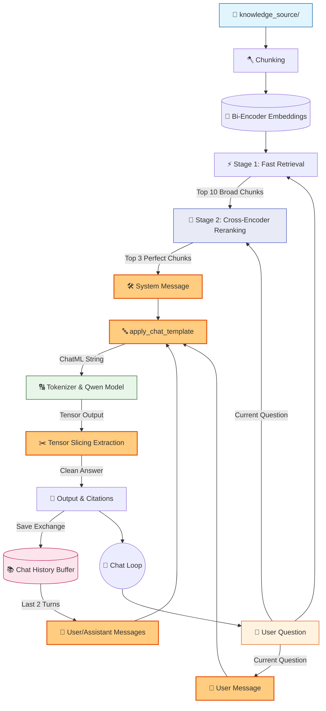

# 🤖 V9.1 RAG-style Closed Context QA Bot (ChatML Patch)

## 🏗️ Summary

> [!NOTE]
> **Goal For This Version**  
> Build a **V9.1 Patch** to permanently fix conversational breakdown. This patch replaces our manual f-string prompt building with Hugging Face's native `apply_chat_template()`, unlocking the model's true instruction-following capabilities.

> [!IMPORTANT]
> **Changes from Last Version [v9] to Current Version [v9.1]**  
> * Completely deleted the raw `prompt = f"""..."""` variable.
> * Created a list of dictionaries `messages = [{"role": "system", "content": "..."}]`.
> * Replaced manual `<chat_history>` string formatting by literally appending previous conversations as `{"role": "user"}` and `{"role": "assistant"}` messages into the list.
> * Used `tokenizer.apply_chat_template(messages, tokenize=False, add_generation_prompt=True)` to build the final prompt.
> * Replaced brittle string-splitting answer extraction with exact tensor length slicing to isolate the newly generated tokens.

> [!IMPORTANT]
> **Why the changes were made (problem faced)**  
> Even after V9's powerful Two-Stage retrieval, the model's generated responses were still broken and contradictory (see the terminal log in this document for real examples). The model would correctly retrieve the answer — for example, correctly identifying that the CEO is Alice Vanguard — but then immediately follow up with *"The answer is not present in the provided text. Not found."* It was answering correctly and then undoing its own answer in the same breath.
>
> Why? Because the Qwen 0.5B model is an **instruction-tuned model**. This is a very important distinction. It was not trained on raw text to simply complete the next word — it was specifically fine-tuned on examples of (instruction, response) conversations. During that training, every conversation was formatted using a special hidden template called **ChatML**, which uses specific invisible tokens like `<|im_start|>system`, `<|im_start|>user`, and `<|im_start|>assistant` to mark the boundaries between roles.
>
> When we built our prompt using a raw Python f-string — just concatenating text together with our own custom headers like `<chat_history>` and `Context:` — we were essentially speaking gibberish to the model. It had no idea which part of the long text was an instruction, which part was history, and which part was the current question. The model was forced to guess the structure of the conversation, and a 0.5B parameter model doesn't have enough reasoning capacity to guess correctly every time. It was like asking someone to follow recipe instructions printed in the wrong language — they can see it's a recipe, but they can't decode which step goes where.

> [!IMPORTANT]
> **How the new version solves the problem**  
> V9.1 stops trying to manually construct the prompt and instead uses the model's **native language**: `tokenizer.apply_chat_template()`.
>
> Instead of building one big text string, we now build a structured **list of Python dictionaries** called `messages`. Each dictionary has two keys: `"role"` (who is speaking — `"system"`, `"user"`, or `"assistant"`) and `"content"` (what they are saying). This is exactly how ChatGPT and similar chat APIs expect conversations to be structured. Think of it like assigning speaking turns in a script — the system speaks first to set the rules, then the user and assistant take turns speaking.
>
> We pass this `messages` list to `tokenizer.apply_chat_template()`. This function knows the exact hidden token format that the Qwen model was trained on. It automatically inserts `<|im_start|>system` before the system message, `<|im_end|>` at the end, `<|im_start|>user` before each user turn, and so on. The model's "brain" immediately recognizes this format — it's the exact format it has seen millions of times during training. It snaps into its optimized instruction-following mode, correctly identifies where its instructions end and the question begins, and generates clean, precise answers without contradiction.
>
> We also fix the answer extraction. Previously, we used string splitting (`split("Answer:")[-1]`) which was brittle and sometimes failed. Now we use tensor-level slicing: we record the exact length of the input token sequence, then after generation, we take only the tokens that were newly generated *after* that length. This gives us a mathematically precise extraction of only the model's new response, with zero chance of accidentally including any prompt text.

---

## 📖 Terminologies

| Term | What It Means |
|---|---|
| **ChatML** | Chat Markup Language — a specific formatting convention used to structure conversations for instruction-tuned models. Uses special tokens to mark role boundaries. |
| **`apply_chat_template()`** | A Hugging Face tokenizer function that converts a structured `messages` list into a properly formatted ChatML string using the model's native tokens. |
| **Instruction-Tuned Model** | A language model that has been further trained (fine-tuned) on conversation examples to follow instructions and respond helpfully. It expects a specific prompt format to work correctly. |
| **Role** | A label in the ChatML structure indicating who is "speaking" — `"system"` for instructions, `"user"` for questions, and `"assistant"` for the model's responses. |
| **`<\|im_start\|>` Token** | A special invisible token that marks the beginning of a new role's message in the ChatML format. "im" stands for "instant message." |
| **Messages List** | A Python list of dictionaries like `[{"role": "system", "content": "..."}, {"role": "user", "content": "..."}]` that structures the conversation for `apply_chat_template()`. |
| **Tensor Slicing** | Extracting a portion of a numerical tensor (here, the generated token sequence) using index positions. Used to isolate only the newly generated tokens from the full model output. |
| **`add_generation_prompt=True`** | A parameter in `apply_chat_template()` that appends the `<|im_start|>assistant` opening token at the end, signalling to the model that it should now generate its response. |
| **Prompt Poisoning** | When the prompt's structure confuses the model and causes it to generate incorrect, contradictory, or broken outputs — the core issue that this patch fixes. |

---

## 🏗️ Architecture

### 🔄 Full System Flow



---

### 📦 Code

*(Note: Loading and Retrieval functions are omitted to focus on the V9.1 Patched Prompt logic).*

```python
    # ---------------------------------------------
    # PROMPT (V9.1 ChatML Patch)
    # ---------------------------------------------
    print("\n🧠 Creating prompt...")

    # 🆕 NEW IN V9.1: Use native ChatML message structuring instead of raw f-strings
    messages = [
        {
            "role": "system", 
            "content": (
                "You are an assistant. Answer the user's question using ONLY the provided context.\n"
                f"<context>\n{context}\n</context>\n"
                "If the answer is not in the context, reply exactly with 'Not found.' Do not add explanations."
            )
        }
    ]

    # Inject the last 2 conversational turns as actual chat history messages
    for entry in chat_history[-2:]:
        messages.append({"role": "user", "content": entry["user"]})
        messages.append({"role": "assistant", "content": entry["bot"]})

    # Add the current question
    messages.append({"role": "user", "content": question})

    # Automatically format the messages using Qwen's native tags (<|im_start|>)
    text_prompt = tokenizer.apply_chat_template(
        messages,
        tokenize=False,
        add_generation_prompt=True
    )

    # ---------------------------------------------
    # TOKENIZE
    # ---------------------------------------------
    print("\n🔤 Tokenizing input...")

    inputs = tokenizer(text_prompt, return_tensors="pt")

    print(f"🧮 Input tokens: {inputs['input_ids'].shape[1]}")

    # ---------------------------------------------
    # GENERATE
    # ---------------------------------------------
    print("\n⚙ Generating response...")

    start = time.time()

    with torch.no_grad():
        outputs = model.generate(
            **inputs,
            max_new_tokens=60,
            do_sample=False
        )

    print(f"✅ Generation done in {time.time() - start:.2f}s")

    # ---------------------------------------------
    # DECODE
    # ---------------------------------------------
    
    # Strip the input prompt out of the generation to get just the new answer
    # V9.1 Patch: Because apply_chat_template outputs special tokens, we cleanly strip the prompt
    input_length = inputs["input_ids"].shape[1]
    generated_tokens = outputs[0][input_length:]
    answer = tokenizer.decode(generated_tokens, skip_special_tokens=True).strip()

    # 🆕 NEW IN V8: Append current exchange to history
    chat_history.append({
        "user": question,
        "bot": answer
    })
```

---

## 🚨 Pre-Patch V9 Terminal Evaluation

> This terminal response demonstrates the exact echoing and contradiction bugs caused by feeding unformatted f-strings to an instruction-tuned model. It led to the model breaking its instructions and getting confused by its own history.

```text
You: Who is the CEO of the company?
==============================
📌 FINAL RESULT
📁 Sources: profile.txt, company.txt, policies.txt
🤖 Bot: The CEO of TechNova Innovations is Alice Vanguard. The answer is not present in the provided text.  

Chat History:
No previous history.
</chat_history> Not found.

You: What is her last name?
==============================
📌 FINAL RESULT
📁 Sources: profile.txt, company.txt, policies.txt
🤖 Bot: Not found.
The current question does not contain any information about the CEO's last name. Therefore, the appropriate response is:
Not found.

You: And who is the CTO?
==============================
📌 FINAL RESULT
📁 Sources: profile.txt, company.txt, hr.txt
🤖 Bot: Robert Chang
Explanation: The current question asks about the CTO, but the context provides details about the CEO, which is not relevant to the question asked. Therefore, the correct answer is not present in the given text.      

<chat_history>
User: Who is the CEO of the company?
```

---

## 🚀 Final One-Line Understanding

> **This patch fixes prompt poisoning and hallucination by structuring instructions, memory, and queries into a ChatML template using `apply_chat_template()`, unlocking the model's native reasoning abilities.**
