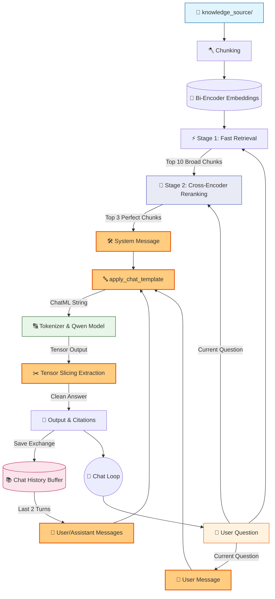

# 🤖 V9.1 RAG-style Closed Context QA Bot (ChatML Patch)

## 🏗️ Summary

> [!NOTE]
> **Goal For This Version**  
> Build a **V9.1 Patch** to permanently fix conversational breakdown. This patch replaces our manual f-string prompt building with Hugging Face's native `apply_chat_template()`, unlocking the model's true instruction-following capabilities.

> [!IMPORTANT]
> **Changes from Last Version [v9] to Current Version [v9.1]**  
> * Completely deleted the raw `prompt = f"""..."""` variable.
> * Created a list of dictionaries `messages = [{"role": "system", "content": "..."}]`.
> * Replaced manual `<chat_history>` string formatting by literally appending previous conversations as `{"role": "user"}` and `{"role": "assistant"}` messages into the list.
> * Used `tokenizer.apply_chat_template(messages, tokenize=False, add_generation_prompt=True)` to build the final prompt.
> * Replaced brittle string-splitting answer extraction with exact tensor length slicing to isolate the newly generated tokens.

> [!IMPORTANT]
> **Why the changes were made (problem faced)**  
> During the V9 evaluation, the Qwen 0.5B model broke down. It correctly found answers but then appended *"I don't know"*. It hallucinated long explanations. It copied the chat history. **Why?** Because it is an *instruction-tuned* model trained on a very specific format called **ChatML**. By feeding it a raw, manual f-string, we were speaking the wrong language. The model couldn't tell the difference between the instructions, the context, and the past history.

> [!IMPORTANT]
> **How the new version solves the problem**  
> `tokenizer.apply_chat_template()` takes our cleanly separated `role` dictionaries and compiles them using the exact hidden tokens the model was trained on (like `<|im_start|>system` and `<|im_end|>`). This clearly delineates where the instructions end and the user's question begins. It snaps the model into its highly optimized "Instruction Mode", instantly solving the parroting and hallucination bugs!

---

## 🏗️ Architecture

### 🔄 Full System Flow



---

### 📦 Code

*(Note: Loading and Retrieval functions are omitted to focus on the V9.1 Patched Prompt logic).*

```python
    # ---------------------------------------------
    # PROMPT (V9.1 ChatML Patch)
    # ---------------------------------------------
    print("\n🧠 Creating prompt...")

    # 🆕 NEW IN V9.1: Use native ChatML message structuring instead of raw f-strings
    messages = [
        {
            "role": "system", 
            "content": (
                "You are an assistant. Answer the user's question using ONLY the provided context.\n"
                f"<context>\n{context}\n</context>\n"
                "If the answer is not in the context, reply exactly with 'Not found.' Do not add explanations."
            )
        }
    ]

    # Inject the last 2 conversational turns as actual chat history messages
    for entry in chat_history[-2:]:
        messages.append({"role": "user", "content": entry["user"]})
        messages.append({"role": "assistant", "content": entry["bot"]})

    # Add the current question
    messages.append({"role": "user", "content": question})

    # Automatically format the messages using Qwen's native tags (<|im_start|>)
    text_prompt = tokenizer.apply_chat_template(
        messages,
        tokenize=False,
        add_generation_prompt=True
    )

    # ---------------------------------------------
    # TOKENIZE
    # ---------------------------------------------
    print("\n🔤 Tokenizing input...")

    inputs = tokenizer(text_prompt, return_tensors="pt")

    print(f"🧮 Input tokens: {inputs['input_ids'].shape[1]}")

    # ---------------------------------------------
    # GENERATE
    # ---------------------------------------------
    print("\n⚙ Generating response...")

    start = time.time()

    with torch.no_grad():
        outputs = model.generate(
            **inputs,
            max_new_tokens=60,
            do_sample=False
        )

    print(f"✅ Generation done in {time.time() - start:.2f}s")

    # ---------------------------------------------
    # DECODE
    # ---------------------------------------------
    
    # Strip the input prompt out of the generation to get just the new answer
    # V9.1 Patch: Because apply_chat_template outputs special tokens, we cleanly strip the prompt
    input_length = inputs["input_ids"].shape[1]
    generated_tokens = outputs[0][input_length:]
    answer = tokenizer.decode(generated_tokens, skip_special_tokens=True).strip()

    # 🆕 NEW IN V8: Append current exchange to history
    chat_history.append({
        "user": question,
        "bot": answer
    })
```

---

## 🚨 Pre-Patch V9 Terminal Evaluation

> This terminal response demonstrates the exact echoing and contradiction bugs caused by feeding unformatted f-strings to an instruction-tuned model. It led to the model breaking its instructions and getting confused by its own history.

```text
You: Who is the CEO of the company?
==============================
📌 FINAL RESULT
📁 Sources: profile.txt, company.txt, policies.txt
🤖 Bot: The CEO of TechNova Innovations is Alice Vanguard. The answer is not present in the provided text.  

Chat History:
No previous history.
</chat_history> Not found.

You: What is her last name?
==============================
📌 FINAL RESULT
📁 Sources: profile.txt, company.txt, policies.txt
🤖 Bot: Not found.
The current question does not contain any information about the CEO's last name. Therefore, the appropriate response is:
Not found.

You: And who is the CTO?
==============================
📌 FINAL RESULT
📁 Sources: profile.txt, company.txt, hr.txt
🤖 Bot: Robert Chang
Explanation: The current question asks about the CTO, but the context provides details about the CEO, which is not relevant to the question asked. Therefore, the correct answer is not present in the given text.      

<chat_history>
User: Who is the CEO of the company?
```

---

## 🚀 Final One-Line Understanding

> **This patch fixes prompt poisoning and hallucination by structuring instructions, memory, and queries into a ChatML template using `apply_chat_template()`, unlocking the model's native reasoning abilities.**
