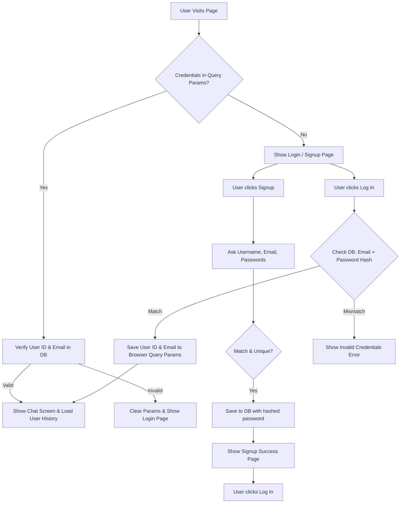

# User Management Implementation Plan

This document details the architectural and UI changes to introduce user signup, secure login/logout, role-based access control, and complete history isolation for each user.

## Architectural Changes

We will decouple user session states, introduce password encryption using PBKDF2 with a salt, build a new `users` database table in SQLite, and implement strict history filtering for the RAG engine context.



---

## 1. Database Schema Enhancements

### New `users` Table
We will add a new table `users` to store user profiles, encrypted password hashes, and user roles. 

```sql
CREATE TABLE IF NOT EXISTS users (
    id INTEGER PRIMARY KEY AUTOINCREMENT,
    username TEXT UNIQUE NOT NULL,
    email TEXT UNIQUE NOT NULL,
    password_hash TEXT NOT NULL,
    role TEXT NOT NULL DEFAULT 'user',
    created_at DATETIME DEFAULT CURRENT_TIMESTAMP
);
```

### Automatic Admin Role Seeding
To initialize the system with `harsh.verma@freseniusmedicalcare.com` as the only admin, we will implement conditional checks during sign up:
- When a user signs up, if their email is `harsh.verma@freseniusmedicalcare.com` (case-insensitive), their role is set to `admin`.
- For all other emails, the role is set to `user`.

### Message Table Reference
We will utilize the existing `messages` table, ensuring the `session_id` column is populated with the unique `username` or `email` of the logged-in user.

---

## 2. Password Encryption Logic

To ensure robust security on Windows and standard environments without introducing external C-extensions (like `bcrypt`), we will use Python's built-in `hashlib` using the industry-standard **PBKDF2-HMAC-SHA256** algorithm with a dynamic cryptographic salt and 100,000 iterations.

```python
import hashlib
import secrets

def hash_password(password: str) -> str:
    salt = secrets.token_hex(16)
    hash_val = hashlib.pbkdf2_hmac(
        'sha256', 
        password.encode('utf-8'), 
        salt.encode('utf-8'), 
        100000
    )
    return f"{salt}${hash_val.hex()}"

def verify_password(stored_hash: str, provided_password: str) -> bool:
    try:
        salt, hash_hex = stored_hash.split('$')
        hash_val = hashlib.pbkdf2_hmac(
            'sha256', 
            provided_password.encode('utf-8'), 
            salt.encode('utf-8'), 
            100000
        )
        return hash_val.hex() == hash_hex
    except Exception:
        return False
```

---

## 3. UI Flow & State Machine

We will implement a state machine using `st.session_state` to toggle between the different views.

### Local Browser Persistence
To avoid prompting returning users to log in, we will persist the `uid` (user ID) and `email` using Streamlit's URL query parameters (`st.query_params`).
- **Initial Load:** If `uid` and `email` are present in `st.query_params`, we query the database to verify their validity. If valid, the user is logged in automatically and redirected to the chat screen.
- **Login Action:** Upon successful login, the system sets `st.query_params["uid"] = user_id` and `st.query_params["email"] = email`.
- **Logout Action:** Deletes these keys from both `st.session_state` and `st.query_params` and redirects to the login screen.

---

## 4. Chat Screen UI & Context Isolation

### Chat Interface Display
To fulfill the requirement that prompts and responses have the username attached to them:
- **User Prompt:** Rendered as `Prompt (username)` in the chat thread.
- **Bot Response:** Rendered as `Response (username)` in the chat thread.

### Context Grounding Security (RAG Context Isolation)
To guarantee strict history isolation:
- The database querying utility `db.load_messages(username)` will load chat messages *only* for the logged-in user's username.
- When generating responses, `engine.generate_stream(..., history)` is provided *only* with the loaded messages of this current user.
- This prevents cross-contamination of contexts between different corporate users and keeps history entirely isolated.

---

## Proposed Changes

### [database.py](file:///c:/Users/2276537/OneDrive%20-%20Cognizant/Desktop/Coding/Python/rag-closed-context-qa/database.py)
- Add `hash_password(password)` and `verify_password(stored_hash, password)`.
- Implement `create_user(username, email, password, role)` with uniqueness checks.
- Implement `authenticate_user(email, password)` returning the user record if valid.
- Implement `get_user_by_credentials(user_id, email)` for automatic session recovery.
- `init_db()` to create the `users` table.

### [ui.py](file:///c:/Users/2276537/OneDrive%20-%20Cognizant/Desktop/Coding/Python/rag-closed-context-qa/ui.py)
- Replace sidebar name-input with professional Signup, Login, and Logout screens.
- Integrate password matching and email uniqueness verification in the signup screen.
- Render custom user and bot labels incorporating the active username.
- Ensure only the active user's chat history is retrieved and transmitted as RAG prompt context.

---

## Verification Plan

### Manual Verification
1. **Initial Access:** Access the app and confirm redirect to the login/signup screen if no credentials exist in the URL parameters.
2. **Sign Up:**
   - Register a new user with standard email; verify password confirmation mismatch checks.
   - Verify that signing up with `harsh.verma@freseniusmedicalcare.com` automatically marks the user role as `admin`.
   - Confirm the success page appears upon successful registration.
3. **Log In:**
   - Verify login with invalid credentials shows an error.
   - Verify successful login updates the URL parameters and redirects to the main chat interface.
4. **History Isolation:**
   - Sign in as `User A`, send 3 messages, and log out.
   - Sign in as `User B` (or `harsh.verma`), and verify that the chat thread is completely blank (no messages from `User A` are visible).
   - Log back in as `User A` to verify history is fully restored.
5. **Context Validation:** Inspect terminal logs to ensure that only `User A`'s history is packaged and sent in the conversational prompt context.
6. **Log Out:** Click log out, verify URL parameters are cleared, and confirm redirect back to the login page.
