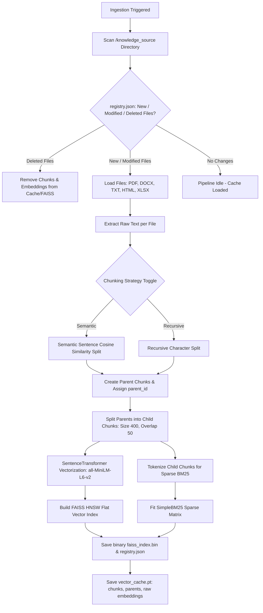
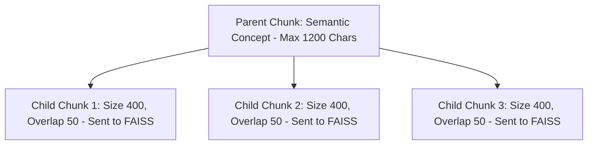

# Core RAG System: Document Ingestion & Indexing Pipeline

This document details the architecture and implementation specifications of the **Offline Ingestion & Indexing Pipeline** for CognIQ. This pipeline processes raw documents from disk and registers them into semantic (dense) and keyword (sparse) indices. All Mermaid diagrams are formatted top-down (`TD`).

---

## 🗺️ Offline Ingestion Flow

The following diagram illustrates the flow of a document from file detection in the `knowledge_source` folder to persistent database indexes.



---

## 1. Document Extraction & Preprocessing

The system processes a variety of file formats deposited in the `knowledge_source` folder:

* **Text (`.txt`):** Extracted using standard file readers with a fallback decode loop (`utf-8`).
* **PDF (`.pdf`):** Processed via **PyMuPDF (`fitz`)**, parsing pages sequentially and gathering plain text elements.
* **Word Document (`.docx`):** Handled via **python-docx**, combining paragraph text runs.
* **HTML (`.html`/`.htm`):** Parsed via **BeautifulSoup4**, stripping stylesheet blocks and scripts before harvesting the text tree.
* **Excel Spreadsheet (`.xlsx`/`.xlsm`):** Parsed dynamically with **openpyxl**. It extracts cells sheet-by-sheet, identifies headers, and formats rows into key-value descriptions (e.g. `Sheet: Sheet1 | Row 2: Header1: Val1 | Header2: Val2`) to preserve row associations.

---

## 2. Chunking & Parent-Child Context Mapping

To resolve the precision-context tradeoff in vector search, CognIQ uses a **Parent-Child** mapping system:



### Chunking Strategies
1. **Semantic Chunking (Topic Shifts):** Splitting text at natural transition boundaries.
   * Text is parsed into individual sentences.
   * Consecutive sentence embeddings are compared via cosine similarity:
     $$\text{Similarity} = \frac{S_{i} \cdot S_{i-1}}{\|S_{i}\| \|S_{i-1}\|}$$
   * A split occurs when similarity drops below a threshold (default `0.5`) or the cumulative size exceeds the character limit (default `1200` characters).
2. **Recursive Character Chunking:** Fallback mechanism dividing text recursively using separators (`\n\n`, `\n`, `. `, ` `) up to `1500` characters.

### Parent-Child Context Setup
* After generating larger **Parent** chunks, each parent is segmented into smaller **Child** chunks (typically `400` characters with `50` characters of overlapping safety boundaries).
* Only the **Child** chunks are vectorized and sent to the index.
* The mapping between the child chunks and their source parent is saved in a lookup dictionary (`self.parent_chunks[parent_id]`).

---

## 3. Vectorization & FAISS HNSW Indexing

* **Embedding Model:** Uses `sentence-transformers/all-MiniLM-L6-v2` which maps text to a 384-dimensional dense space.
* **Normalization:** All child vectors are normalized to unit length ($L_2$ normalization). This makes the inner product calculation ($IP$) equivalent to cosine similarity, improving query times:
  ```python
  faiss.normalize_L2(embeddings_np)
  ```
* **HNSW Graph Index:** The vectors are stored in a **Hierarchical Navigable Small Worlds** Flat Index (`faiss.IndexHNSWFlat`) configured with a link index $M = 32$ and an construction depth `efConstruction = 200` for high retrieval accuracy.

---

## 4. Sparse Keyword Indexing (BM25)

To ensure search hits on exact identifiers, model serials, ticket IDs, or specific code names, the system builds a parallel sparse index:
* **Algorithm:** A custom implementation of the classic **BM25** relevance scoring model.
* **Preprocessing:** Strips punctuation, downcases, and tokenizes chunk strings.
* **Execution:** Calculates Inverse Document Frequency ($IDF$) values across all chunks and normalizes based on document length to score terms.

---

## 5. Incremental Index Caching & Synchronization

Computing embeddings and building graphs is CPU/GPU intensive. CognIQ implements persistent caching:

* **File Registry:** Keeps track of files and their last modification times (`mtime`) on disk in `file_registry.json`.
* **Index Artifacts:** Persists variables to disk:
  * `vector_cache.pt`: A PyTorch file containing chunk lists, parent mappings, and raw embeddings numpy arrays.
  * `faiss_index.bin`: The binary HNSW graph index.
* **Incremental Synchronization:** During startup, if files are added, modified, or deleted:
  1. Registry lists are compared.
  2. Deleted files and their associated chunks are purged from lists.
  3. New/Modified files are processed, chunked, and embedded.
  4. New vectors are concatenated with remaining cached vectors, and the HNSW graph is rebuilt.
  5. The cache files are updated, avoiding redundant computations for unchanged documents.
