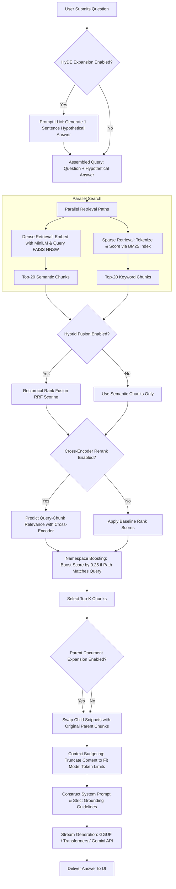

# Core RAG System: Online Query & Generation Pipeline

This document details the architecture and execution pipeline of the **Online Query & Generation Pipeline** for CognIQ. This pipeline resolves user questions by expanding queries, performing hybrid retrieval, reranking candidates, and generating grounded answers. All Mermaid diagrams are formatted top-down (`TD`).

---

## 🗺️ Online Execution Flow

The following diagram trace the request lifecycle from when a user enters a query to when the final response is generated.



---

## 1. Query Expansion via HyDE

When enabled, **HyDE (Hypothetical Document Embeddings)** translates questions into answers before retrieval:
* **The Problem:** Short user queries are structurally different from expository knowledge base articles.
* **The Solution:** The system prompts the active LLM: `"Write a one-sentence technical answer to this question: {question}"`. 
* **The Result:** The model’s hypothetical response is combined with the original question. This expanded query is used for vector search, aligning the search query with the semantic structure of the indexed documents.

---

## 2. Hybrid Retrieval & Rank Fusion (RRF)

CognIQ runs two parallel searches to find the best context matches:
1. **Dense Retrieval (FAISS HNSW):** Maps semantic meaning, synonyms, and context matches.
2. **Sparse Retrieval (SimpleBM25):** Ensures accuracy for exact IDs, technical terms, and serial codes.

### Reciprocal Rank Fusion (RRF)
To merge these results without dealing with incompatible raw scoring scales, the system uses RRF:
* Candidates are re-scored based on their rank index position in the dense and sparse search lists:
  $$RRF\_Score(d \in D) = \sum_{m \in \{\text{dense}, \text{sparse}\}} \frac{1}{60 + r_m(d)}$$
  *(Where $r_m(d)$ is the document's rank position (0-indexed) in search list $m$, and 60 is a standard smoothing constant).*

---

## 3. Reranking & Namespace Boosting

### Cross-Encoder Reranking
The top 20 candidate chunks are evaluated using a Cross-Encoder (`cross-encoder/ms-marco-MiniLM-L-6-v2`):
* Unlike Bi-encoders which evaluate query and context vectors separately, a Cross-Encoder processes the query and the chunk text *together*, analyzing the exact relationship between terms.
* Chunks are re-sorted based on the Cross-Encoder's relevance prediction.

### Namespace Boosting
If a user specifies a target folder namespace or if the directory name matches words in the query, the retrieval system boosts the relevance score of chunks in that namespace by adding `0.25`:
```python
if ns and ns in question.lower():
    candidate["score"] += 0.25
```

---

## 4. Parent Document Expansion

* **Search Precision vs. Generation Context:** Small chunks (`400` chars) are ideal for precise search matches, but they lack the surrounding context the LLM needs to answer complex questions.
* **The Solution:** Once the top-K child chunks are retrieved, their IDs are cross-referenced with `self.parent_chunks`. The child text is swapped with its corresponding **Parent** chunk (typically `1200` characters) before being fed into the LLM.

---

## 5. Context Budgeting & Token Safety

To prevent context window overflow (which causes crashes or cuts off generations):
1. **Token Calculation:** The system estimates the exact token count of the prompt template, system guidelines, and recent conversation history (last 2 turns).
2. **Dynamic Truncation:** It subtracts this count and the expected response size (`max_tokens` + safety headroom) from the model's maximum context limit (`n_ctx`).
3. **Context Fitting:** The retrieved parent context is dynamically truncated by lines until it fits within the remaining token budget.

---

## 6. Inference Execution & Strict Grounding Guidelines

CognIQ supports three model execution modes:
* **GGUF Mode:** Runs quantized local models (e.g. `llama-cpp-python` in 4-bit) optimized for consumer CPUs with multi-threaded compilation.
* **Transformers Mode:** Runs PyTorch models with **BitsAndBytes** 4-bit NormalFloat (NF4) quantization on CUDA GPUs.
* **Gemini API Mode:** Routes prompts to external Google Gemini models.

### Strict Grounding System Prompt
To prevent hallucinations, the model is initialized with strict instructions:
1. **Strict Context Adherence:** Answer the question using **ONLY** the provided context block. Do not extrapolate, assume, or bring in pre-trained external knowledge.
2. **Fallback Output:** If the context lacks the answer, the model must output exactly: `"I think this info isn't yet added to my knowledge base."` and nothing else.
3. **Stream Delivery:** Responses are returned via a background thread and a `TextIteratorStreamer` to display tokens in the Streamlit UI in real-time.


