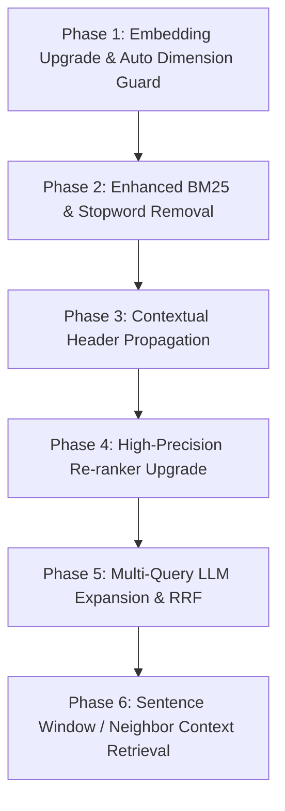
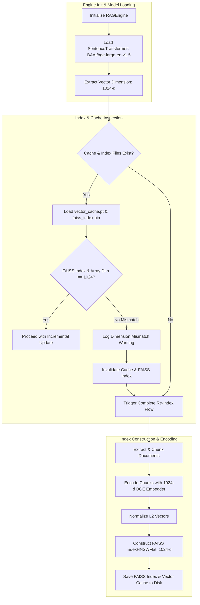
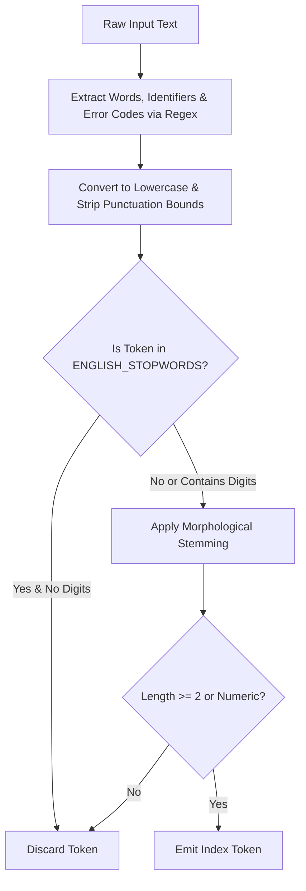

# RAG Engine Architectural Enhancements

This document tracks the phased architectural enhancements implemented in CognIQ to resolve false-positive chunk retrieval and achieve state-of-the-art closed-context QA accuracy.

---

## 🗺️ 6-Phase Enhancement Roadmap Overview



---

## 🟢 Phase 1: High-Capacity Vector Embedding Upgrade & Auto Dimension Guard

### 1. Overview & Problem Statement
* **Legacy Model:** `sentence-transformers/all-MiniLM-L6-v2`
  * Vector Dimension: **384**
  * Context Window: Truncated at **256 tokens** (~180 words)
  * **Limitations:** Weak semantic capture for enterprise terminology, technical manuals, acronyms, and long domain queries.
* **Upgraded Model:** `BAAI/bge-large-en-v1.5`
  * Vector Dimension: **1024**
  * Context Window: **512 tokens**
  * **Capabilities:** High-density semantic vectors, top benchmark score on MTEB retrieval leaderboard, superior domain concept separation.

---

### 2. Architecture & Data Execution Flow



---

### 3. Vector Dimension Auto-Invalidation Guard

When switching embedding models, mismatched vector dimensions between a cached FAISS index (e.g. `384-d`) and a newly loaded model (`1024-d`) will crash vector search operations at runtime.

Phase 1 introduces an automatic dimension verification guard inside `process_knowledge_base()` in `core.py`:

```python
# Verify embedding dimension compatibility
embed_dim = self.embedder.get_sentence_embedding_dimension() if self.embedder else 1024
if self.faiss_index is not None and getattr(self.faiss_index, "d", None) != embed_dim:
    print(f"[!] Vector dimension mismatch (Cached FAISS index: {self.faiss_index.d}d, Loaded embedder: {embed_dim}d). Invalidating cache and triggering complete re-index.")
    do_incremental = False

embeddings_np = data.get("embeddings_np", None)
if do_incremental and embeddings_np is not None and embeddings_np.shape[1] != embed_dim:
    print(f"[!] Vector dimension mismatch (Cached embeddings array: {embeddings_np.shape[1]}d, Loaded embedder: {embed_dim}d). Invalidating cache and triggering complete re-index.")
    do_incremental = False
```

---

### 4. Technical Impact
1. **Semantic Resolution:** 1024-dimensional embeddings provide 2.6x higher vector space resolution, dramatically improving similarity separation between domain-specific technical concepts.
2. **Crash Prevention:** The auto-invalidation guard guarantees seamless transitions between embedding models without requiring manual file deletion.
3. **Traceability:** Model defaults across `core.py`, `app.py`, and `ui.py` are synchronized to `BAAI/bge-large-en-v1.5`.

---

## 🟢 Phase 2: Enhanced BM25+ Engine, Stopword Removal & Dynamic Intent Switching

### 1. Overview & Problem Statement
* **Tokenizer Bottleneck:** Standard whitespace tokenizer left common English stopwords (`how`, `is`, `the`, `in`, `to`, `for`) in the sparse index. User queries with stopword noise generated high keyword scores for completely unrelated chunks.
* **BM25 Saturation Problem:** Standard Okapi BM25 severely penalizes long documents as term frequency grows.
* **Static Candidate Ratio Limitations:** Using a static 20/20 candidate split between FAISS dense search and BM25 sparse search treats exact code error lookups (`ERR-9021`) identically to open-ended procedural questions (`How do I configure users?`).

---

### 2. Architecture & Dynamic Execution Flow

```mermaid
flowchart TD
    UserQuery[User Input Query] --> IntentClassifier[detect_query_intent Analyzer]
    
    IntentClassifier -->|Contains Error Code / ID / Hex / Quotes| ExactIntent[Intent: EXACT_MATCH]
    IntentClassifier -->|Starts with how/explain or len >= 8| ConceptIntent[Intent: CONCEPTUAL]
    IntentClassifier -->|Standard Query| HybridIntent[Intent: HYBRID]
    
    subgraph Dynamic Search Depth & Allocation
        ExactIntent -->|BM25+ Depth: 35 | FAISS Depth: 10| ExactAlloc[Set Candidate Depths]
        ConceptIntent -->|FAISS Depth: 35 | BM25+ Depth: 10| ConceptAlloc[Set Candidate Depths]
        HybridIntent -->|FAISS Depth: 20 | BM25+ Depth: 20| HybridAlloc[Set Candidate Depths]
    end
    
    ExactAlloc --> ParallelRetrieval[Parallel Search Execution]
    ConceptAlloc --> ParallelRetrieval
    HybridAlloc --> ParallelRetrieval
    
    subgraph Parallel Search
        ParallelRetrieval --> DenseSearch[FAISS Dense Search: BAAI/bge-large-en-v1.5]
        ParallelRetrieval --> SparseSearch[BM25+ Sparse Search: Enhanced Tokenizer]
    end
    
    DenseSearch --> RRF_Engine[Dynamic Weighted RRF Engine]
    SparseSearch --> RRF_Engine
    
    subgraph Dynamic RRF Fusion
        RRF_Engine --> ExactWeight[EXACT_MATCH: BM25 Weight = 1.0, FAISS Weight = 0.4]
        RRF_Engine --> ConceptWeight[CONCEPTUAL: FAISS Weight = 1.0, BM25 Weight = 0.4]
        RRF_Engine --> HybridWeight[HYBRID: Equal Weights = 1.0]
    end
    
    ExactWeight --> CandidatePool[Top 25 Candidates for Reranking]
    ConceptWeight --> CandidatePool
    HybridWeight --> CandidatePool
```

---

### 3. Mathematical Foundations

#### A. BM25+ Scoring Formula
To avoid over-penalizing long documents and guarantee a non-zero base reward for any document containing query terms:

$$\text{Score}_{\text{BM25+}}(D, Q) = \sum_{q \in Q} \text{IDF}(q) \cdot \left[ \frac{f(q, D) \cdot (k_1 + 1)}{f(q, D) + k_1 \cdot \left(1 - b + b \cdot \frac{|D|}{\text{avgdl}}\right)} + \delta \right]$$

*(Where $k_1 = 1.5$, $b = 0.75$, and $\delta = 1.0$ is the term frequency lower bound).*

#### B. Dynamic Weighted Reciprocal Rank Fusion (Dynamic RRF)
Instead of uniform rank scoring, list-specific weights $w_m$ and smoothing constants $k_m$ are dynamically assigned based on query intent:

$$\text{Fused Score}(d) = \sum_{m \in \{\text{dense}, \text{sparse}\}} w_m \cdot \frac{1}{k_m + r_m(d)}$$

---

### 4. Tokenizer Enhancement Pipeline



---

### 5. Technical Impact
1. **Zero Stopword Noise:** Words like `"what"`, `"is"`, `"how"`, `"in"` are purged before indexing, preventing irrelevant chunks from surfacing on common query words.
2. **Precision for Error Codes & Serial Numbers:** Exact error code lookups (`ERR-9021`) trigger `EXACT_MATCH` intent, boosting BM25+ depth to 35 and weighting BM25+ RRF ranks at `1.0` vs FAISS at `0.4`.
3. **Semantic Dominance for Natural Questions:** Natural language questions trigger `CONCEPTUAL` intent, allocating 35 FAISS vector candidates and weighting BGE-large dense vectors at `1.0` vs BM25+ at `0.4`.

