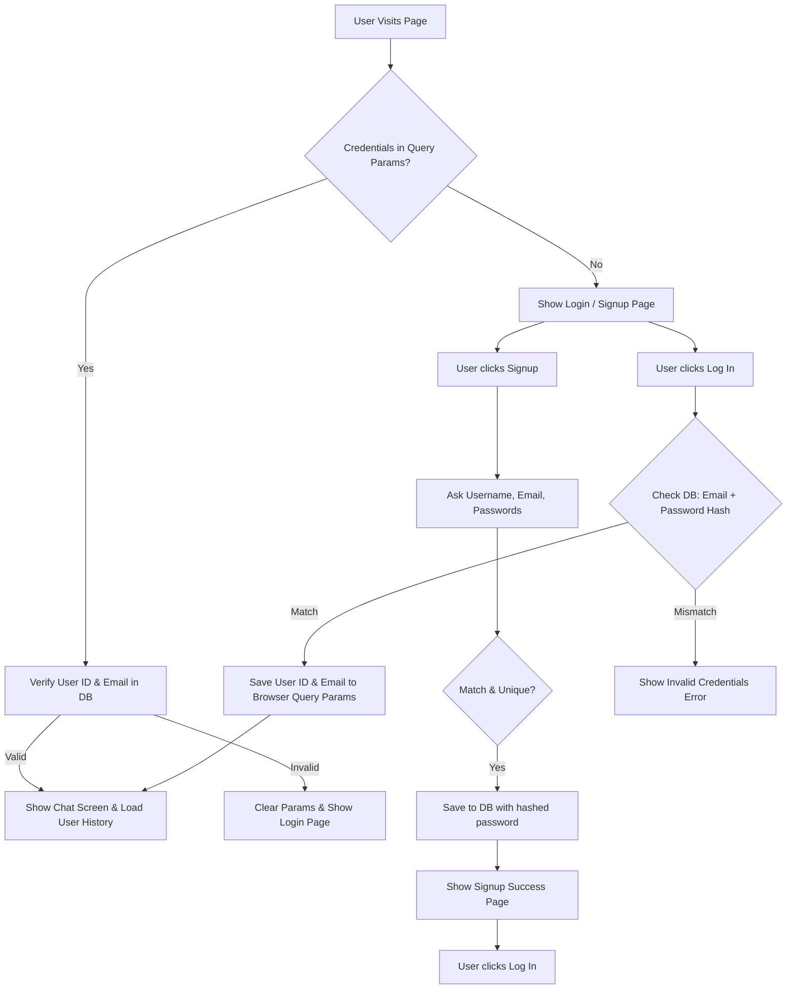
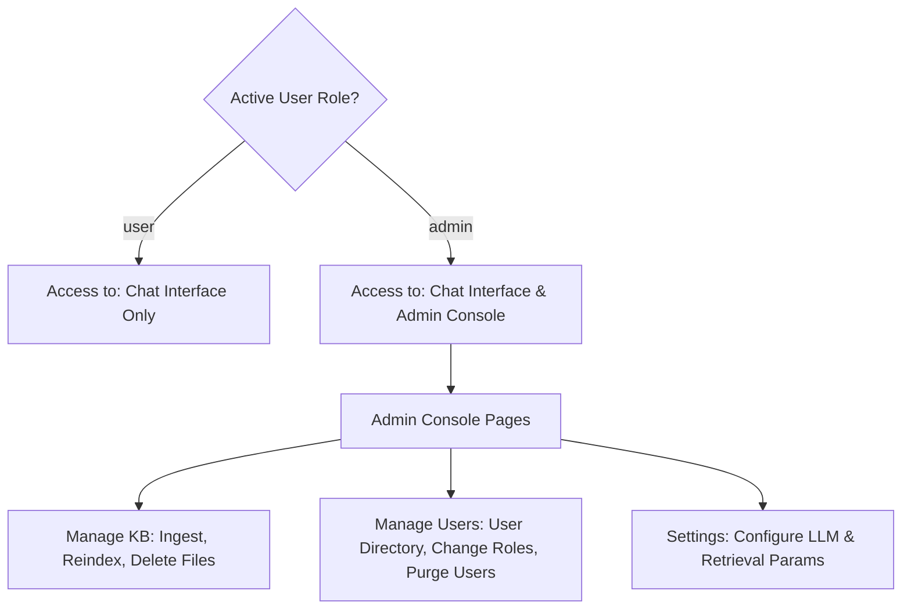

# User Management & System Security Architecture

This document details the architectural, UI, and security specifications for user signup, secure login/logout, session persistence, role-based access control, and complete history isolation for each user in CognIQ.

---

## 🗺️ Authentication & Session Lifecycle

The authentication system handles user visits, checks for browser URL queries to support auto-login, and loads the active chat session context. All Mermaid diagrams are formatted top-down (`TD`).



---

## 1. Database Schema Specifications

The system utilizes SQLite (`rag_history.db`) to manage user profiles, session states, and chat histories.

### `users` Table
Stores user credentials, access privilege roles, and UI theme configurations.
```sql
CREATE TABLE IF NOT EXISTS users (
    id INTEGER PRIMARY KEY AUTOINCREMENT,
    username TEXT UNIQUE NOT NULL,
    email TEXT UNIQUE NOT NULL,
    password_hash TEXT NOT NULL,
    role TEXT NOT NULL DEFAULT 'user',
    theme_preference TEXT NOT NULL DEFAULT 'dark',
    created_at DATETIME DEFAULT CURRENT_TIMESTAMP
);
```

### `messages` Table
Stores individual query and response interactions. The column `session_id` maps to the active user's `username` to enforce strict session boundary limits.
```sql
CREATE TABLE IF NOT EXISTS messages (
    id INTEGER PRIMARY KEY AUTOINCREMENT,
    session_id TEXT,
    role TEXT,
    content TEXT,
    sources TEXT,
    metrics TEXT,
    timestamp DATETIME DEFAULT CURRENT_TIMESTAMP
);
```

---

## 2. Password Cryptography Logic

CognIQ uses Python's built-in `hashlib` using the **PBKDF2-HMAC-SHA256** algorithm to encrypt password hashes with a random cryptographic salt and 100,000 hashing iterations. This ensures robust security in standard execution environments without requiring compiled C-extensions.

```python
import hashlib
import secrets

def hash_password(password: str) -> str:
    salt = secrets.token_hex(16)
    hash_val = hashlib.pbkdf2_hmac(
        'sha256', 
        password.encode('utf-8'), 
        salt.encode('utf-8'), 
        100000
    )
    return f"{salt}${hash_val.hex()}"

def verify_password(stored_hash: str, provided_password: str) -> bool:
    try:
        salt, hash_hex = stored_hash.split('$')
        hash_val = hashlib.pbkdf2_hmac(
            'sha256', 
            provided_password.encode('utf-8'), 
            salt.encode('utf-8'), 
            100000
        )
        return hash_val.hex() == hash_hex
    except Exception:
        return False
```

---

## 3. Session Persistence & UI Lifecycle

### Local Browser Persistence
To improve the user experience, CognIQ persists session states in the browser URL using query parameters (`uid` and `email` keys).
* **Auto-Login:** When the application is accessed, it attempts to load `st.query_params["uid"]` and `st.query_params["email"]`. If present, it queries the database via `db.get_user_by_credentials(uid, email)`. If valid, the user is authenticated automatically.
* **Streamlit Compatibility:** The session management checks both standard `st.query_params` and the older `st.experimental_get_query_params()` as fallback configurations.
* **Logout Actions:** Clears the active user state from `st.session_state` and removes query parameters from the browser URL, redirecting the user back to the sign-in prompt.

---

## 4. Access Control Levels & Roles

CognIQ distinguishes two primary roles: **User** and **Admin**.

### Admin Seeding
During account registration, administrative status is automatically seeded for corporate domains if the registration email matches specific credentials:
* **Admin Emails:** `admin@freseniusmedicalcare.com` or `cognizant.admin@freseniusmedicalcare.com` (case-insensitive).
* All other registered emails defaults to the `user` role.

### Role Authorization Boundaries
The user's assigned role determines their routing access across UI pages:



---

## 5. Admin Console & User CRUD Operations

Admins can access a dedicated User Administration Dashboard to supervise registered users:

* **User Directory Search:** Filter users dynamically by name or email.
* **Profile Modification:** Modify a user's preferred username or assign privilege levels (`user` / `admin`).
* **Profile & Context Purging:** Delete a user account. This executes `db.delete_user_and_history(user_id, username)` which cascades database deletions:
  1. Purges all prompt and response history linked to that username from the `messages` table.
  2. Deletes the core user registration from the `users` table.
* **Lockout Safeguard:** The active logged-in admin cannot delete their own profile from the interface, avoiding accidental system locking.

---

## 6. Context Grounding Security (RAG Context Isolation)

To guarantee corporate data compliance and context isolation:
1. **Isolated Retrieval:** When loading history, the system calls `db.load_messages(username)`. This retrieves *only* the messages where `session_id` matches the active user's username.
2. **Context Separation:** Only the retrieved messages of the active logged-in user are passed into the LLM context prompt buffer (`engine.generate_stream(..., history)`). 
3. **No Cross-Contamination:** A user cannot view, search, or utilize retrieval contexts belonging to another corporate user.

---

## 7. Security Risk Analysis & Mitigation

### SQL Injection Protection
* **Risk:** Arbitrary SQL payload execution in username, email, or search parameters.
* **Mitigation:** The database persistence layer uses parameterized bindings (`?`) for all SQL operations across `database.py`. Raw string formatting in query execution is forbidden.

### Session Parameter Vulnerability (Architectural Limitation)
* **Risk:** Session hijacking or account impersonation via URL query parameter tampering. Because the system checks `uid` and `email` directly from the URL to restore credentials, an attacker could spoof another user if they know or guess their user ID and email.
* **Mitigation / Next Steps:** For production deployment, session tokens should be wrapped in signed cookies, JWT (JSON Web Tokens), or integrated with a secure Single Sign-On (SSO) gateway (e.g. OAuth2 / Entra ID) rather than parsing raw parameters from browser URL strings.
