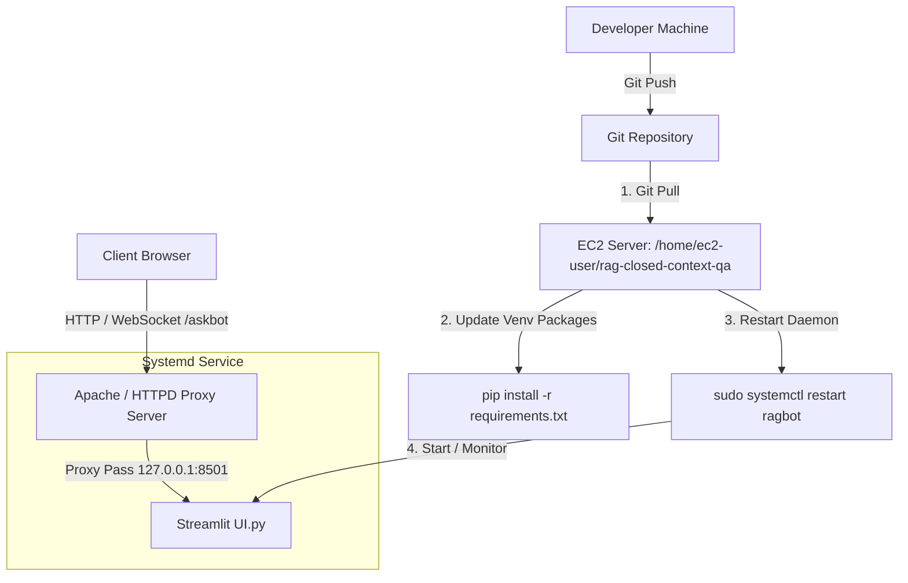

# Comprehensive Red Hat EC2 Deployment & Maintenance Guide

This document outlines the step-by-step process for deploying and updating the RAG Chatbot on a Red Hat Enterprise Linux (RHEL) EC2 instance. It details configuring system services, setting up a reverse proxy using Apache (both for existing Windchill environments and fresh servers), and implementing the update push pipeline. All Mermaid diagrams are formatted top-down (`TD`).

---

## 🖥️ Target Deployment Environment Specifications

The production application runs in a secure, private AWS environment optimized for local LLM vector calculations and retrieval.

### Core Infrastructure
* **AWS Region:** Europe (Frankfurt) / `eu-central-1`
* **Operating System:** Red Hat Enterprise Linux (RHEL)
* **Virtualization Type:** HVM (Hardware Virtual Machine)
* **Boot Mode:** UEFI
* **IAM Instance Profile:** Configure with an SSM Instance Profile (e.g., `EC2RoleForSSM`) to allow secure passwordless access via AWS Systems Manager.

### Compute & Memory Profile
* **Instance Type:** `m5.2xlarge`
* **CPU Architecture:** `x86_64` (8 vCPUs)
* **Total Memory:** 32 GiB RAM
* **Hardware Accelerations:** Support for **Intel AVX-512** vector acceleration (critical for local FAISS and quantization matrix operations).

### Network & Security
* **Subnet:** Private Subnet (No Public IPv4/IPv6 or Public DNS assigned).
* **Private IPv4 Address:** `10.40.97.75`
* **Access Control:** Connection is established using the AWS SSM Session Manager as a superuser (`su`), avoiding open SSH inbound ports.

---

## 🗺️ System Deployment & Update Topology

The diagram below represents how the code is pushed from the developer, pulled on the server, and routed securely from the proxy down to the Streamlit service.



---

## 1. Systemd Service Registration (`ragbot.service`)

To ensure the application runs continuously as a background daemon, recovers from restarts, and is managed properly by the OS, it is registered as a systemd service.

### Service Configuration File
Create and edit the systemd file at the following path:
```bash
sudo nano /etc/systemd/system/ragbot.service
```

Add the following contents:
```ini
[Unit]
Description=Streamlit RAG Chatbot
After=network.target

[Service]
User=ec2-user
WorkingDirectory=/home/ec2-user/rag-closed-context-qa
ExecStart=/home/ec2-user/rag-closed-context-qa/venv/bin/streamlit run ui.py --server.baseUrlPath=/askbot --server.port=8501 --server.address=127.0.0.1 --server.enableCORS=false --server.enableXsrfProtection=false
Restart=always

[Install]
WantedBy=multi-user.target
```

### Managing the Service
* **Reload Systemd:** `sudo systemctl daemon-reload`
* **Enable on Boot:** `sudo systemctl enable ragbot`
* **Start Service:** `sudo systemctl start ragbot`
* **Stop Service:** `sudo systemctl stop ragbot`
* **Restart Service:** `sudo systemctl restart ragbot`
* **Check Status:** `sudo systemctl status ragbot`

---

## 2. Reverse Proxy Configurations (Apache HTTPD)

We redirect incoming public requests on port `80` / `443` down to the local Streamlit application running on `127.0.0.1:8501` under the `/askbot` path.

### Option A: Integration with Existing Windchill HTTPD (Recommended)
If your server already hosts an application like Windchill, map the proxy routes in the existing HTTPD configuration.

1. Open or create the custom proxy config file:
   ```bash
   sudo nano /opt/ptc/Windchill_13.0/HTTPServer/conf/conf.d/ragbot.conf
   ```
2. Insert the following configuration to handle WebSockets, normal asset requests, and prevent timeout drops:
   ```apache
   # --------------------------------------------------
   # RAG Chatbot Integration Mappings (Fixed for WebSockets)
   # --------------------------------------------------

   # Explicitly intercept and route the Streamlit Core WebSocket stream path
   ProxyPass /askbot/_stcore/stream ws://127.0.0.1:8501/askbot/_stcore/stream
   ProxyPassReverse /askbot/_stcore/stream ws://127.0.0.1:8501/askbot/_stcore/stream

   # Route standard HTTP text, JS, and static layout assets
   ProxyPass /askbot http://127.0.0.1:8501/askbot
   ProxyPassReverse /askbot http://127.0.0.1:8501/askbot

   # Global Rewrite Rules as a backup fallback
   RewriteEngine On
   RewriteCond %{HTTP:Upgrade} =websocket [NC]
   RewriteRule ^/askbot/(.*) ws://127.0.0.1:8501/askbot/$1 [P,L]

   # Prevent early server drops during processing
   ProxyTimeout 86400
   LimitRequestBody 52428800
   ```
3. Restart Apache to apply the routing additions:
   ```bash
   sudo systemctl restart apachedaemon   # Adjust command name based on the specific Windchill server script
   ```

### Option B: Deploying on a Fresh Server (Apache/Nginx Setup)
If deploying on a brand new server with no preexisting web servers:

#### Using Apache (HTTPD)
1. Install and start Apache:
   ```bash
   sudo dnf install -y httpd mod_ssl
   sudo systemctl enable httpd --now
   ```
2. Configure the virtual host by creating `/etc/httpd/conf.d/ragbot.conf` and inserting the same proxy configuration shown in Option A.
3. Restart Apache:
   ```bash
   sudo systemctl restart httpd
   ```

#### Using Nginx
If you prefer Nginx over Apache on a clean server:
1. Install and start Nginx:
   ```bash
   sudo dnf install -y nginx
   sudo systemctl enable nginx --now
   ```
2. Create `/etc/nginx/conf.d/ragbot.conf`:
   ```nginx
   server {
       listen 80;
       server_name localhost;

       location /askbot {
           proxy_pass http://127.0.0.1:8501/askbot;
           proxy_http_version 1.1;
           proxy_set_header Upgrade $http_upgrade;
           proxy_set_header Connection "upgrade";
           proxy_set_header Host $host;
           proxy_read_timeout 86400;
       }
   }
   ```
3. Restart Nginx:
   ```bash
   sudo systemctl restart nginx
   ```

---

## 3. Red Hat Security & SELinux Adjustments

By default, Red Hat Security (SELinux) blocks proxy engines (Apache/Nginx) from communicating with downstream local ports. Execute the following to lift the blocks:

```bash
# Allow Apache/HTTPD to forward traffic over the local loopback network
sudo setsebool -P httpd_can_network_connect 1

# Open port 80 / 443 in firewalld
sudo firewall-cmd --permanent --add-service=http
sudo firewall-cmd --permanent --add-service=https
sudo firewall-cmd --reload
```

---

## 4. Server Update & Code Maintenance Pipeline

When updates are pushed from the developer/pusher side to the code repository, follow these steps on the EC2 server to fetch updates and sync changes:

### Source Directory
The production application files reside in:
`/home/ec2-user/rag-closed-context-qa/` (Specifically the core file `/home/ec2-user/rag-closed-context-qa/ui.py`).

### Update Sequence

Execute this exact command flow to pull updates, sync dependencies, and restart the service:

```bash
# 1. Navigate to the application folder
cd /home/ec2-user/rag-closed-context-qa

# 2. Pull the updated files from the repository
git pull

# 3. IF requirements.txt was updated, activate the virtual environment and install new libraries
source venv/bin/activate
sudo -u ec2-user ./venv/bin/pip install -r requirements.txt

# 4. Restart the systemd daemon to swap active execution processes
sudo systemctl restart ragbot

# 5. Monitor real-time logs and verify startup stability
sudo journalctl -u ragbot.service -f
```
