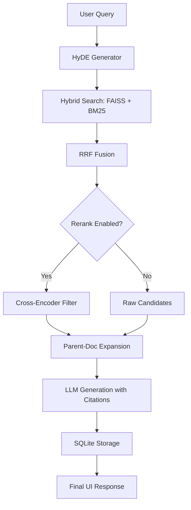

# 🤖 V20 RAG-style Closed Context QA Bot (The Modular Intelligence Lab)

## 🏗️ Summary

> [!NOTE]
> **Goal For This Version**  
> Build the **V20 Modular RAG Intelligence Lab**. This version shifts the focus from simple speed to **Retrieval Precision** and **Verifiability**. By introducing semantic-aware chunking, hypothetical answer expansion (HyDE), and persistent chat history, we transform the engine into a professional-grade research tool.

> [!IMPORTANT]
> **Changes from Last Version [v19] to Current Version [v20]**  
> *   **Semantic Chunking**: Replaced fixed-size splitting with an algorithm that detects sentence boundaries and "topic transitions" using embeddings.
> *   **HyDE (Hypothetical Document Embeddings)**: Added a "Query Expansion" layer where the LLM generates a draft answer to improve search accuracy.
> *   **Parent-Document Retrieval**: Implemented a two-tier indexing strategy (Search Child, Retrieve Parent) for superior context quality.
> *   **SQLite Persistence**: Integrated a relational database to save chat history, telemetry, and citations permanently.
> *   **Modular Control Center**: Added a full suite of toggles to the UI to enable/disable every algorithmic stage on-the-fly.
> *   **Verified Citations**: Updated the generation logic to enforce numbered citations `[1]`, `[2]` linked to verifiable source snippets in the UI.

> [!IMPORTANT]
> **Why the changes were made (problem faced)**  
> In V19, we had a very fast engine, but it still suffered from three major "RAG traps":
> 1. **Fragmented Context**: Fixed chunks often cut sentences in half, leading to answers that felt "incomplete."
> 2. **Vague Query Failure**: If a user asked a very short question, the vector database often failed to find the right document because there weren't enough matching keywords.
> 3. **The "Goldfish" Problem**: Refreshing the browser wiped the entire chat, making it impossible to use the tool for long-term research.

> [!IMPORTANT]
> **How the new version solves the problem**  
> V20 introduces the **"Modular Intelligence"** architecture to solve these traps:
> 
> 1. **Topic-Aware Indexing (Semantic Chunking)**: The student now reads by "topic" rather than by "character count." It ensures that a whole paragraph about "Vacation Policy" stays together.
> 2. **Pre-Thinking (HyDE)**: Before searching the library, the student now "imagines" what a good answer might look like. They use this imagination to find much more relevant books.
> 3. **The Long-Term Memory (SQLite)**: We gave the student a diary (`rag_history.db`). Every word spoken and every source cited is written down permanently.
> 4. **Verified Trust**: The student can no longer "just say things." They must point to exactly which line in the book they are citing, and the teacher (user) can verify it with a single click.

---

## 🛠️ How to Build V20 Modular Intelligence (From Scratch)

1. **Install Persistence Layer**:
   ```bash
   pip install sqlite3 # Included in Python Standard Library
   ```

2. **Implement Semantic Splitting**:
   Instead of just splitting by characters, use your embedding model to compare sentences:
   ```python
   def semantic_chunking(sentences, embedder, threshold=0.5):
       embeddings = embedder.encode(sentences)
       # Calculate similarity between adjacent sentences
       # Split where similarity < threshold
   ```

3. **Implement Parent-Child Mapping**:
   Index small snippets (Children) for search speed, but store their surrounding context (Parent) for generation:
   ```python
   # Retrieval Logic
   child_match = faiss_search(query)
   parent_context = database.get_parent(child_match.parent_id)
   return parent_context
   ```

4. **Add UI Modular Toggles**:
   Use `st.toggle` in the sidebar to pass boolean flags (`use_hyde`, `use_rerank`) to your retrieval function.

---

## 📖 Terminologies

| Term | What It Means |
|---|---|
| **Semantic Chunking** | Splitting text based on changes in meaning rather than fixed character limits. |
| **HyDE** | (Hypothetical Document Embeddings) Generating a "fake" ideal answer to use as a search query. |
| **Parent-Child RAG** | Indexing small segments for retrieval but providing large segments to the LLM for context. |
| **Persistence** | Storing data (like chat history) so that it survives a program restart or page refresh. |
| **Modular Control** | The ability to turn specific parts of an AI pipeline on or off for testing. |

---

## 🏗️ Architecture

### 🔄 V20 Modular Intelligence Pipeline



---

## 🚀 Final One-Line Understanding

> **V20 transforms the SourceIQ engine into a professional Research Lab, combining semantic intelligence, persistent memory, and modular toggles to provide verifiable, high-precision answers.**

---
© 2026 SourceIQ Engineering | *Documentation v20.0*
